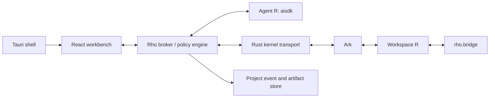

# Rho: Agent-native R Scientific Workbench

> Status: reviewed architecture baseline  
> Date: 2026-07-15  
> Project root: `D:\Rho`  
> Primary AI runtime: [`YuLab-SMU/aisdk`](https://github.com/YuLab-SMU/aisdk)  
> Primary R kernel: [`posit-dev/ark`](https://github.com/posit-dev/ark)

## 1. Product definition

Rho is a local-first, cross-platform scientific workbench built around a persistent R workspace. It combines an IDE-quality R session with an AI agent that can inspect the current analysis state, diagnose failures, edit project files, execute code, and produce auditable scientific artifacts.

Rho is not an RStudio clone with a chat panel. Its defining behavior is:

1. The user and the AI operate on one authoritative live R workspace.
2. The AI plans independently, but every observation and action against the analysis state is executed inside that workspace.
3. Every broker-mediated execution, warning, error, observed project change, plot, package action, and agent decision is traceable.
4. Interactive exploration can be promoted into reproducible scripts, Quarto documents, and `renv`-managed projects.

Initial target users are R-based computational scientists and bioinformaticians. The architecture should remain suitable for broader statistics and data-science use.

## 2. Architecture decisions

### 2.1 Adopt two R sessions with one authoritative workspace

Rho will run two R processes by default:

- **Workspace R**: launched through Ark. It owns `.GlobalEnv` and executes all user and agent analysis code.
- **Agent R**: runs `aisdk`, `ChatSession`, model calls, planning, approved skills, MCP clients, and approval hooks. It emits events but is not a direct persistence writer.

This is not a replicated analysis environment. Agent R must not hold copies of analysis objects as its source of truth. It stores only references and bounded summaries tagged with kernel instance, state revision, and project revision.

Reasons for the split:

- LLM network latency does not block the R console.
- Agent cancellation does not kill the user's analysis session.
- Workspace crashes do not destroy chat history and task state.
- User code cannot directly modify the agent runtime or read model credentials inherited by that process.
- Background literature retrieval and planning can continue while Workspace R is idle.
- The workspace remains the only place where scientific object semantics are evaluated.

A single-process mode may remain available for `aisdk.console`, RStudio add-ins, and debugging, but it is not the default desktop architecture.

### 2.2 Use Ark as the workspace kernel

Ark is selected because it:

- binds natively to R's frontend C API;
- supports console-oriented interaction rather than only notebook execution;
- speaks the Jupyter messaging protocol;
- returns structured streams, errors, rich display data, and kernel status;
- provides a path toward integrated LSP and DAP functionality;
- is MIT licensed.

Ark does not by itself expose all domain-specific R state required by the agent. Rho will load a small companion package into Workspace R to provide structured inspection and execution services.

Rho does **not** require Python, Jupyter Server, JupyterLab, or a notebook runtime. Ark's Jupyter protocol is retained only as an internal kernel message specification.

The Rust broker starts Ark directly and connects to its ZeroMQ channels using:

- `jupyter-protocol` for message types and serialization;
- `jupyter-zmq-client` for authenticated ZeroMQ transport;
- the MIT-licensed [`wurli/jet`](https://github.com/wurli/jet) core design as a practical reference for kernel lifecycle, multiple clients, streaming, stdin, comms, and Ark integration.

Rho should depend on the underlying crates or a small reviewed subset of `jet_core`, not bundle the Jet CLI. Jet is currently alpha and its CLI does not yet support Windows, so Windows support must be established by Rho's own integration tests before this path is considered stable.

The broker normalizes the following internal channels into the Rho Workbench Protocol:

| Channel | Rho responsibility |
|---|---|
| shell | execute, complete, inspect, history, and code-completeness requests |
| iopub | status, streams, errors, display data, plots, HTML, and comm events |
| stdin | structured input requests and replies |
| control | shutdown and control requests supported by the kernel |
| heartbeat | kernel liveness |

The broker owns the Ark process handle. Interrupt is a kernel-manager responsibility rather than ordinary R code: use a process-group signal on Unix and a verified Windows process-control implementation. The Windows mechanism and post-interrupt recovery behavior are Phase 0 exit gates.

### 2.3 Evaluate arf as a fallback runtime, not the GUI Console

[`eitsupi/arf`](https://github.com/eitsupi/arf) is a relevant MIT-licensed alternative R frontend written in Rust. It provides cross-platform binaries, direct R embedding, `rig` integration, multiline editing, completion, help, SQLite history, headless mode, and local IPC over Unix sockets or Windows named pipes.

Rho should reuse or learn from:

- `arf-libr` and `arf-harp` if a custom embedded R frontend becomes necessary;
- R discovery and `rig` integration patterns;
- completion, help indexing, history, and IPC mutual-exclusion behavior;
- its single-binary cross-platform release workflow.

The current arf IPC is experimental and returns text-oriented results after evaluation. It does not yet provide all Rho requirements for incremental streams, rich display bundles, structured traceback, GUI completion, or a true interrupt RPC. The Ratatui/Reedline terminal UI is also not directly reusable in a React workbench.

Therefore:

- Ark plus direct Rust Jupyter transport is the primary runtime;
- arf headless is tested in Phase 0 as a fallback spike;
- `arf-console` must not be embedded in xterm.js as Rho's primary R console;
- switching to arf requires an explicit ADR showing how streaming, plots, interrupt, traceback, and GUI completion will be supplied.

### 2.4 Use a lightweight desktop shell

The target desktop shell is **Tauri 2**, with a frontend that can also run in a normal browser during development.

Frontend stack:

- React + TypeScript + Vite
- Monaco Editor
- a custom structured R Console consuming Workbench Protocol events
- xterm.js only for an actual shell terminal, never for the Ark R Console
- TanStack Query for server state
- Zustand for local UI state
- react-resizable-panels for workbench layout
- TanStack Table or AG Grid Community for tabular inspection
- a restrained component system using accessible native controls

Electron is not the default because `aisdk` is R-native and there is no requirement for a Node-based AI runtime. Electron remains a fallback if future requirements include Code OSS compatibility, VS Code extensions, or strict Chromium rendering parity.

### 2.5 Keep the frontend transport-independent

The UI must depend on a versioned `Rho Workbench Protocol`, not directly on Tauri commands, Ark, Jupyter messages, or `aisdk` internals.

The same React application should support:

- browser development mode against a local broker;
- Tauri desktop mode;
- a future remote Workspace R connection.

### 2.6 Define the workbench interface as a product contract

Rho should retain the useful RStudio mental model without reproducing its fixed four-pane layout. Users should immediately recognize the editor, console, environment, plots, files, packages, and help surfaces, while agent activity becomes a first-class work area rather than a chat add-in.

The default desktop layout has four structural regions:

| Region | Primary responsibility | Default sizing guidance |
|---|---|---|
| Left sidebar | Project files, artifacts, and run history | 180-240 px, collapsible |
| Center workspace | Source editor, data viewers, reports, and diffs | Largest flexible region, minimum 480 px when possible |
| Right context panel | Agent and Environment as switchable tabs | 320-420 px, resizable and collapsible |
| Bottom execution dock | Console, Plots, Problems, and Jobs | 180-280 px, resizable and collapsible |

The layout must be dense, quiet, and optimized for repeated scientific work. Use flat structural panels with restrained separators. Avoid dashboard-style metric cards, decorative gradients, oversized headings, floating chat bubbles, and card-per-message conversation layouts.

#### Center workspace

The center workspace is always the visual priority. It supports tabbed documents and inspectable outputs:

- `.R`, `.Rmd`, and `.qmd` source editors;
- data-frame and scientific-object viewers;
- rendered plots, HTML, PDF, and Quarto previews;
- side-by-side or inline file diffs;
- provenance and run inspection.

Large data and artifact viewers should open as center tabs rather than being squeezed into the Environment panel.

#### Left sidebar

The left sidebar combines project navigation and execution history:

- file tree with version-control state;
- project artifacts and generated outputs;
- named agent/user runs with state and timestamp;
- search and command entry points.

Selecting a historical run should reconstruct its code, tool timeline, outputs, approvals, and artifact references without changing Workspace R unless the user explicitly requests restoration or re-execution.

#### Right context panel

Agent and Environment share the right panel because both describe the current workspace context.

The **Agent** tab contains:

- current task, kernel instance, state revision, and project revision;
- concise plan steps with queued, running, waiting, completed, failed, and cancelled states;
- tool calls with exact code or operation, duration, and state/project revision transitions;
- approval requests and file diffs;
- a compact conversation composer.

The **Environment** tab contains:

- `.GlobalEnv` object manifest;
- class, dimensions, approximate size, and semantic adapter;
- package/search-path summary;
- targeted inspect and open-in-viewer actions.

Do not render all reasoning as chat bubbles. Agent work should primarily appear as an auditable task timeline. Natural-language messages remain available but are secondary to actions, state transitions, and artifacts.

#### Agent operating modes

The composer exposes a three-state segmented control:

| Mode | Allowed behavior |
|---|---|
| Ask | Use allowlisted read-only bridge probes and explain; no arbitrary R evaluation, file mutation, package installation, or external write action |
| Plan | Use allowlisted read-only bridge probes and produce a proposed plan; arbitrary execution and mutation wait for confirmation |
| Act | Execute and modify within the configured policy; approval is still required for protected tool classes |

The selected mode is part of every agent run record. Avoid a vague global `Autonomous` switch that hides the actual permission boundary.

#### Bottom execution dock

The bottom dock provides four tabs:

- **Console**: one live Workspace R console with history, multiline input, interrupt, and execution origin;
- **Plots**: plot history, navigation, export, and provenance link;
- **Problems**: structured errors, warnings, diagnostics, traceback, and source locations;
- **Jobs**: background agent, render, package, and remote-compute tasks.

Console entries and execution events identify their origin as `user`, `agent`, or `system`. Selecting an entry links back to the source code, agent turn, run, revision, and output artifacts.

Errors must not exist only as console text. A Problems item offers explicit actions such as Explain, Propose Fix, Retry, and Open Debugger when supported. Fixes preserve the original error and execution record.

#### Workspace status and stale context

The persistent status bar shows only high-value operational state:

- R version and `idle`, `busy`, `waiting`, `interrupted`, or `disconnected` status;
- kernel status plus state and project revisions;
- `renv` state;
- current source position and encoding;
- remote/local workspace identity when relevant.

The Agent and Environment tabs display the revision they are describing. If Agent R attempts an action using a stale revision, the UI presents a refresh/replan state rather than silently executing against new workspace state.

#### Work modes

Rho supports layout presets without changing the underlying content model:

| Work mode | Layout behavior |
|---|---|
| Code | Editor dominates; Agent is narrow; Console remains accessible |
| Analyze | Data/plot viewer and Environment receive more space |
| Agent | Agent task timeline expands while editor context remains visible |
| Focus | Side panels are hidden; editor and selected bottom surface remain |

All panels remain manually resizable and collapsible. Presets are layout commands, not separate application routes.

#### Responsive and accessibility behavior

At narrow widths, do not compress four regions until labels and controls overlap. Collapse the left sidebar first, then present Editor, Agent/Environment, and Console/Plots/Problems as switchable primary surfaces. Preserve native keyboard focus, semantic tabs, accessible names, and non-color status indicators.

Core keyboard workflows include running a selection, sourcing a file, interrupting R, opening the command palette, switching primary surfaces, and focusing the Agent composer. Shortcuts belong in menus and the command palette rather than permanent instructional text in the interface.

### 2.7 Open-source component adoption matrix

| Capability | Selected component | Adoption rule |
|---|---|---|
| Workspace R kernel | Ark | Primary runtime; pin exact prerelease and run compatibility probes |
| Rust kernel client | `jupyter-protocol`, `jupyter-zmq-client`, Jet core design | Direct broker integration; no Jet CLI bundle; verify Windows and licenses |
| Alternative R frontend | arf, `arf-libr`, `arf-harp` | Phase 0 fallback only unless ADR-009 selects it after gap closure |
| AI runtime | `YuLab-SMU/aisdk` | Agent R engine through a Rho structured adapter |
| Static R LSP and formatter | Air | Initial editor service; standalone Rust binary |
| R version management | rig | Optional managed installer/selector with explicit user action |
| Project package environment | renv | Project library, lockfile, restore, snapshot, and drift status |
| Source editor | Monaco | React editor surface, independent from runtime transport |
| R Console | Rho structured Console | Render Workbench Protocol events; never parse a PTY transcript |
| Shell terminal | xterm.js | Shell jobs only, isolated from the Workspace R Console |
| Desktop shell | Tauri 2 | Lightweight cross-platform shell and trusted broker host |

Every dependency requires an exact version, license record, upstream URL, checksum or lockfile entry, update policy, and replacement boundary. Source-available components with service restrictions are not included without a separate product and legal ADR.

## 3. Process topology



### 3.1 Tauri shell

Responsibilities:

- launch and supervise the broker, Agent R, and Ark;
- discover installed R versions;
- open native file and folder dialogs;
- store provider credentials in the OS credential store;
- provide application lifecycle, update, signing, and crash recovery;
- expose only narrow, typed commands to the renderer.

The renderer must run with no unrestricted filesystem or shell access.

### 3.2 Rho broker

The broker is the control plane and policy boundary. It should be implemented in Rust and shared by:

- a local development server binary;
- the Tauri desktop backend.

Responsibilities:

- own the authoritative workspace execution queue;
- translate Workbench Protocol requests into Jupyter messages;
- correlate Jupyter parent message IDs with Rho execution IDs;
- fan out structured events to the UI and Agent R;
- enforce approval and filesystem policies;
- supervise heartbeats and restart behavior;
- assign execution, state, project, and kernel instance revisions;
- act as the single writer for run, session, approval, and provenance state;
- watch project files and perform a bounded post-execution change scan so Workspace R mutations are reflected in `project_revision`;
- prevent simultaneous user and agent execution against Workspace R.

The broker embeds the Rust Ark client directly. There is no Python gateway process and no loopback Jupyter HTTP server. Kernel connection files, HMAC keys, ZeroMQ ports, and process handles stay private to the broker.

For the Phase 0 bridge RPC, the broker supplies a unique result path below the
operating system temporary directory. Workspace R serializes only the bounded
`rho.bridge` result to JSON, writes a sibling temporary file, and atomically
renames it to the supplied path. After receiving both iopub `idle` and shell
`execute_reply`, the broker enforces the protocol frame-size limit, parses the
JSON, and deletes both paths. This is an internal result transport, not event
persistence or console scraping; SQLite remains the authoritative store.

Ark 0.1.252 was tested with Jupyter `user_expressions`, but returns an empty
result map, and its R-side display API only exposes specific HTML output rather
than arbitrary MIME bundles. A future Ark custom-MIME or comm API may replace
the temporary result transport behind the same broker RPC contract.

Rich output follows Ark's two supported frontend modes. Without a UI comm,
plots arrive as Jupyter display bundles such as `image/png`. Once
`positron.ui` is open, HTML arrives as a `show_html_file` event and plots open
`positron.plot` comms; Rho requests SVG/PNG/PDF renderings through correlated
comm RPCs. The broker validates MIME type and bounded payload size before
forwarding a Workbench Protocol display event.

### 3.3 Agent R

Agent R starts with a restricted environment and loads `aisdk` plus a Rho frontend adapter.

Responsibilities:

- provider/model configuration;
- `ChatSession` and branch management;
- agent reasoning and tool selection;
- approved skills, semantic adapters, and MCP clients;
- context budgeting and summaries;
- human approval hooks;
- structured streaming of reasoning, messages, tool calls, costs, and run state.

The `aisdk` family is treated as an existing application platform, not merely
an LLM HTTP client. Rho reuses `aisdk` core's `ChatSession`, public
`send_stream(..., on_event=)` typed event stream, run-trace sink, `HookHandler`, normalized run state, tool schema,
context management, semantic adapter protocol, and session branching. The
`aisdk.console` package is the reference implementation for turn handling,
stream rendering, tool timelines, inspection, cancellation, and continuation.
Rho does not call `console_chat()` or render its terminal frame inside the GUI;
it implements another frontend over the same exported core extension seams.

Other family packages are adopted by boundary:

- `aisdk.bioc` supplies semantic adapter behavior, executed through bounded
  Workspace R bridge probes rather than by copying Bioconductor objects to Agent R;
- `aisdk.skills` supplies discovery and authoring, while project skill scripts
  execute through broker-controlled Workspace R or isolated workers;
- `aisdk.orchestration` is an optional later Agent R layer after the single-agent
  execution coordinator is stable;
- `aisdk.mcp` supplies protocol/client semantics, but local MCP child processes
  must be launched by the broker with a stripped environment;
- `aisdk.console` remains a supported developer/debug frontend and compatibility
  reference, not Rho's primary desktop console.

Cross-repository changes that would reduce Rho-specific adapter code are tracked
in `docs/architecture/aisdk-family-change-proposals.md`. The highest-priority
items are a correlated public event envelope, cooperative cancellation,
pluggable tool/context and skill executors, and a secure `aisdk.mcp` process
launcher that does not inherit all Agent R credentials.

Agent R communicates with the broker over a dedicated, length-prefixed JSON frame protocol on a broker-owned loopback TCP connection. Protocol data must not share stdout or stderr with R packages or native libraries.

Bootstrap sequence:

1. Broker binds an ephemeral `127.0.0.1` listener and generates a 256-bit single-use token.
2. Broker starts Agent R with ordinary stdout/stderr redirected to bounded diagnostic logs.
3. Broker sends port, token, and protocol version through Agent R stdin as a one-time bootstrap frame; the token is not placed in command-line arguments or project files.
4. Agent R connects outward to the loopback listener and authenticates in its first framed message.
5. Broker invalidates the token after one successful connection and rejects additional clients.

Local TCP is selected over per-platform socket APIs for the initial implementation because base R supports cross-platform socket connections. A later inherited-handle, Unix-socket, or named-pipe transport may replace it behind the same protocol.

Frame format:

```text
4-byte unsigned big-endian payload length
UTF-8 JSON payload of exactly that length
```

Message classes:

```text
request   broker -> Agent R or Agent R -> broker
response  correlated success or failure
event     one-way streaming state or content update
cancel    cancellation request for a specific operation
```

Every message includes `protocol_version`, `id`, `type`, `timestamp`, and a schema-versioned payload. Requests include a deadline and an idempotency classification. Unknown message types or protocol versions fail closed.

Agent R stdout and stderr are never parsed as protocol. They are captured into bounded rotating diagnostic logs with secret redaction. Structured `aisdk` content travels only over the authenticated frame connection. Phase 0 includes deliberate stdout/stderr contamination tests to verify protocol isolation. Broker-side defense-in-depth redaction covers common credential query parameters, JSON credential fields, and bearer tokens, including early Agent R failure diagnostics; this boundary is required even when provider libraries include a credential in an HTTP error.

Tool requests block the active Agent R run until the broker returns a correlated response. Cancellation has two layers: a cooperative protocol `cancel` followed, after a bounded grace period, by an OS-level interrupt or Agent R restart. The broker remains responsive throughout.

### 3.4 Workspace R

Workspace R is the only authoritative scientific runtime. It owns:

- `.GlobalEnv`;
- loaded packages and namespaces;
- working directory and project options;
- graphics devices and plot history;
- active R objects, including non-serializable objects and external pointers;
- execution history, warnings, errors, and traces;
- project `renv` library and Bioconductor state.

Workspace R must not receive model API keys. Its child-process environment is built from an allowlist rather than inherited wholesale from the desktop process.

## 4. Workspace state awareness

### 4.1 Ark provides transport, not complete semantic state

Ark/Jupyter provides kernel status, execution requests, standard streams, errors, rich display outputs, completion, inspection, history, interrupt, and shutdown mechanics. Rho still needs an R-aware bridge for scientific object inspection and failure diagnosis.

Create a small R package named provisionally `rho.bridge`, loaded during Workspace R startup.

Required functions:

```text
rho_workspace_snapshot()
rho_workspace_digest()
rho_list_objects()
rho_inspect_object(name, detail, limits)
rho_inspect_function(name, package, detail)
rho_get_documentation(topic, package, section)
rho_get_last_execution()
rho_get_last_error()
rho_get_last_trace()
rho_get_plot_manifest()
rho_get_package_state()
rho_get_renv_state()
rho_execute(code, execution_metadata)
```

Reuse or adapt existing `aisdk` capabilities where possible:

- `collect_ai_context()`
- `create_r_context_tools()`
- `inspect_r_object()`
- `inspect_r_function()`
- `get_r_documentation()`
- semantic adapter registries

These functions currently inspect the R process in which `aisdk` is loaded.
In desktop mode that process is Agent R, so their schemas and rendering logic
may be reused but their execution targets must be replaced by broker RPC tools.
In particular, `create_r_introspect_tools()`, `r_eval`, and
`execute_r_code_local` must never be presented as Workspace R operations.

These functions currently inspect the R process in which `aisdk` is loaded.
In desktop mode that process is Agent R, so their schemas and rendering logic
may be reused but their execution targets must be replaced by broker RPC tools.
In particular, `create_r_introspect_tools()`, `r_eval`, and
`execute_r_code_local` must never be presented as Workspace R operations.

The bridge should return bounded, schema-stable summaries. Large data frames, matrices, genomic ranges, single-cell objects, model objects, and external pointers must remain inside Workspace R.

### 4.2 Execution and revision identities

Do not use one counter for transport ordering, R state, and project files. The broker maintains four distinct identities:

| Identity | Change rule | Purpose |
|---|---|---|
| `kernel_instance_id` | new value whenever Workspace R starts or restarts | invalidates all live object references |
| `execution_seq` | increments for every accepted Workspace request | total ordering and event correlation |
| `state_revision` | increments after any arbitrary R evaluation or state-capable operation, including failures | detects stale R state assumptions |
| `project_revision` | increments after broker-observed project file, environment, or lockfile mutations | detects stale source and artifact assumptions |

Allowlisted bridge probes such as object metadata lookup and help retrieval increment `execution_seq` but normally do not increment `state_revision`. Their implementations must be narrow and reviewed. Because R active bindings and custom methods may have side effects, a probe that executes arbitrary user dispatch is classified as state-capable and increments `state_revision`.

All arbitrary R evaluations increment `state_revision` when they finish, including requests that end in error, because code may mutate state before failing.

Agent tool calls that depend on prior state include an expected revision:

```json
{
  "tool": "inspect_r_object",
  "name": "sce",
  "expected_kernel_instance_id": "kernel_01",
  "expected_state_revision": 42,
  "expected_project_revision": 8
}
```

If a required identity differs, the broker returns `stale_kernel`, `stale_state`, or `stale_project`. The agent must refresh its snapshot or explicitly replan against current state. A kernel mismatch can never be overridden for a live object reference.

### 4.3 Object references

Objects are represented to Agent R as references rather than serialized values:

```json
{
  "workspace_id": "ws_01",
  "kernel_instance_id": "kernel_01",
  "state_revision": 42,
  "name": "sce",
  "classes": ["SingleCellExperiment"],
  "dimensions": [23571, 8487],
  "size_bytes": 88210234,
  "semantic_adapter": "single_cell_experiment"
}
```

An object reference is invalid when its workspace or kernel instance changes. It is potentially stale when its state revision is older than the current state revision.

### 4.4 Limits of live inspection

When Workspace R is executing R or native code, another request cannot generally inspect arbitrary local variables because R is single-threaded. During execution, Rho can observe:

- `busy`/`idle` state;
- stdout, stderr, messages, warnings, and progress events that have been emitted;
- interrupt and heartbeat status.

Inspection of an active call frame requires debugger support, a `browser()` state, Ark DAP, or cooperative checkpoints. The UI and product language must not imply unrestricted concurrent inspection of a busy R stack.

## 5. Execution and error model

### 5.1 Single serialized workspace queue

All requests to Workspace R enter one queue:

- console submissions;
- editor selections and source files;
- agent-generated code;
- object inspection;
- documentation requests that require live state;
- Quarto or package actions that run in the workspace.

Each request contains:

```text
execution_id
origin: user | agent | system
session_id
workspace_id
expected_kernel_instance_id
expected_state_revision
expected_project_revision
code or operation
working_directory
timeout policy
approval state
```

User and agent requests must never race in `.GlobalEnv`. Model reasoning may run concurrently because it occurs in Agent R, but its next workspace action is serialized by the broker.

### 5.2 Execution events

Normalize Jupyter and bridge output into Workbench Protocol events:

```text
execution.queued
execution.started
kernel.status
output.stdout
output.stderr
condition.message
condition.warning
condition.error
display.data
display.plot
display.html
execution.interrupted
execution.completed
workspace.state_revision_changed
workspace.project_revision_changed
workspace.kernel_instance_changed
```

Every event includes `execution_id`, sequence number, timestamp, and origin.

### 5.3 Error capture

Before control returns after an error, record:

- condition message and classes;
- visible call;
- structured traceback where available;
- warnings and messages emitted before failure;
- code and source reference;
- working directory;
- execution sequence, kernel instance, and state/project revisions before and after execution;
- relevant object names touched when discoverable;
- package and session information digest.

Errors should become first-class events, not text scraped from a console.

Capture contract:

- Ark iopub `error`, `stream`, and `status` messages are the primary transport record.
- `rho.bridge` wraps only broker-submitted execution requests with per-request condition handlers to collect condition classes, calls, warnings, messages, and a bounded call stack before unwinding.
- Do not globally replace the user's `options(error = ...)` handler. If a compatibility hook is ever required, it must chain transparently and be covered by explicit tests.
- Preserve top-level visibility, source references, restarts, interactive input, graphics behavior, and partial state mutations.
- Store raw protocol payloads in bounded diagnostic form when normalization fails, without exposing secrets.

Phase 0 error fixtures include base errors, `rlang` errors, warnings-as-errors, custom handlers, `withRestarts()`, `browser()` entry, stdin requests, source references, graphics before failure, native-code errors where safe, and mutation followed by failure.

The UI may offer:

- **Explain**: provide diagnosis without modifying state;
- **Fix code**: propose an editor patch;
- **Retry**: execute corrected code after approval;
- **Open debugger**: enter a future Ark DAP workflow.

Automatic diagnosis must be configurable. It should not send project context to a model without a visible data-flow policy.

## 6. `aisdk` integration contract

### 6.1 Frontend adapter

Implement a Rho-specific `aisdk` renderer/adapter that emits stable structured events instead of terminal markup.

Required event types:

```text
chat.message_started
chat.text_delta
chat.thinking_delta
chat.message_completed
agent.run_started
agent.run_state_changed
tool.call_started
tool.approval_required
tool.call_completed
tool.call_failed
session.branch_changed
cost.updated
```

The adapter should reuse existing `aisdk` hooks, run states, session semantics, and branching APIs, but Broker storage is authoritative. In desktop mode, Agent R emits normalized session events to the broker instead of independently appending the same events to `aisdk` JSONL. Import/export compatibility with the existing `aisdk` session event format is preserved at the boundary.

Concrete integration seams audited in the current `aisdk` family:

| Existing seam | Rho use | Constraint |
|---|---|---|
| `ChatSession$send_stream(..., on_event=)` | public typed text, thinking, final, and done events | normalize to Workbench Protocol |
| `set_run_trace_sink()` | model calls, responses, policy decisions, tool-result traces, usage and latency | redact before broker persistence |
| `create_hooks()` / `HookHandler` | tool start/end and synchronous approval round-trip | broker remains approval authority |
| `new_run_state()` / `ChatSession$get_run_state()` / `continue_run()` | blocked, waiting, retry, explain, manual and completion states | do not invent a second agent state machine |
| session event and branching API | import/export compatibility and branch semantics | broker SQLite is the only desktop writer |
| `aisdk.console` frame/timeline logic | UX reference and behavior fixtures | no terminal markup or `console_chat()` embedding |
| `create_console_agent()` and console tools | system-prompt/tool-design reference | default local R/file/shell tools bypass broker and are not used unchanged |

`rho.agent` owns the desktop adapter. It builds an `aisdk` `ChatSession` with
Rho Tool objects whose `execute` functions issue correlated broker requests.
Workspace identity is injected by the adapter, not model-generated. Effectful
tools synchronously wait for a broker approval response through the authenticated
side channel. Agent R stdout/stderr remains diagnostic only.

Concrete integration seams audited in the current `aisdk` family:

| Existing seam | Rho use | Constraint |
|---|---|---|
| `ChatSession$send_stream(..., .stream_event_callback=)` | text, thinking, final, and done events | normalize to Workbench Protocol |
| `set_run_trace_sink()` | model calls, responses, policy decisions, tool-result traces, usage and latency | redact before broker persistence |
| `create_hooks()` / `HookHandler` | tool start/end and synchronous approval round-trip | broker remains approval authority |
| `new_run_state()` / `ChatSession$get_run_state()` / `continue_run()` | blocked, waiting, retry, explain, manual and completion states | do not invent a second agent state machine |
| session event and branching API | import/export compatibility and branch semantics | broker SQLite is the only desktop writer |
| `aisdk.console` frame/timeline logic | UX reference and behavior fixtures | no terminal markup or `console_chat()` embedding |
| `create_console_agent()` and console tools | system-prompt/tool-design reference | default local R/file/shell tools bypass broker and are not used unchanged |

`rho.agent` owns the desktop adapter. It builds an `aisdk` `ChatSession` with
Rho Tool objects whose `execute` functions issue correlated broker requests.
Workspace identity is injected by the adapter, not model-generated. Effectful
tools synchronously wait for a broker approval response through the authenticated
side channel. Agent R stdout/stderr remains diagnostic only.

### 6.2 Workspace tools exposed to agents

Initial production tool set:

```text
get_workspace_snapshot
list_r_objects
inspect_r_object
inspect_r_function
get_r_documentation
get_last_execution
get_last_error
run_r
interrupt_r
read_project_file
apply_project_patch
list_project_files
install_r_packages
render_quarto
run_project_command
```

Prefer narrow typed tools for normal product workflows. MCP is intended for external and user-provided integrations, not as the internal transport between Agent R and Workspace R.

### 6.3 Context construction

Do not send a complete workspace dump on each turn. Build context progressively:

1. project and workspace digest;
2. last execution/error summary;
3. active document and selection supplied by the UI;
4. small object manifest;
5. targeted inspection only when selected by the agent;
6. domain semantic adapters for supported object classes.

All context parts carry source, kernel instance, state/project revision, truncation, and sensitivity metadata.

## 7. Security and privacy

### 7.1 Trust boundaries

- Renderer: untrusted web content boundary.
- Broker: trusted policy and process control boundary.
- Agent R: credential-bearing application process that must not execute arbitrary project code.
- Workspace R: arbitrary code execution environment and therefore untrusted relative to credentials.
- External MCP server: separate process or service with explicit configuration and a stripped environment.

### 7.2 Credential handling

- Store provider credentials in Windows Credential Manager, macOS Keychain, or Linux Secret Service.
- Inject credentials only into Agent R.
- Do not write keys to project files, logs, provenance, prompts, crash reports, or Workspace R environment variables.
- Redact known secret patterns from agent and subprocess output.
- Never inherit provider credentials into Workspace R, MCP child processes, shell jobs, render jobs, or skill-script workers.
- Treat skill instruction files as data. Project-provided skill scripts run only in Workspace R or an isolated worker, never via `source()` inside Agent R.
- Launch MCP child processes with an explicit environment-variable allowlist and no provider keys unless a connector-specific credential is deliberately configured for that MCP server.

### 7.3 Tool approval policy

Default policy classes:

| Class | Examples | Default |
|---|---|---|
| Allowlisted probe | inspect bounded object metadata, read project file, read help | automatic |
| Arbitrary Workspace R execution | run user- or agent-generated R in the current project | permitted only under the active workspace trust policy, always with a visible trace |
| Project mutation | patch source files, create reports | preview diff or configurable automatic |
| Environment mutation | install packages, update lockfile | user approval |
| External effect | network upload, remote job, MCP write action | user approval |
| Destructive | delete, overwrite outside project, arbitrary shell | explicit approval |

In a native local workspace, arbitrary R evaluation is equivalent to full code execution as the current OS user. R code can call `system()`, delete files, access the network, and bypass tool-level shell or file approval prompts. Tool approval is an intent and audit mechanism, not an isolation boundary.

Likewise, provenance in a trusted local workspace is an operational audit trail, not a tamper-proof security log against arbitrary same-user code. Rho detects broker-mediated actions and observed project-file changes; it cannot guarantee visibility into files outside the project, undisclosed network effects, or deliberate local tampering without an isolated workspace and stronger attestation.

MVP trust modes:

| Mode | Meaning |
|---|---|
| Trusted local workspace | User accepts that user and agent R code have current-user privileges; approvals provide visibility and workflow control only |
| Isolated workspace | Workspace R runs in a container, VM, restricted account, or future OS sandbox with explicit filesystem and network policy |

The first release may ship only trusted local workspaces, but the UI and documentation must state this accurately before Act mode is enabled. `aisdk::SandboxManager` is an R environment-level restriction and is not an operating-system sandbox.

## 8. Reproducibility and provenance

The broker is the only process allowed to write Rho metadata. Agent R and Workspace R emit events to the broker and never append directly to shared session or provenance files.

Use SQLite in WAL mode for sessions, branches, runs, executions, events, approvals, revisions, and artifact metadata. Store large artifacts as content-addressed files. JSONL is an export and compatibility format, not the authoritative concurrent store.

SQLite WAL is supported only on a filesystem with reliable local locking. Phase 1A supports local disks. Before Phase 1B, add a filesystem capability check for network shares and sync-backed folders; either place the operational database in the app-private local data directory with a stable project ID, or use a documented non-WAL fallback. Do not silently use WAL on an unsupported filesystem.

Project layout under `.rho/`:

```text
.rho/
  project.json
  rho.sqlite
  rho.sqlite-wal
  exports/
  artifacts/
  plots/
  cache/
  provenance.jsonl       # generated export when requested
```

Each run records:

- user/agent origin;
- exact executed code;
- kernel instance plus execution sequence and state/project revision ranges;
- input file hashes where known;
- generated and modified file hashes;
- R version and platform;
- `renv.lock` digest;
- attached packages and version digest;
- random seed when observable;
- model/provider identifier and cost metadata;
- tool calls and approvals;
- output artifact references.

Do not store large binary outputs inside SQLite or JSONL. Store artifacts separately and reference them by content hash. Broker transactions commit an execution's terminal state and artifact references atomically. Startup recovery marks incomplete executions as interrupted and verifies referenced artifact hashes.

Project change detection uses filesystem notifications plus a bounded post-execution reconciliation of path, size, modification time, and hashes for changed files. Define exclusions for `.git`, package libraries, caches, and large raw-data roots. Changes outside the project are not claimed as reproducible provenance unless performed through a broker tool.

## 9. Proposed repository layout

```text
D:\Rho\
  README.md
  Cargo.toml
  package.json
  pnpm-workspace.yaml
  apps/
    desktop/              # Tauri app
    web/                  # React workbench
  crates/
    rho-core/             # broker domain logic
    rho-protocol/         # Rust protocol types
    rho-kernel/           # direct Ark lifecycle and Rust Jupyter transport
    rho-process/          # child process supervision
    rho-store/            # event/provenance persistence
    rho-server/           # browser development server
  packages/
    protocol/             # generated TypeScript protocol types
    ui/                   # reusable workbench components
  r/
    rho.agent/            # aisdk host and structured renderer
    rho.bridge/           # Workspace R inspection and execution bridge
  schemas/
    workbench-events/
    agent-rpc/
  tests/
    integration/
    fixtures/
    cross-platform/
  docs/
    architecture/
    decisions/
    protocols/
```

Use generated protocol types from a single JSON Schema or OpenAPI source. Do not maintain independent handwritten R, Rust, and TypeScript message definitions.

Required ADRs before Phase 0 implementation expands beyond spikes:

```text
ADR-001 two R sessions and one authoritative workspace
ADR-002 Ark with direct Rust Jupyter transport; no Python/Jupyter Server
ADR-003 authenticated loopback, length-prefixed Agent R protocol
ADR-004 broker single-writer SQLite WAL store
ADR-005 execution and revision identity model
ADR-006 trusted local versus isolated workspace security model
ADR-007 custom structured R Console; xterm.js only for shell
ADR-008 credential, skill-script, and MCP process boundaries
ADR-009 arf fallback adoption criteria
```

## 10. Phased implementation plan

Duration estimates assume a focused team of approximately three to four engineers covering Rust/runtime, R/aisdk integration, frontend, and cross-platform release work. A smaller team should preserve exit gates and extend dates rather than collapse phases.

### Phase 0: architecture spike

**Duration:** 2-3 weeks  
**Goal:** select and prove the no-Python R runtime path on Windows before building the full workbench.

#### Spike A: primary Ark path

1. Start Ark directly from Rust with no Python or Jupyter Server process.
2. Connect shell, iopub, stdin, control, and heartbeat channels through `jupyter-protocol` and `jupyter-zmq-client`.
3. Validate HMAC signing, kernel connection lifecycle, heartbeat, shutdown, and orphan cleanup.
4. Stream stdout, stderr, messages, warnings, errors, status, plots, HTML, and other display bundles.
5. Handle stdin requests and multiline code completeness.
6. Implement and verify Windows interrupt, followed by successful execution in the same kernel.
7. Exercise Ark comms, including the session-aware LSP startup path demonstrated by Jet.
8. Run at least two logical clients through the broker without losing parent-message correlation.

#### Spike B: arf fallback comparison

1. Start `arf headless` on Windows and connect over its named-pipe JSON-RPC interface.
2. Validate persistent state, execution, session inspection, history, and Agent R access.
3. Measure the gaps for incremental streaming, rich plots/HTML, structured errors and traceback, GUI completion, stdin, and true interrupt.
4. Estimate the cost of extending upstream arf versus maintaining a Rho-specific fork based on `arf-libr` and `arf-harp`.

Spike B is a decision input, not a second production runtime to maintain by default.

#### Shared architecture proof

1. Start Agent R with `aisdk` and a minimal structured renderer.
2. Implement the authenticated loopback, length-prefixed Agent R frame protocol, including contamination, token replay, cancellation, timeout, and crash tests.
3. Execute user code and retain objects in Workspace R `.GlobalEnv`.
4. Let Agent R inspect and reuse those objects through allowlisted bridge probes.
5. Capture representative failures and deliver structured conditions and traces to Agent R.
6. Implement `kernel_instance_id`, `execution_seq`, `state_revision`, and `project_revision` with stale-context rejection.
7. Persist events through a broker-owned SQLite WAL store and recover an interrupted run.
8. Verify that model credentials are absent from Workspace R, MCP child environments, logs, and the project store.
9. Stream kernel and agent events to a minimal browser UI using the Workbench Protocol.

Current Windows evidence includes both a deterministic two-client coordinator
probe and an opt-in `deepseek:deepseek-v4-flash` run. In the real-model run,
Agent R emitted a single `run_r` tool request, the broker completed its approval
round trip, Ark created `rho_model_probe_value <- 6 * 7`, the adapter consumed
the revised workspace identity from the tool response, and a later inspection
returned `num 42`. The broker persisted 130 correlated events without Python.

Required demonstration:

```r
sce <- create_example_single_cell_object()
```

The user asks the agent to inspect `sce`, calculate a QC summary in Workspace R, deliberately triggers an error, and asks the agent to diagnose and correct it without restarting the workspace.

Exit gates:

- the runtime ADR selects Ark direct transport or documents concrete evidence that arf is superior after required extensions;
- no Python, Jupyter Server, JupyterLab, or notebook process exists in the selected path;
- 100 sequential executions preserve state correctly.
- Windows interrupt returns the workspace to idle without process restart and a follow-up expression succeeds.
- streams and display events arrive incrementally with correct execution correlation.
- a PNG/SVG plot, HTML display, warning, error, stdin request, and comm message are represented without console scraping.
- Agent inspection never serializes the full scientific object.
- Error context is structured and sufficient for a correction attempt.
- state revision changes on successful and partially failing arbitrary R code, while allowlisted pure probes do not create false staleness.
- kernel restart invalidates prior live object references.
- broker restart recovers SQLite state and marks incomplete executions as interrupted.
- deliberate Agent R stdout/stderr contamination does not corrupt the frame protocol, and a second client cannot replay the bootstrap token.
- at least one opt-in real-model run completes an approved Workspace R tool call, consumes the returned workspace revision, and performs a subsequent inspection.
- Windows x64 cold startup is measured and documented.

### Phase 1A: Windows vertical slice

**Duration:** 4-6 weeks  
**Goal:** provide a narrow but complete Windows workflow suitable for daily internal dogfooding.

Prototype checkpoint (2026-07-16): an installable Tauri/NSIS build now proves
the main workbench shape on Windows. It includes a source editor, live Ark R
Console, Environment, PNG Plots, Problems, revision status, interrupt/restart
controls, and an Ask/Plan/Act DeepSeek Agent panel using the same Workspace R.
This checkpoint intentionally uses a lightweight textarea editor and a scratch
document; Monaco, native project/file operations, durable ChatSession history,
interactive approval dialogs and installer signing remain Phase 1A work. See
`docs/windows-prototype.md` for the exact boundary.

Frontend:

- project opening;
- basic resizable editor, Agent/Environment, and execution dock layout;
- project file tree;
- Monaco editing for `.R` files;
- R console with history, interrupt, and user/agent/system execution origins;
- Agent panel with task timeline, revisions, tool calls, approval states, and compact conversation;
- Ask, Plan, and Act operating modes with enforced allowlists and trust messaging;
- Agent and Environment right-panel tabs;
- Console, Plots, and Problems bottom-dock tabs;
- structured Problems entries with Explain, Propose Fix, and Retry;
- status bar with kernel state and revision identities;
- paged data-frame viewer;
- approval and file-diff UI.

Backend:

- direct Rust Ark lifecycle, channels, heartbeat, interrupt, and restart;
- broker execution queue;
- authenticated loopback, length-prefixed Agent R RPC framing;
- initial `rho.bridge` package;
- broker-owned SQLite WAL store and session restoration;
- OS credential storage;
- R discovery and selection;
- project-scoped `renv` detection;
- trusted local workspace disclosure and consent before Act mode.

Agent behavior:

- natural-language analysis requests;
- targeted workspace inspection;
- R execution with visible code;
- error diagnosis;
- editor patch proposal and application;
- explicit approval for package installation and shell commands;
- cancellation and recoverable run states.

Exit gates:

- a user can complete a small end-to-end single-cell QC workflow on Windows;
- Ask mode can use only allowlisted probes, Plan mode cannot perform arbitrary execution or mutation before confirmation, and Act mode clearly states native-code trust implications;
- every visible agent execution links to its code, origin, kernel instance, state/project revision transition, and run record;
- an R error appears as a structured Problems item and can enter the explain/fix/retry workflow;
- Environment and Agent show the state/project revisions they describe and stale agent context is visibly rejected;
- restart restores project files, chat history, run records, and artifact references;
- workspace crash is detected and can be restarted without losing Agent R session history;
- Agent R crash can be restarted without losing Workspace R;
- no secret appears in Workspace R, logs, or project event files;
- a 500-execution Windows soak test has no correlation, persistence, or recovery failure.

### Phase 1B: complete local MVP and cross-platform beta

**Duration:** 6-8 weeks  
**Goal:** complete the intended workbench surface and validate the architecture across supported desktop platforms.

Deliverables:

- resizable four-region workbench with Code, Analyze, Agent, and Focus presets;
- project artifacts and run history in the left sidebar;
- `.Rmd` and `.qmd` editing;
- Jobs bottom-dock tab;
- Files, Packages, Help, plot history, and richer data/object viewers;
- responsive narrow-window surface switching;
- accessible keyboard navigation and command palette;
- signed development builds for internal testing;
- macOS arm64/x64 and Linux x64 process, transport, filesystem, and WebView support;
- explicit dependency manifest and license audit for Ark, Jet-derived code, Rust Jupyter crates, Air, rig, renv, and frontend packages.

Exit gates:

- the user can switch among Code, Analyze, Agent, and Focus modes without losing editor, console, or task state;
- structured Console and Problems behavior is consistent on Windows, macOS, and Linux without terminal-text parsing;
- the same Workspace Protocol contract passes on all supported platforms;
- plots, HTML widgets, Unicode, paths with spaces, non-ASCII paths, and large object summaries pass the cross-platform fixture suite;
- smoke tests pass on Windows x64, macOS arm64, macOS x64, and Linux x64;
- installer and dependency licenses are documented and compatible with the intended distribution model.

### Phase 2: reproducible scientific beta

**Duration:** 8-12 weeks  
**Goal:** move from interactive AI execution to reviewable scientific work.

Deliverables:

- first-class Quarto rendering;
- `renv` initialize, restore, snapshot, and status workflows;
- Bioconductor version diagnostics;
- semantic inspectors from `aisdk.bioc`;
- provenance inspector linking figures and tables to code and runs;
- plot history and export;
- richer viewers for HTML widgets, images, PDF, CSV/TSV, and common bioinformatics outputs;
- skills library and project-specific skills;
- PubMed and scientific MCP connectors;
- long-running task UI with checkpoints;
- exportable run report.

Exit gates:

- every generated report figure can be traced to a run and source code;
- environment drift is visible before execution;
- common Bioconductor objects are summarized without excessive serialization;
- a second team member can reproduce a selected run from project metadata;
- a complete analysis can be exported without chat-only information loss.

### Phase 3: debugging, remote compute, and extension API

**Duration:** 10-14 weeks  
**Goal:** support advanced users and larger bioinformatics workloads.

Deliverables:

- Ark DAP integration and debugger UI;
- breakpoints when supported, call stack, scopes, and frame inspection;
- remote Workspace R over SSH;
- Slurm submission and monitoring adapter;
- optional Docker/Podman workspace backend;
- stable tool/skill/semantic-adapter extension API;
- multiple named workspaces, with only one active interactive workspace per window;
- resource monitoring for memory, CPU, and long-running processes.

Exit gates:

- local and remote workspace backends implement the same protocol contract;
- disconnect/reconnect does not duplicate execution;
- remote artifacts are transferred with integrity checks;
- debugger operations cannot bypass broker authorization;
- extension compatibility is covered by contract tests.

### Phase 4: product hardening

**Duration:** ongoing  
**Goal:** prepare signed public releases and institutional deployment.

Deliverables:

- signed and notarized installers;
- automatic updates with rollback;
- startup diagnostics and support bundles with secret redaction;
- schema migrations for project stores;
- accessibility and internationalization;
- opt-in telemetry;
- enterprise model/provider policies;
- configurable data egress rules;
- performance and memory budgets;
- threat modeling and external security review.

Exit gates:

- signed release artifacts for supported platforms;
- upgrade and rollback preserve project stores;
- failure injection tests cover process and storage recovery;
- no critical findings in the release security review;
- documented support policy and compatibility matrix.

## 11. Cross-platform strategy

Initial supported targets:

- Windows 10/11 x64
- macOS 13+ arm64 and x64
- Ubuntu 22.04/24.04 x64

R strategy:

- discover system R installations;
- support `rig` for installing and selecting R versions;
- do not bundle a full R distribution in the first release;
- maintain a project-specific package library using `renv`;
- show explicit diagnostics for compilers and system libraries;
- bind a selected R installation to each project.
- use the MIT-licensed Rust-based Air language server and formatter for static editor services initially;
- use Ark's session-aware LSP comm only after the direct transport spike verifies lifecycle and Windows behavior.

Sidecar strategy:

- build Ark for each target and pin a verified version;
- use checksums and a manifest for every bundled binary;
- embed the Ark client in the Rust broker using pinned `jupyter-protocol` and `jupyter-zmq-client` dependencies;
- use Jet core as a reviewed reference or pinned source dependency only after Windows and license verification;
- do not bundle Jet CLI, Python, Jupyter Server, JupyterLab, `uv`, or Kallichore;
- retain arf headless only as a Phase 0 fallback spike and optional developer diagnostic until an ADR selects it;
- use checksummed standalone Air and optional rig binaries rather than Python-based installation paths.

The Cargo lockfile, Ark version, protocol versions, and binary manifest are release inputs. Ark releases are currently prerelease-quality, so every supported R and OS combination requires a startup, execute, display, stdin, interrupt, and shutdown compatibility probe.

Tauri uses system WebViews, so the visual test matrix must include WebView2, WKWebView, and WebKitGTK. Scientific HTML widgets require explicit compatibility tests rather than assuming Chromium behavior.

## 12. Testing strategy

### Unit tests

- protocol serialization and schema compatibility;
- execution sequence, kernel instance, state revision, and project revision rules;
- policy decisions and approval state machines;
- bounded object summaries;
- secret redaction;
- event ordering and persistence;
- length-prefixed frame parsing, truncation, malformed input, and stdout contamination;
- SQLite transaction, WAL recovery, and single-writer invariants;
- `aisdk` renderer mappings.

### Integration tests

- broker starts and stops both R processes;
- direct Ark channel connection, HMAC validation, stream correlation, stdin, comms, interrupt, and restart;
- agent tool request round trip;
- error and traceback capture;
- stale revision rejection;
- user and agent queue ordering;
- process crash and recovery;
- kernel restart invalidation and stale-reference rejection;
- absence of Python/Jupyter Server processes and Python runtime dependencies;
- project store migrations.

### End-to-end workflows

- import CSV, inspect, model, plot, and write Quarto report;
- diagnose a failed package call;
- modify an R script through an approved diff;
- single-cell object inspection and QC summary;
- interrupt a long execution;
- restore a project after application restart;
- deny a protected broker tool request and verify the trusted-workspace disclosure for arbitrary R execution;
- verify credentials are not observable from Workspace R.

### Nonfunctional targets

Targets should be confirmed during Phase 0 rather than treated as promises:

- warm application-to-console-ready time under 5 seconds;
- cold start under 10 seconds on reference hardware;
- interrupt acknowledgement under 2 seconds for interruptible R code;
- no unbounded data-frame or plot serialization;
- renderer remains responsive during model streaming and workspace execution;
- 1,000 sequential short executions without message correlation failure.

## 13. Principal risks and mitigations

| Risk | Impact | Mitigation |
|---|---|---|
| Ark interfaces evolve | kernel integration churn | pin versions; isolate in `rho-kernel`; run compatibility probes |
| Rust Jupyter crates or Jet core are alpha/unstable | client breakage and Windows gaps | pin exact revisions; own adapter; contract tests; keep arf fallback ADR |
| Windows interrupt or ZeroMQ behavior differs | unusable console recovery | make Windows interrupt and follow-up execution Phase 0 gates |
| Ark LSP/DAP is not fully frontend-neutral | delayed IDE/debug features | use `languageserver` initially; stage DAP later |
| R package system dependencies differ by OS | failed onboarding | environment doctor; `rig`; `renv`; optional containers |
| Agent acts on stale workspace state | incorrect analysis | separate state/project revisions, kernel identity, and stale-context rejection |
| Large scientific objects flood context | latency and cost | object references, semantic adapters, strict size limits |
| Model waiting blocks Agent R | delayed agent control | separate Agent R; broker remains responsive; OS-level cancellation |
| Busy R cannot be inspected concurrently | misleading UX | expose busy state; DAP/checkpoints for frame inspection |
| Permission UI is mistaken for isolation | unsafe code execution | explicit trust messaging; container/VM backend for isolation |
| Project skills or MCP inherit Agent R credentials | credential exposure | never execute project scripts in Agent R; child environment allowlists |
| Tauri WebView differences | rendering defects | platform screenshot and widget compatibility tests |
| Event/provenance store grows indefinitely | disk and performance issues | content-addressed artifacts, compaction/indexing policy, retention UI |
| Project lives on a network or sync filesystem | SQLite WAL corruption or lock failures | filesystem capability check; app-local operational DB or documented journal fallback |

## 14. Explicit MVP non-goals

- VS Code extension compatibility
- a general Python IDE
- any required Python runtime or Jupyter Server dependency
- real-time multi-user collaboration
- cloud-hosted multi-tenant execution
- unrestricted autonomous shell access
- transparent serialization of every R object
- JupyterLab or notebook-server compatibility as a product requirement
- guaranteed inspection of arbitrary live call frames while R is busy
- replacing CRAN, Bioconductor, `renv`, or Quarto ecosystems

## 15. Immediate next actions

1. Initialize the monorepo at `D:\Rho`.
2. Write and approve ADR-001 through ADR-009 listed in this plan.
3. Build Spike A: direct Rust-to-Ark launch, channels, streaming, display, stdin, interrupt, and comm probe on Windows.
4. Build Spike B: bounded arf headless comparison and gap report.
5. Select the runtime ADR; do not carry both production paths forward by default.
6. Implement the first `rho.bridge` functions: snapshot, object list, inspect, last error, and execute.
7. Implement the authenticated loopback, length-prefixed Agent R protocol and a minimal `aisdk` structured renderer.
8. Define generated schemas for execution, identities, workspace, agent, approval, and artifact events.
9. Implement the broker-owned SQLite WAL store and crash recovery probe.
10. Demonstrate revision-aware Agent R inspection in a minimal web UI.
11. Record Phase 0 security, startup, interrupt, correlation, and recovery measurements before Phase 1A.

The first engineering milestone is not a polished interface. It is a reliable proof that Agent R can observe, reason about, and safely act on one persistent Ark-backed Workspace R without stale state, credential leakage, or loss of execution provenance.

## 16. Review status and remaining confirmations

The architecture has been reviewed against process isolation, state consistency, transport, storage, security, UI behavior, cross-platform packaging, and delivery scope. No known issue currently requires abandoning the two-session design, Ark primary runtime, Tauri shell, or `aisdk` agent engine.

The following decisions remain intentionally open until measured evidence is available:

| Confirmation | Required evidence | Deadline |
|---|---|---|
| Ark direct client on Windows | execute, incremental streams, rich display, stdin, heartbeat, shutdown, interrupt, and follow-up execution | Phase 0 |
| Jet-derived integration boundary | exact crates/source revision, Windows behavior, API surface, and dependency license audit | Phase 0 |
| Ark session-aware LSP comm | start, reconnect, shutdown, and state-aware completion behavior outside Positron | Phase 0 or defer to Phase 1B |
| Agent R loopback transport | token bootstrap, replay rejection, frame corruption tests, cancellation, and crash recovery | Phase 0 |
| arf fallback viability | quantified work for streaming, display, interrupt, traceback, and GUI completion | Phase 0 |
| SQLite placement for sync/network projects | filesystem detection and app-local versus project-local operational store decision | Before Phase 1B |
| Initial workspace trust offering | explicit decision whether public beta ships trusted-local only or also includes an isolated backend | Before external beta |
| Exact supported R matrix | Ark compatibility results for selected R versions on every target OS/architecture | Before Phase 1B release |

If Ark direct transport fails a Phase 0 exit gate, do not silently reintroduce Python/Jupyter Server. Reopen ADR-002 and compare a corrected Rust client, a scoped arf extension, and other no-Python alternatives using the same Workbench Protocol requirements.
