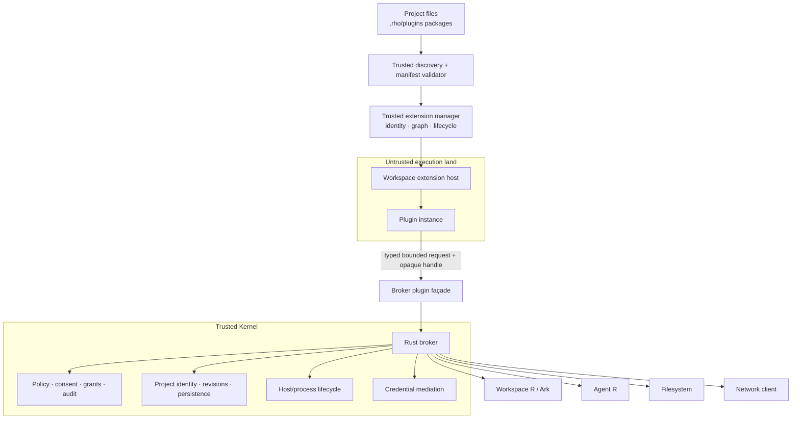
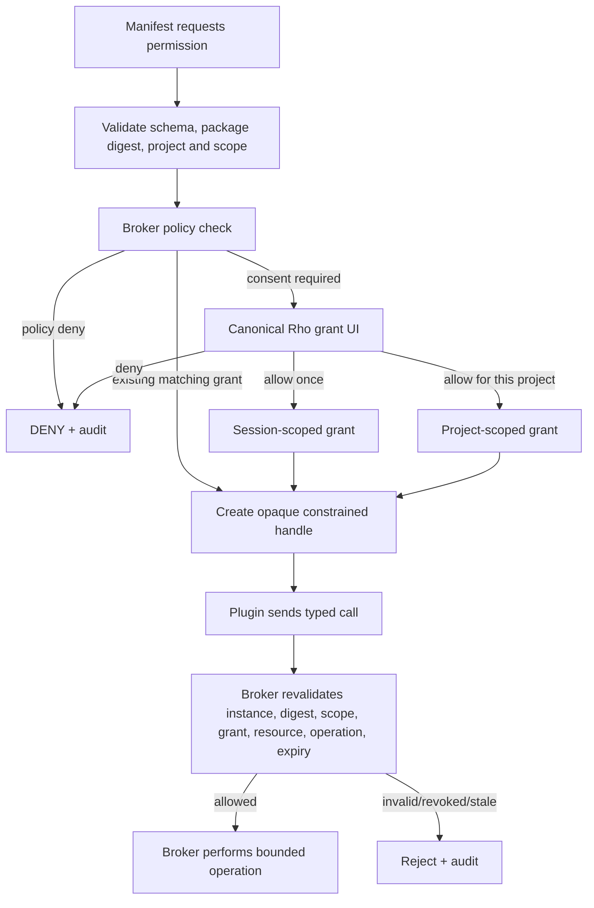

# Phase 2 Workspace Third-Party Plugin Runtime Design

Status: active; P2-0 authorized 2026-08-19; owner explicitly authorized a
bounded P2-0/P2-1/P2-2/P2-3/P2-4 pure-contract review-remediation slice on
2026-08-19; executable-host selection, product wiring, installed-platform
acceptance, and Phase 2 acceptance remain open

Date: 2026-08-14
Issue: [#17](https://github.com/YuLab-SMU/Rho/issues/17)
Scope: explicit project-local workspace plugin discovery, isolated
execution, manifest validation, broker-mediated permission grants, constrained
capability handles, controlled UI contributions, audit, disable/uninstall, and
failure recovery

Change class: D3 safety-critical architecture. The original proposal change was
documentation-only; the active review-remediation slice adds non-routable pure
Rust contracts and tests. Any implementation that executes project-authored code,
changes permissions, or broadens filesystem, network, Workspace R, process, or
credential authority is R3 and requires the full negative, failure-injection,
restart, isolation, and independent-review evidence in
`docs/project/active-development-governance.md`.

Source review:

- `YuLab-SMU/Rho` `main` at
  `533ac12f324b2d9b15653a8cf33351d593050853`;
- [DeepSeek Harness architecture](https://github.com/deepseek-ai/deepseek-harness/blob/master/docs/architecture.md)
  for context, capability seams, and reversible registration;
- [VS Code Extension Host](https://code.visualstudio.com/api/advanced-topics/extension-host)
  for process/runtime separation and lazy activation;
- [VS Code extension runtime security](https://code.visualstudio.com/docs/configure/extensions/extension-runtime-security)
  as evidence that a separate extension host is not automatically least
  privilege when it retains host-equivalent operating-system authority;
- [JupyterLab application plugins](https://jupyterlab.readthedocs.io/en/4.4.x/extension/extension_dev.html)
  for provider/consumer tokens;
- [Kubernetes custom resources](https://kubernetes.io/docs/concepts/extend-kubernetes/api-extension/custom-resources/)
  and [finalizers](https://kubernetes.io/docs/concepts/overview/working-with-objects/finalizers/)
  for control-plane authority and quiesce/finalization semantics;
- [Chrome extension manifests](https://developer.chrome.com/docs/extensions/reference/manifest)
  and [Manifest V3 security guidance](https://developer.chrome.com/docs/extensions/develop/migrate/improve-security)
  for declared, resource-scoped permissions and bundled executable logic;
- [Extism manifests](https://extism.org/docs/concepts/manifest/)
  for host-controlled memory, host, and path constraints around WebAssembly
  plugins.

Cross-reviewed against:

- `AGENTS.md`;
- `docs/project/active-development-governance.md`;
- `docs/project/active-development-roadmap.md`;
- `docs/project/active-document-cross-review.md`;
- `docs/decisions/accepted-ADR-002-kernel-transport.md`;
- `docs/decisions/accepted-ADR-003-agent-transport.md`;
- `docs/architecture/implemented-aisdk-family-integration.md`;
- `docs/implementation/implemented-wp4-project-skills-interface.md`;
- `docs/design/proposed-2026-07-26-public-workbench-protocol-cli-mcp-design.md`;
- `docs/design/implemented-agent-file-editing-design.md`;
- `docs/plans/proposed-2026-08-10-ai-capability-gap-closure-plan.md`;
- `docs/design/active-2026-08-19-plugin-runtime-phase-2-5-agent-authored-evolution-design.md`;
- `CODE_SIGNING_POLICY.md`, `PRIVACY.md`, and `SECURITY.md`.

Repository integration note: the original proposal and its separate Phase 2.5
companion were independently reviewable documentation changes. After activation,
the central cross-review matrix owns their implementation status and dependency
boundaries. The current remediation remains source-only and non-routable.

Implementation entry rule: Phase 2 product code cannot begin until the Phase 1
internal plugin runtime has accepted capability identifiers, scope generation,
transactional activation, reversible effects, and transport-safe host façades.
That prerequisite is logical, not a reason to stack this pull request on the
Phase 1 branch. Each Phase 2 work package requires separate explicit
authorization and a stop/review checkpoint.

## Summary

Phase 2 opens a deliberately narrow path for **project-local workspace
plugins** without giving project code the authority of Rho, Tauri, Agent R,
Workspace R, or the operating-system user.

In this design, “workspace plugin” describes the user-facing extension category.
Security ownership is always the canonical `project_id`. The plugin package is
discovered from the project root; Workspace R is a separate broker-managed child
runtime and never becomes the filesystem, package, or permission owner.

The design separates three concepts:

1. **Capability contribution** — what a plugin adds, such as a tool, source,
   Skill pack, command, or viewer;
2. **Permission request** — what privileged operation the plugin asks the Rust
   broker to perform, constrained to an exact project, resource, operation, and
   lifetime;
3. **Authority** — the broker-owned decision and opaque handle that may deny,
   prompt, grant, revalidate, audit, and revoke the operation.

The governing rule is:

> A manifest describes requested capabilities and permissions. It never grants
> authority by itself.

Third-party code runs outside the Trusted Kernel. It receives only typed,
bounded messages and host functions. The initial execution profiles must not
include a Node/Tauri/native runtime with ambient filesystem, network, process,
or credential access. The broker remains the security reference monitor for
every privileged call.

Phase 2 does not create a marketplace. Distribution, publisher verification,
package signing policy, catalog updates, global installation, and automatic
updates remain Phase 3 concerns.

Phase 2 also does not authorize an Agent to create, repair, enable, or retire
executable plugins. That capability-growth loop is owned by the companion
Phase 2.5 proposal. Phase 2 provides its prerequisite untrusted-code host,
digest-bound identity, candidate replacement, permission, and revocation
semantics; Phase 2.5 must preserve them rather than introducing a privileged
"self-modification" path.

## Preconditions From Phase 1

Phase 2 assumes the following have been accepted, not merely drafted:

- capability IDs and contract versions are explicit;
- `provides`, `requires`, and `optional` dependencies validate before
  activation;
- application/project/Workspace R/Agent scope identity and generation are
  explicit;
- activation is transactional and all registration effects are reversible;
- project replacement preserves the old active scope when candidate activation
  fails;
- no plugin contract requires raw Rust, Tauri, Node, R environment, socket,
  SQLite, process, credential, or root DOM objects;
- privileged operations already enter through narrow host/broker façades.

If implementation reveals that Phase 1 violates one of these requirements,
stop and amend/review the Phase 1 contract before building an external host.

## Goals

Phase 2 will define and, after separate authorization, allow Rho to implement:

- explicit project-local workspace plugin discovery under one broker-normalized project
  root;
- a bounded, versioned, fail-closed manifest schema;
- immutable package digest as part of plugin instance identity;
- user-visible enablement; opening a project never auto-executes newly
  discovered plugin code;
- an isolated extension host with no inherited model credentials or raw host
  bridge;
- controlled runtime kinds suitable for deny-by-default execution;
- capability and permission namespaces that cannot be confused;
- broker-owned, resource-scoped grants and opaque capability handles;
- canonical permission UI rendered only by the trusted Rho shell;
- per-call broker revalidation of identity, scope, resource, operation, expiry,
  and current grant state;
- controlled tools, sources, Skill packs, commands, viewers, and panels;
- project-scoped plugin storage with quotas, if an authorized package proves it
  is necessary;
- quiesce, disable, uninstall, crash, hang, restart, upgrade, and revocation
  behavior;
- two-project isolation and a complete adversarial acceptance matrix;
- an API shape that can support a later WebAssembly/WASI implementation without
  changing authority semantics.

## Non-Goals

Phase 2 does not authorize:

- a public marketplace, catalog, publisher ranking, recommendations, ratings,
  payment, or discovery service;
- final package signing, notarization, publisher identity, transparency log, or
  update policy;
- global/user-wide plugins shared implicitly across projects;
- auto-enabling executable plugins because files exist in a project;
- remote-hosted executable code, runtime code download, `eval`, or fetched
  scripts/commands;
- native dynamic libraries, arbitrary executables, Node extensions, npm
  postinstall scripts, R package startup hooks, Python environments, or shell
  entry points;
- ambient filesystem, network, process, clipboard, credential, Workspace R, or
  Agent R access;
- raw secret bytes by default;
- direct `process.spawn`, shell, unrestricted R evaluation, arbitrary project
  writes, or package installation in the initial permission set;
- direct Tauri `invoke`, broker socket, internal framed protocol, SQLite, or
  operating-system credential-store access;
- arbitrary DOM mutation, global CSS, trusted-dialog replacement, or shell
  store monkey patching;
- plugin-defined approval or grant UI;
- automatic permission escalation after upgrade;
- Agent-authored executable plugin generation, self-repair, autonomous
  activation, lineage standing policies, trace replay, or capability pruning;
- treating a package signature as permission or safety proof;
- merging Skills and executable Plugins into one trust category;
- weakening current project Skills, file-edit review, MCP, or Agent approval
  contracts;
- describing an isolated process as a security sandbox unless its ambient
  operating-system authority is also constrained and tested.

## Threat Model

Phase 2 treats plugin packages and project-controlled plugin configuration as
potentially malicious.

### Adversaries And Failure Sources

- a project intentionally containing a malicious plugin;
- a legitimate plugin with a compromised dependency or update;
- a plugin attempting prompt injection through bundled Skills or UI text;
- malformed or oversized manifests and package files;
- a plugin that crashes, panics, hangs, loops, leaks memory, or floods messages;
- a plugin attempting filesystem path traversal or symlink escape;
- a plugin exploiting host wildcards, redirects, DNS ambiguity, alternate
  schemes, or methods to bypass network constraints;
- a plugin replaying a stale handle after project switch, Workspace R restart,
  permission revocation, disable, uninstall, or package upgrade;
- one workspace reusing another workspace's handle, storage, grant, or result;
- a plugin attempting credential exfiltration through network, logs, errors,
  model context, Artifact payloads, or generated filenames;
- a plugin spoofing trusted Rho approval or security UI;
- a plugin returning oversized, recursive, malformed, or deceptive data;
- a plugin attempting to download or interpret new executable logic after
  review;
- host crash or power loss during enable, grant, call, disable, uninstall, or
  upgrade.

### Security Properties

The implementation must prove:

- deny by default;
- no ambient host authority;
- explicit user or policy grant for each privileged permission class;
- least privilege and resource constraints;
- complete binding to plugin instance, package digest, project/scope, and
  operation;
- revocability and bounded lifetime;
- broker revalidation on every privileged call;
- canonical trusted UI for consent;
- project isolation;
- bounded inputs, outputs, time, memory, and concurrency;
- truthful failure and recovery;
- immutable executable logic for an enabled package digest;
- auditable decisions without leaking sensitive payloads.

## Authority Boundary



No edge may bypass the broker façade from an untrusted plugin to Workspace R,
Agent R, Tauri, filesystem, network, process APIs, credentials, or durable
storage.

## Workspace-Local Discovery

Initial discovery root:

```text
<project-root>/.rho/plugins/
```

Each plugin is one directory:

```text
<project-root>/.rho/plugins/<directory>/rho-plugin.json
```

Discovery is broker-owned and uses the canonical normalized project root.

Rules:

- no alternate roots in Phase 2;
- no recursive search outside `.rho/plugins`;
- the `.rho/plugins` root, plugin directory, manifest, entry, Skill files, and
  static assets must not be symlinks or junction escapes;
- every referenced path is relative, normalized, and contained in the plugin
  directory;
- absolute paths, parent traversal, device paths, ambiguous encodings, and
  case-folding collisions are rejected;
- manifest bytes, file count, individual file bytes, aggregate package bytes,
  path length, and nesting depth are bounded before expensive parsing;
- hidden executable entry points not declared by the manifest are ignored and
  never loaded;
- the host computes the package digest from a canonical file inventory; the
  plugin does not declare its own trusted digest;
- executable logic for one enabled digest is immutable; network responses are
  data and cannot be evaluated as replacement code;
- project open discovers metadata only. A newly discovered or changed executable
  plugin remains disabled pending explicit review/enablement.

The existing `.rho/skills` directory and trust model remain separate. A plugin
may bundle a bounded Skill pack under its own package, but that content is still
labeled by origin and does not gain executable authority.

## Plugin Identity

A running plugin instance is identified by:

```text
plugin ID
plugin version
canonical package digest
runtime kind
project_id
scope_id
activation generation
instance nonce
```

A package update that changes any executable or declared resource changes the
digest, creates a new instance identity, and invalidates prior grants and
handles unless a future policy explicitly proves a safe carry-forward rule.
Phase 2 uses no automatic carry-forward.

Plugin ID alone is not sufficient for authorization or audit.

## Manifest V1

Illustrative schema:

```json
{
  "schemaVersion": 1,
  "id": "org.example.rho-bioconductor",
  "name": "Rho Bioconductor",
  "version": "0.1.0",
  "apiVersion": "^1.0",

  "runtime": {
    "kind": "web-worker",
    "entry": "dist/plugin.js",
    "scope": "project"
  },

  "activation": [
    "onCapability:tool.bio.enrichment"
  ],

  "provides": [
    {
      "capability": "tool.bio.enrichment",
      "version": "1.0"
    },
    {
      "capability": "source.bioc.annotation",
      "version": "1.0"
    },
    {
      "capability": "ui.viewer.enrichment",
      "version": "1.0"
    },
    {
      "capability": "skill.bioconductor",
      "version": "1.0",
      "path": "skills/"
    }
  ],

  "requires": [
    {
      "capability": "service.workspace-summary",
      "version": "^1.0"
    }
  ],

  "optional": [
    {
      "capability": "ui.viewer.table",
      "version": "^1.0"
    }
  ],

  "permissions": [
    {
      "name": "project.fs.read",
      "paths": ["data/**/*.csv"]
    },
    {
      "name": "workspace.r.inspect",
      "operations": ["metadata", "preview"],
      "maxBytes": 262144
    },
    {
      "name": "network.fetch",
      "schemes": ["https"],
      "hosts": ["bioconductor.org", "*.bioconductor.org"],
      "methods": ["GET"],
      "maxResponseBytes": 1048576
    }
  ],

  "ui": {
    "commands": ["bio.runEnrichment"],
    "viewers": ["bio.enrichmentResult"]
  }
}
```

The final schema is authorized separately. The durable invariants are:

- manifest and package identity are validated before code runs;
- capabilities and permissions use different namespaces;
- `provides` never grants authority;
- `permissions` are requests subject to policy and consent;
- runtime kind is explicit;
- project is the only executable scope in the initial version;
- compatibility is explicit and fail-closed;
- code is bundled with the reviewed package digest;
- unsupported and unknown security-relevant fields fail validation rather than
  being ignored silently.

Publisher/signature fields are intentionally not frozen in Phase 2. The host
still computes and records a digest. Phase 3 may bind that digest to publisher
identity and distribution provenance. A future signature proves package
integrity/source identity; it does not bypass permissions.

## Capability And Permission Taxonomy

### Initial Third-Party Capabilities

| Namespace | Initial status | Rules |
| --- | --- | --- |
| `tool.*` | allowed | schema and output bounded; execution uses broker façade |
| `source.*` | allowed | read-only bounded data/context source |
| `skill.*` | allowed | declarative content only; origin remains untrusted |
| `ui.command.*` | allowed | trusted shell registers and renders command |
| `ui.viewer.*` | allowed | controlled renderer contract or sandboxed surface |
| `ui.panel.*` | conditional | only named shell slots; no trusted-dialog replacement |
| `service.*` | internal dependency token | transport-safe interface only |
| `provider.model.*` | deferred | credential/network complexity requires later contract |
| `provider.runtime.*` | deferred | process/network/remote lifecycle requires later contract |
| `broker.*`, `policy.*`, `approval.*` | forbidden | Trusted Kernel cannot be replaced by a normal plugin |
| `credential.raw.*` | forbidden | raw secret distribution is not a contribution |

### Initial Permission Set

The first permission prototype is intentionally read-only:

| Permission | Constraints |
| --- | --- |
| `project.fs.read` | canonical project root, allowed relative glob, file type, byte budget |
| `workspace.r.inspect` | exact operation, object/reference ownership, revision, row/column/depth/byte bounds |
| `network.fetch` | HTTPS, exact/wildcard host semantics, method, redirect policy, request/response byte and time limits |

Deferred from the initial Phase 2 permission set:

- `project.fs.write`;
- unrestricted `workspace.r.invoke` or arbitrary evaluation;
- `process.spawn` or shell;
- package installation;
- raw `credential.read`;
- unrestricted clipboard;
- arbitrary external URI schemes.

Those operations require separate evidence and authorization. Existing Agent
Act/file-edit/environment mutation lanes are not reused implicitly.

## Permission Request And Grant Flow



Rules:

- the trusted shell owns wording, grouping, warning level, and actions;
- plugin-controlled text may describe purpose but is visually separated and
  cannot impersonate the system consequence;
- the user sees plugin name, version, digest change status, project, permission,
  exact resource constraints, duration, and revocation path;
- permissions are denied by default;
- grants may be `allow once` or bounded to the current project;
- no organization-wide or all-project grant in initial Phase 2;
- changing package digest, permission constraints, or runtime kind requires new
  consent;
- denying one optional permission may disable only the dependent feature if the
  manifest and capability graph can remain valid; required permission denial
  keeps the plugin disabled;
- UI success is not authority until the broker durably commits the grant.

## Opaque Constrained Handles

A plugin receives an opaque token, never a mutable in-process permission object.

Illustrative public shape:

```ts
type CapabilityHandle = {
  readonly id: string;
  readonly permission: string;
  readonly scopeId: string;
  readonly expiresAt?: number;
};
```

Authoritative broker state includes:

```rust
struct PluginGrant {
    handle_digest: SecretDigest,
    plugin_instance_id: PluginInstanceId,
    plugin_id: PluginId,
    plugin_version: PluginVersion,
    package_digest: PackageDigest,
    project_id: ProjectId,
    scope_id: ScopeId,
    activation_generation: u64,
    permission: PermissionKind,
    constraints: PermissionConstraints,
    grant_source: GrantSource,
    created_at: Timestamp,
    expires_at: Option<Timestamp>,
    revoked_at: Option<Timestamp>,
}
```

Every privileged call revalidates:

- opaque handle authenticity without logging the token;
- exact plugin instance and package digest;
- active project/scope/generation;
- permission kind;
- canonical resource after normalization and symlink checks;
- operation/method;
- current project and Workspace R revisions where relevant;
- byte/time/concurrency budget;
- grant expiry and revocation;
- host process/session identity.

A valid handle in project A is invalid in project B. A valid handle before
Workspace R restart, plugin crash, disable, uninstall, upgrade, or permission
revoke cannot be replayed afterward unless the broker explicitly created a new
matching handle.

## Execution Host

### Security Requirement

A separate process or worker is useful for stability, but separation alone is
not a sandbox. An initial runtime kind is acceptable only if the implementation
proves the plugin cannot use undeclared host APIs to reach files, network,
processes, credentials, Tauri, or internal broker transport.

### Recommended Runtime Profiles

Phase 2 should prototype two explicit profiles rather than a general native
runtime:

#### `web-worker`

Use for control logic and safe UI-adjacent plugins:

- browser Web Worker semantics;
- no Node built-ins;
- no Tauri invoke bridge;
- restrictive content security policy;
- network unavailable except through broker host functions;
- typed message protocol only;
- worker termination on quota, crash, disable, or scope teardown.

The exact Tauri/WebView configuration must be security-tested; merely naming a
Web Worker is insufficient.

#### `wasm`

Use for bounded backend computation when the prototype needs executable code
outside browser JavaScript:

- WebAssembly instance hosted by Rho or an embedded runtime;
- WASI disabled by default;
- only explicit Rho host functions imported;
- memory, call time, response bytes, variable/storage bytes, and allowed hosts
  or paths bounded by the host;
- no raw system call, file, network, process, or credential access;
- instance destruction revokes its imported capability handles.

Wasm/Extism is an implementation candidate, not a product requirement tied to
one vendor. The stable contract is typed messages plus host-granted
capabilities.

### Forbidden Runtime Kinds In Initial Phase 2

- Node.js with ordinary OS permissions;
- arbitrary executable child process;
- native dynamic library;
- R/Python/shell entry point;
- Tauri plugin;
- code fetched after enablement;
- package-manager install hooks.

If no candidate host can prove deny-by-default behavior on every supported
platform, Phase 2 must reduce scope to declarative contributions and Skills
rather than ship ambient-authority executable plugins.

## Host Protocol

The host protocol is separately versioned from the application and public
Workbench Protocol. It uses bounded typed messages such as:

```text
hello / negotiated API version
activate / activation result
register contribution / registration result
grant request / opaque handle
capability call / bounded result
cancel
quiesce / quiesced
dispose / disposed
heartbeat
host diagnostic
```

Requirements:

- length/byte limits before deserialization;
- request and instance IDs generated or validated by the host;
- no plugin-supplied project or Workspace authority accepted without binding to
  the active host session;
- stable error codes and retryability;
- cancellation and deadline on every call;
- no stdout/stderr parsing as protocol;
- heartbeat/liveness supervision;
- no model credentials or unrelated environment variables in the host;
- malformed frame closes or quarantines the plugin instance without affecting
  the broker;
- late responses from an old generation are rejected;
- host protocol types do not expose internal coordinator/store structs as a
  public ABI.

## Controlled UI Contributions

Third-party plugins may not modify Rho's root DOM or trusted security surfaces.
Initial contribution points are:

```text
ui.command.*
ui.viewer.*
ui.panel.*      only approved named slots
```

Rules:

- the trusted shell owns placement, focus, keyboard, accessibility, theme, and
  lifecycle;
- command metadata is declarative and bounded;
- viewer input is a typed, bounded Artifact/result projection;
- plugin-rendered interactive content runs in a sandboxed surface or a narrow
  host-rendered component model;
- plugin content is visually identified and cannot imitate approval, credential,
  update, privacy, security, or destructive system dialogs;
- no global CSS, arbitrary HTML injection, direct Monaco internals, or hidden
  Tauri bridge;
- every UI registration is a reversible effect;
- closing the project or disabling the plugin removes its commands, viewers,
  panels, event listeners, timers, and retained payloads.

The exact UI DSL versus sandboxed frame choice is an authorization decision.
The security properties above are not optional.

## Skill Packs

A plugin may bundle Skills, but the two trust layers remain distinct:

- Skill files are declarative, bounded, and labeled with plugin/package origin;
- Skill content does not execute;
- Skill instructions cannot override system, developer, user, broker policy,
  or grant decisions;
- a Skill may refer to capabilities provided by its plugin;
- disabling the plugin removes the Skill pack from future Agent context;
- historical Agent evidence retains truthful origin/digest references as
  required by the owning conversation/evidence contract;
- plugin Skills cannot load arbitrary project files or secrets beyond the
  existing Skills rules.

## Plugin Storage

Generic plugin persistence is deferred until a Phase 2 package demonstrates a
necessary use case. If authorized, it must be:

- broker-owned, not direct SQLite;
- keyed by `project_id + plugin_id + package_digest` or an explicitly reviewed
  upgrade identity;
- quota-limited by bytes, keys, value size, and write rate;
- serialized through a bounded schema;
- excluded from model context by default;
- deleted or retained according to an explicit disable/uninstall policy;
- unavailable across projects without a separate export/import contract;
- transactional and recoverable under crash/failure injection.

A plugin may not create arbitrary tables or inspect another plugin's state.

## Lifecycle, Disable, And Uninstall

### States

| State | Meaning |
| --- | --- |
| `discovered` | metadata known; executable code has not run |
| `blocked` | manifest, compatibility, trust, policy, or package validation failed |
| `disabled` | valid package, not permitted to execute |
| `resolving` | capability and permission prerequisites are being evaluated |
| `activating` | isolated instance is starting transactionally |
| `active` | contributions committed and calls admitted |
| `quiescing` | new calls denied; in-flight calls drain/cancel |
| `disposing` | effects, handles, host instance, and storage leases are closing |
| `stopped` | no code or capability is routable |
| `crashed` | host/instance terminated unexpectedly; handles revoked |
| `update-pending` | new digest discovered; old instance remains active or is stopped according to policy |

### Disable

1. mark the instance `quiescing` in the broker;
2. reject new calls and registrations;
3. revoke all opaque handles;
4. cancel or bound-drain in-flight calls;
5. dispose contributions and subscriptions in reverse dependency order;
6. terminate the worker/Wasm instance;
7. reconcile scoped storage leases;
8. mark `stopped` only after routing is removed;
9. surface cleanup failures and recovery actions truthfully.

### Uninstall

Uninstall is disable plus package and optional storage removal. The trusted
manager, not the plugin, performs removal. A package is not deleted while code
is still routable. Failure enters a visible finalization/recovery state; it is
not reported as complete.

### Crash And Hang

- host crash revokes all instance handles immediately;
- one plugin crash must not terminate the broker, Workspace R, Agent R, or other
  project plugin instances;
- restart is bounded and never replays a privileged side effect automatically;
- repeated crash/hang disables the plugin and requires explicit user action;
- heartbeat timeout terminates the instance;
- late messages from a killed generation are rejected;
- partial activation rolls back all registered effects;
- durable calls use the owning operation's idempotency/recovery contract rather
  than plugin memory.

## Upgrade And Compatibility

Phase 2 supports local package replacement, not a marketplace updater.

Rules:

- `apiVersion` uses explicit compatibility ranges and fail-closed major
  versions;
- capability contracts carry their own major versions;
- package digest change creates a new identity;
- no live code patch or in-place module replacement;
- upgrade uses candidate validation and activation, then quiesces the old
  instance only after the candidate is ready;
- permission grants do not carry forward automatically to a new digest;
- plugin storage migration, if ever supported, is an explicit broker-mediated
  transaction with backup/recovery fixtures;
- failure leaves the old accepted version active when safe, or both versions
  stopped with truthful diagnostics when authority/recovery cannot be proved;
- downgrade follows the same validation and does not guess storage
  compatibility.

A later Phase 2.5 standing policy may make a broker-owned decision for a new
digest without interrupting the user when the candidate remains inside an
exact pre-authorized envelope. That is not grant inheritance: the broker must
materialize a new grant bound to the candidate digest, exact standing-policy
revision, evaluation evidence, project, scope, generation, operation, and
constraints, then issue fresh handles. Phase 2 itself authorizes no such
policy and continues to require fresh consent for every changed digest.

Phase 3 may add signatures, publishers, catalogs, blocklists, and update
channels. Those supply-chain controls do not replace runtime least privilege.

## Audit And Privacy

The broker records bounded metadata for:

- discovery and manifest/package validation;
- enable, disable, uninstall, and upgrade decisions;
- package identity and digest;
- capability graph resolution;
- permission request, deny, grant, expiry, and revoke;
- privileged call kind, constrained resource class, outcome, duration, and
  stable error;
- host start, crash, hang, kill, restart, and finalization;
- cross-workspace, stale-handle, and policy violations.

Audit excludes:

- opaque handle/token bytes;
- raw credentials;
- full model prompts/responses unless the existing Agent evidence contract owns
  them;
- unbounded file, network, or R object content;
- secrets embedded in errors, URLs, headers, environment variables, or plugin
  logs.

Plugin logs are untrusted data, bounded, labeled, redacted, and rate-limited.
They do not become trusted system diagnostics simply because the plugin emits
JSON.

## Failure And Recovery Semantics

| Failure/attack | Required behavior |
| --- | --- |
| malformed/oversized manifest | reject before code execution |
| unsupported schema/runtime/API | block with stable diagnostic |
| path traversal/device path | reject after canonicalization |
| symlink/junction escape | reject at discovery and again at call boundary |
| package changes after validation | digest mismatch; stop/deny execution |
| missing dependency/cycle | block before activation |
| activation halfway failure | reverse all effects; revoke handles; terminate instance |
| plugin crash | revoke instance; keep broker/Workspace R/Agent R alive |
| plugin hangs | deadline/heartbeat kill; no false success |
| project switch during call | old generation call cancelled or rejected; no new-project reuse |
| project close during call | revoke handles; bound cancellation/finalization |
| Workspace R restart | stale R-inspect handle rejected |
| permission revoke during call | operation follows exact broker cancellation/commit contract; subsequent calls rejected |
| `../` or encoded path escape | reject canonical resource |
| symlink introduced after grant | re-resolve at call time; reject escape |
| wildcard/redirect network bypass | broker validates final scheme/host/redirect chain |
| plugin identity mismatch | reject and audit |
| stale handle | reject and audit |
| cross-workspace handle reuse | reject and audit |
| credential exfiltration attempt | no raw secret; deny unauthorized destination/call |
| oversized result/message/log | truncate or reject with explicit metadata; never unbounded transport |
| remote code fetch/eval | runtime/CSP/host contract rejects execution |
| spoofed approval UI | plugin cannot render trusted grant surface |
| host/broker crash during grant | no grant until durable commit; recover pending state truthfully |
| crash during uninstall | resume finalization or report blocked cleanup; do not claim removal |

## Verification Matrix For Future Implementation

The original documentation-only proposal claimed no tests. The authorized
pure-contract remediation now records its exact automated evidence in the
remediation section above; future executable Phase 2 packages must still add
deterministic coverage for at least the following.

### Manifest And Package Tests

- valid minimal package;
- unknown required/security field;
- invalid ID/version/API range;
- oversized manifest, file, package, and file count;
- absolute, parent, device, alternate-separator, case-collision, and malformed
  UTF-8 paths;
- symlink/junction at `.rho`, `plugins`, package, manifest, entry, Skill, and
  asset levels;
- digest determinism and time-of-check/time-of-use modification;
- undeclared entry or remote code attempt;
- two packages declaring the same ID/capability;
- dependency missing, optional, incompatible, and cyclic.

### Host Isolation Tests

- no Node/native/Tauri APIs in the allowed runtime;
- no inherited model/provider credentials or unrelated environment variables;
- direct filesystem, network, process, clipboard, credential, and broker socket
  attempts fail;
- allowed broker host function succeeds only with valid handle;
- malformed frame, oversized message, crash, panic, infinite loop, memory flood,
  log flood, and heartbeat timeout;
- one plugin failure does not affect another plugin, broker, Workspace R, Agent
  R, or desktop interaction;
- restart does not replay a side effect.

### Permission And Handle Tests

- deny by default;
- allow once and project grant;
- optional permission denial;
- changed digest/constraints invalidates grant;
- path glob, canonical root, file type, and byte limits;
- path traversal and symlink introduced after grant;
- HTTPS/host/method/redirect/response-size network limits;
- Workspace R object ownership, revision, operation, and preview bounds;
- expired, revoked, stale-generation, wrong-plugin, wrong-digest, wrong-project,
  wrong-workspace, wrong-host-session, and duplicate handles;
- permission revoke during queued and executing call;
- audit redaction and no token leakage.

### Lifecycle And Recovery Tests

- discovery does not execute;
- explicit enable and transactional activation;
- partial activation rollback;
- disable with idle and in-flight calls;
- project close and A/B rapid switching;
- Workspace R restart;
- crash/hang/repeated-crash disable;
- uninstall success, cleanup failure, crash/reopen, and resume;
- candidate upgrade success and failure while old version remains safe;
- package digest changes during activation;
- no commands/viewers/Skills/storage/handles remain routable after teardown.

### UI And Trust Tests

- plugin UI visibly distinguished from trusted shell;
- plugin cannot replace or overlay approval, credential, update, privacy,
  security, or destructive dialogs;
- controlled command/viewer/panel registration and disposal;
- sandbox and content security policy negative probes;
- keyboard/focus/accessibility behavior;
- browser/mock parity where the product uses deterministic preview fixtures;
- malicious labels/HTML/URLs do not escape rendering or spoof consequences.

### Installed-App And Platform Tests

Because runtime isolation is platform-sensitive, the final Phase 2 candidate
requires representative installed-app acceptance on every supported platform.
Source-only or browser-only evidence cannot prove that packaged Tauri/WebView,
filesystem, process, credential, or OS sandbox behavior is safe.

## Work Packages And Mandatory Stop Points

Each package requires separate authorization. No later package activates
implicitly.

### 2026-08-19 Independent-Review Remediation Authorization

Following the independent review of the initial local implementation, the
owner explicitly authorized corrective work across P2-0, P2-1, P2-2, P2-3,
and P2-4 as one bounded pure-Rust contract slice. This authorization is limited
to closing the recorded review findings in manifest/discovery validation, host
frame identity, constrained grant revalidation, contribution/lifecycle project
isolation, and their deterministic regression tests.

This slice does not select or ship a Web Worker/Wasm host, execute project code,
perform a privileged operation, persist a grant, expose UI, or satisfy the
installed-platform stop gates. The implementation must remain non-routable
outside tests. Completion of this remediation slice requires focused tests,
crate tests, clippy with warnings denied, workspace build, rustfmt, diff check,
and a second contract review. It does not advance Phase 2 to implemented or
accepted status.

Version decision: this non-routable internal contract remediation does not bump
the application or R packages and does not add a `NEWS.md` entry. It cannot be
distributed as third-party plugin support; selecting and wiring a real host is
the named future user-visible candidate/version gate.

Remediation evidence recorded 2026-08-19:

- the independent-review findings for authorization state, nested manifest
  validation, declared-path/root safety, host instance identity, opaque grant
  authenticity and per-call constraints, project/plugin/generation/host-bound
  contributions, project-isolated lifecycle/replacement, and the duplicate-ID
  fixture are resolved;
- `cargo test -p rho-extension-runtime` passes 153 tests;
- `cargo clippy -p rho-extension-runtime --all-targets -- -D warnings` passes;
- `cargo fmt -p rho-extension-runtime -- --check` passes;
- `cargo build --workspace` and `git diff --check` pass;
- a second contract review found no unresolved blocking issue in this bounded
  non-routable slice;
- repository-wide `cargo fmt --all -- --check` remains outside this slice
  because it reports only preserved concurrent `rho-store`/desktop changes.

The real runtime profile, privileged-operation implementations, persistence,
UI, installed-platform evidence, and Phase 2 acceptance remain open.

### P2-0: Threat Model, Manifest, And Disabled Discovery

Deliver:

- exact manifest/package schema and bounds;
- broker-owned workspace discovery;
- digest computation and compatibility validation;
- every plugin remains disabled; no executable host exists.

Stop gate:

- path/symlink/size/digest/compatibility adversarial tests pass;
- opening an unfamiliar project executes no plugin code;
- central cross-review and privacy/security review are complete.

### P2-1: Isolated Host With No Privileged Capabilities

Deliver:

- one selected runtime profile (`web-worker` or `wasm`);
- versioned typed host protocol;
- activation, heartbeat, cancellation, crash, hang, and disposal;
- no filesystem, network, Workspace R, process, credential, or Tauri capability.

Stop gate:

- ambient-authority negative probes pass in source and installed application;
- crash/hang cannot affect broker, Workspace R, Agent R, or another project;
- no product capability contribution is accepted yet beyond a synthetic
  bounded echo/diagnostic fixture.

### P2-2: Read-Only Broker Handles

Deliver:

- `project.fs.read`;
- `workspace.r.inspect`;
- `network.fetch`;
- canonical trusted grant UI;
- opaque handles, revocation, and bounded audit.

Stop gate:

- path, symlink, host, redirect, stale, cross-project, cross-workspace,
  wrong-digest, revoke-during-call, credential, and oversized-result tests pass;
- grants are project-scoped and changed digest requires fresh consent;
- independent security review finds no direct privileged bridge.

### P2-3: Controlled Contributions

Deliver:

- a small third-party tool/source/Skill fixture;
- one command or viewer contribution through the trusted shell;
- no provider.model/runtime, process, write, or arbitrary R permission.

Stop gate:

- all registrations are reversible;
- plugin UI cannot spoof trusted UI;
- Agent tool use remains inside existing broker/approval contracts;
- projects A and B have separate instances, grants, storage, and UI state.

### P2-4: Disable, Uninstall, Restart, And Upgrade

Deliver:

- quiesce/finalization;
- disable/uninstall;
- crash/reopen recovery;
- local package replacement and candidate rollback;
- complete bounded audit and user-facing diagnostics.

Stop gate:

- no stale capability remains after teardown;
- crash at every transition recovers truthfully;
- old accepted version remains active only when safety and compatibility are
  proven;
- all installed-platform acceptance and independent review are complete.

## Definition Of Done

Phase 2 may be accepted only when:

- newly discovered project plugins are disabled until explicit enablement;
- untrusted code has no ambient filesystem, network, process, credential,
  Workspace R, Agent R, Tauri, database, or trusted UI authority;
- capabilities and permissions are distinct in schema, API, UI, and policy;
- manifest requests never self-authorize;
- every privileged operation uses a broker-owned constrained handle and is
  revalidated per call;
- grants bind to package digest, project, scope, generation, operation, and
  resource constraints and can be revoked;
- path/host/revision/cross-workspace/stale-handle/credential/oversize attacks
  fail under automated and installed-app testing;
- plugin crash/hang/disable/uninstall/upgrade does not corrupt broker,
  Workspace R, Agent R, project selection, or another plugin;
- all contributions and handles disappear after scope teardown;
- trusted permission UI cannot be replaced or spoofed by plugin code;
- executable logic is fixed by the enabled package digest and cannot be fetched
  remotely;
- API/version, storage, audit, privacy, version/NEWS, and release impacts are
  recorded truthfully;
- the central cross-review matrix is reconciled before implementation status is
  advanced;
- marketplace/distribution claims remain deferred to Phase 3.

## Open Decisions For Authorization

The first implementation-authorization review must close or explicitly defer:

1. the exact initial runtime profile: restricted Web Worker, WebAssembly host,
   or a smaller declarative-only subset if neither is proven safe;
2. whether one host process/worker is created per project, per plugin, or as a
   broker-supervised pool without weakening isolation;
3. exact manifest bounds and canonical package digest algorithm/file ordering;
4. the initial capability and activation-event list;
5. exact path glob, host wildcard, redirect, DNS/IP, and Workspace R inspect
   semantics;
6. grant persistence, expiry, revocation, and user-facing wording;
7. whether plugin storage is needed at all in Phase 2;
8. controlled UI rendering model: host-rendered descriptors versus sandboxed
   frame;
9. host protocol versioning and compatibility-fixture ownership;
10. platform-specific sandbox requirements and installed-app probes;
11. whether Phase 2 permits only local manually placed packages or also an
    explicit developer install command before Phase 3;
12. the exact evidence required before adding any write, process, arbitrary R,
    model-provider, runtime-provider, or credential-use permission.

## Version, NEWS, And Release Impact

This design PR changes no runtime behavior, application version, R package
version, `NEWS.md`, installer, update manifest, or release decision.

Any future Phase 2 implementation is user-visible and security-sensitive. It
requires synchronized version/NEWS decisions and an exact candidate with
installed-app acceptance. A source merge alone is not authority to distribute
executable third-party plugin support publicly.

## Phase 3 Deferrals

The following remain a separate distribution/ecosystem design:

- package archive format and reproducible build requirements;
- publisher identity and verification;
- signatures, transparency/provenance, and revocation/blocklists;
- catalog/marketplace, search, ranking, moderation, and malicious-package
  response;
- install/update/downgrade channels;
- global/user-level plugin inventory;
- API deprecation and long-term compatibility policy;
- developer tooling, scaffolding, test harness, documentation portal, and AI
  assistance for ordinary developer-authored ecosystem packages;
- organization allowlists and enterprise policy;
- public ecosystem governance.

Phase 3 may reuse the package digest and capability/permission contracts, but it
must not reinterpret a signed or catalog-listed plugin as trusted to receive
broader runtime authority.

Agent-authored project capability growth is not a marketplace feature and is
therefore not assigned to Phase 3. It remains the separately gated Phase 2.5
workstream. Phase 3 distribution policy and Phase 2.5 evolution policy may
share package provenance primitives, but neither may grant authority on behalf
of the other.
