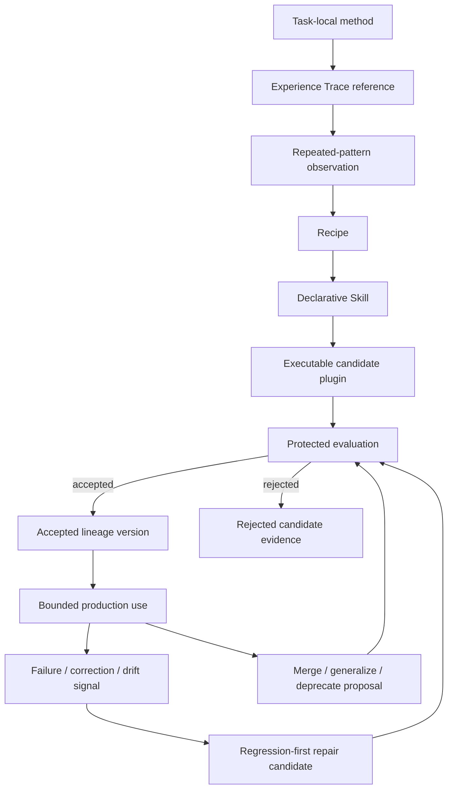

# Phase 2.5 Agent-Authored And Self-Evolving Plugin Design

Status: active design; owner explicitly authorized a bounded pure-contract
review-remediation slice for P2.5-0 through P2.5-6 on 2026-08-19; executable
Phase 2.5 work remains unauthorized until Phase 2 isolation, identity,
permission, grant, candidate-replacement, and recovery contracts are accepted

Date: 2026-08-19
Issue: [#17](https://github.com/YuLab-SMU/Rho/issues/17)
Scope: project-scoped experience distillation, recipe and Skill promotion,
Agent-authored plugin candidates, protected evaluation, plugin lineage,
standing evolution policy, candidate repair and rollback, and capability
gardening

Change class: D3 safety-critical architecture. The current remediation changes
only non-routable pure Rust contract predicates and tests. Any implementation that retains task experience, generates
or executes code, creates a permission decision, mutates a project package,
activates a candidate, or retires a capability is R3 and requires the complete
negative, failure-injection, restart, project-isolation, privacy, and
independent-review evidence in
`docs/project/active-development-governance.md`.

Design origin: the product direction recorded by the project owner on
2026-08-19 is that Rho should eventually let an Agent turn repeated work into
durable capability and improve that capability over time, while keeping the
Rust broker's authority boundary fixed.

Cross-reviewed against:

- `AGENTS.md`;
- `docs/project/active-development-governance.md`;
- `docs/project/active-development-roadmap.md`;
- `docs/project/active-document-cross-review.md`;
- Phase 1 in [PR #75](https://github.com/YuLab-SMU/Rho/pull/75), especially
  capability identity, scope generation, candidate publication, reversible
  effects, quiesce/dispose, and rollback;
- `docs/design/active-2026-08-14-plugin-runtime-phase-2-workspace-third-party-design.md`,
  especially digest-bound identity, isolated execution, constrained handles,
  permission grants, upgrade, audit, and recovery;
- `docs/implementation/implemented-wp4-project-skills-interface.md`;
- `docs/design/implemented-agent-file-editing-design.md`;
- `docs/plans/active-2026-08-06-agent-result-transport-recovery-spec.md`;
- `docs/plans/proposed-2026-08-10-ai-capability-gap-closure-plan.md`;
- `PRIVACY.md`, `SECURITY.md`, and `CODE_SIGNING_POLICY.md`.

Repository integration note: this is a companion to, not an amendment that
silently expands, the Phase 2 third-party runtime. Phase 2 can be reviewed and
implemented without Phase 2.5. Executable Phase 2.5 work cannot start until
the relevant Phase 2 isolation, identity, permission, candidate replacement,
and recovery contracts are accepted. Before any Phase 2.5 implementation, this
proposal must be activated and added to the central cross-review matrix with
one bounded work package and stop point.

## Ownership And Sequencing

Phase 2.5 owns the capability-growth control loop, not the lower-level
authorities it composes:

| Concern | Owning contract | Phase 2.5 boundary |
| --- | --- | --- |
| capability graph, scope generation, effects, candidate CAS, quiesce/dispose | Phase 1 / PR #75 | reuse unchanged; no parallel lifecycle or live-patch path |
| package discovery/digest, isolated host, plugin instance, permission grant/handle, disable/upgrade | Phase 2 companion | every candidate and production call uses these exact identities and gates |
| project Skill discovery and trust | WP4 Project Skills | Recipe/Skill promotion remains declarative and cannot acquire executable authority |
| Agent reasoning, Provider credential use, task/event persistence | existing Agent contracts | builder calls use the admitted Agent lane; plugin host receives no Provider credential |
| reviewed project-file mutation | Agent file-editing contract | builder staging is a separate lane; it cannot silently reuse Accept/apply authority to replace an active package |
| Run, Artifact, and task truth | existing store/result/provenance contracts | traces reference authoritative records; they do not duplicate or reinterpret outcome truth |
| lineage/policy/evaluation persistence | future active Phase 2.5 schema package | no schema or migration is implied by this proposal |
| publisher, signature, catalog, distribution, public update | Phase 3 | lineage/evaluation evidence is not publisher trust or distribution authority |
| Rho first-party source and release | development/release governance | promotion creates a normal reviewed workstream, never a runtime state change |

Sequencing is deliberately asymmetric:

- P2.5-0 may define pure contracts only after the accepted Phase 1 semantics and
  proposed Phase 2 identities have no unresolved conflict;
- P2.5-1 may later explore observation, Recipes, and Skills without executable
  plugin activation, but it cannot change WP4 or Agent evidence authority;
- P2.5-2 requires the accepted Phase 2 package, digest, and hostile-input
  validation contract even though candidates remain in staging;
- P2.5-3 and every later package require the accepted Phase 2 isolated host,
  grant/handle, candidate activation, disable, recovery, and upgrade path;
- no Phase 2.5 package may concurrently redefine a shared plugin identity,
  grant, storage, policy, or lifecycle schema owned by an active Phase 2 package.

Stop and amend both contracts if implementation would need lineage identity to
authorize a call, would let the builder mutate an active package through the
ordinary Agent file-edit lane, or would treat historical task evidence as a new
source of execution or permission truth.

## Summary

Rho's long-term plugin system should do more than let developers add features.
It should let an Agent convert repeated, successful project work into a durable
capability:

> Experience becomes a recipe; a stable recipe becomes a Skill; a proven Skill
> may become an executable plugin candidate; a used plugin accumulates failure
> evidence and may be repaired, generalized, merged, or retired.

The desired loop is:

```text
Observe -> Distill -> Create -> Evaluate -> Use -> Repair
   ^                                              |
   +-------- Merge / Generalize / Prune ----------+
```

This is not unrestricted self-modification. The Agent may author candidate
code, tests, and explanations in a broker-owned staging lane. It may not change
the Trusted Kernel, grant itself permissions, widen a standing policy, edit
protected acceptance fixtures, hide failures, rewrite provenance, or promote
itself into a first-party capability.

The governing rule is:

> Candidate code may evolve autonomously inside an exact user-approved
> envelope. Authority, policy, protected evaluation, and first-party promotion
> remain independently owned.

Phase 2.5 keeps Phase 2's identity rule intact: every new package digest is a
new executable identity. A stable lineage explains how versions are related;
it is not an authorization principal. When a standing policy allows a new
digest without another prompt, the broker still creates a fresh, digest-bound
grant decision and fresh handles from the exact policy revision. Nothing is
silently inherited from the previous digest.

## Problem

An Agent already solves tasks by composing basic tools, project Skills,
Workspace R, reviewed file changes, and user decisions. Some task shapes recur:

```text
subset data
  -> compute markers
  -> filter and annotate
  -> save a table
  -> render a volcano plot and heatmap
  -> record provenance
```

Without a capability-growth model, Rho has two bad outcomes:

1. every recurrence is solved from scratch, so corrections and proven workflow
   structure are lost; or
2. every apparent repetition immediately becomes executable code, causing a
   project to accumulate overlapping, poorly tested, over-permissioned plugins.

A useful system needs gradual crystallization, evidence-based promotion,
candidate replacement instead of live patching, and active maintenance of the
capability inventory. It must also treat task traces as sensitive project data
and prevent the Agent that authored a candidate from defining its own authority
or moving its own goalposts.

## Goals

Phase 2.5 will define and, only after separate package authorization, allow Rho
to implement:

- project-scoped, consent-aware observation of repeated task patterns;
- a staged growth chain from experience references to Recipe, Skill, candidate
  plugin, and accepted lineage version;
- broker-owned lineage and candidate identity with complete provenance;
- Agent-authored source and tests in an isolated staging area;
- static, unit, contract, regression, replay, and safe shadow evaluation;
- comparison against the current accepted version using a sealed evaluation
  plan and explicit resource budgets;
- failure classification and regression-first candidate repair;
- manual promotion and rollback before any autonomous activation exists;
- optional standing policies that allow non-interrupting iteration only inside
  exact capability, permission, runtime, project, and budget envelopes;
- a fresh grant decision and fresh handles for every candidate digest;
- visible, bounded improvement history without prompting on every permitted
  code-only update;
- capability gardening that can propose merge, generalization, deprecation, or
  pruning while preserving history and rollback;
- deterministic negative and recovery tests for policy drift, evaluation
  tampering, metric gaming, stale candidates, and cross-project leakage.

## Non-Goals

Phase 2.5 does not authorize:

- editing a live or currently routable plugin in place;
- changing Rho source, the Rust broker, policy engine, approval UI, credential
  mediation, store authority, or release pipeline through the plugin builder;
- allowing a plugin or its authoring Agent to create, edit, approve, or select
  its own standing policy;
- carrying a previous digest's grants or handles forward;
- widening capability, permission, runtime, network, filesystem, process,
  credential, data-classification, or project scope without trusted review;
- arbitrary shell, package-manager hooks, native code, remote code loading, or
  fetched executable dependencies;
- training a model on project history or exporting traces to a Provider merely
  because experience observation is enabled;
- copying full prompts, outputs, files, R objects, credentials, or private data
  into a generic plugin corpus by default;
- replaying mutating or externally visible operations against production state;
- treating task completion, low error count, model confidence, usage count, or
  one synthetic benchmark as sufficient proof of improvement;
- automatic modification of a third-party signed package; a derivative must be
  a new lineage with license and origin review;
- silent deletion of an unused or superseded plugin;
- automatic promotion into Rho first-party source or a public marketplace;
- cross-project learning, shared lineage, or organization-wide evolution
  policy in the initial design;
- promising that a self-evolving plugin will monotonically improve.

## Core Invariants

The following invariants survive every work package:

1. **Package digest is executable identity.** `lineage_id` never replaces the
   Phase 2 plugin instance identity or authorizes a call.
2. **Candidate, never live patch.** Every change creates an immutable candidate
   package and new activation generation.
3. **Authority is external to the builder.** The Agent may request but cannot
   grant, broaden, or conceal authority.
4. **Policy is an upper bound, not a suggestion.** A candidate outside any
   envelope is blocked before execution and requires trusted review.
5. **Evaluation is versioned evidence.** The candidate cannot modify or choose
   the protected gate used for its own activation.
6. **No production side-effect replay.** Shadowing a mutating operation means
   comparing a plan or using an isolated fixture, not repeating the effect.
7. **Project ownership is exact.** Traces, recipes, Skills, lineages, grants,
   fixtures, metrics, candidates, and rollback targets are project-scoped.
8. **History is append-only in meaning.** Corrections may supersede a record
   but cannot erase which version, policy, evidence, and authority actually
   produced an effect.
9. **Failure is not automatically a plugin defect.** Input misuse, environment
   drift, broker failure, policy denial, and capability mismatch are classified
   before repair is attempted.
10. **First-party promotion is ordinary product work.** It requires source
    review, active contracts, repository validation, version/NEWS decisions,
    candidate acceptance, and release governance.

## Capability Growth Chain



Promotion is not based on a raw invocation count. Each transition has a typed
entry gate:

| Stage | Representation | May execute? | Entry gate |
| --- | --- | --- | --- |
| task-local method | one task plan and evidence | only through existing tools | existing task admission |
| experience trace | bounded references and outcome labels | no | consent, project scope, redaction, retention |
| pattern observation | heuristic grouping of similar traces | no | explainable similarity and user-correction review |
| Recipe | typed reusable steps, inputs, outputs, preconditions | no new authority | deterministic validation and preview |
| Skill | bounded declarative instructions | no executable authority | existing Skill trust and context rules |
| candidate plugin | immutable package digest in staging | only in evaluation host | Phase 2 manifest, isolation, and policy preflight |
| accepted version | one published lineage pointer | yes, through Phase 2 host | protected evaluation and grant decision |
| first-party capability | reviewed Rho source | trusted only by accepted architecture | ordinary repository and release governance |

Rho may recommend a transition, but the owning policy decides whether that
transition is automatic, requires one click, or is forbidden.

## Core Durable Objects

The exact schema requires a separately authorized persistence package. The
illustrative model establishes ownership and identity:

```text
ExperienceTraceRef {
  trace_ref_id
  project_id
  source_task_id / run_id / artifact_ids[]
  normalized_pattern_features
  outcome_class
  user_correction_refs[]
  redaction_profile
  consent_scope
  retention_class
}

Recipe {
  recipe_id
  project_id
  purpose
  input_schema
  preconditions
  ordered_steps[]
  output_schema
  provenance_refs[]
  revision
}

PluginLineage {
  lineage_id
  project_id
  purpose
  origin_kind
  origin_trace_refs[]
  training_example_refs[]
  regression_fixture_refs[]
  parent_lineage_ids[]
  accepted_digest
  rollback_digest
  capability_envelope
  permission_envelope
  runtime_envelope
  versions[]
  metrics_projection
  lifecycle_state
}

LineageVersion {
  package_digest
  parent_digest
  source_digest
  manifest_digest
  dependency_lock_digest
  builder_identity
  build_input_digest
  evaluation_evidence_id
  policy_decision_id
  state
}

EvolutionStandingPolicy {
  policy_id
  revision
  policy_digest
  project_id
  lineage_id
  autonomy_level
  capability_envelope
  permission_envelope
  runtime_envelope
  data_classification_envelope
  build_and_dependency_rules
  evaluation_policy_id
  resource_budgets
  expiry
  revoked_at
}

EvaluationEvidence {
  evidence_id
  candidate_digest
  baseline_digest
  evaluation_plan_digest
  protected_fixture_set_digest
  policy_digest
  results[]
  regressions[]
  resource_observations
  decision
  decided_by
}
```

`origin_trace_refs` are provenance links, not permission to duplicate their
payloads. `accepted_digest` is a broker-owned compare-and-swap pointer. The
lineage can describe ancestry, including a merge lineage with multiple parents,
but every executable call still binds to the exact Phase 2 package digest,
project, scope, generation, instance nonce, grant, and handle.

## Experience Observation And Privacy

Experience is sensitive project data. Observation therefore starts with the
minimum useful facts and references existing task/run/artifact evidence instead
of copying complete content into a new store.

Initial rules:

- disabled by default until a project-level user decision enables observation;
- records remain in the owning project and are unavailable in another project;
- raw model prompts/responses, full source files, data frames, R objects,
  credentials, environment values, and unbounded logs are excluded by default;
- redaction occurs before data enters pattern analysis or an authoring prompt;
- a Provider call for distillation is a separate admitted Agent operation; the
  plugin host never receives Provider credentials;
- consent identifies which historical tasks may be referenced and whether new
  tasks may be observed prospectively;
- retention is bounded; expiry removes derived observation payloads while
  preserving the minimum audit facts required to explain an already accepted
  lineage version;
- deleted or unavailable source evidence is represented truthfully; the system
  does not fabricate a reconstructable trace;
- cross-project generalization and centralized model training are forbidden in
  the initial version;
- users can inspect why Rho believes a pattern repeats and exclude a trace from
  future distillation without rewriting past execution truth.

Pattern similarity is heuristic and never sufficient authority to generate or
activate executable code. A recipe must state its purpose, typed inputs,
preconditions, ordered operations, outputs, failure behavior, and provenance so
the user can distinguish a genuine repeated workflow from superficial overlap.

## Agent Plugin Builder

The builder is a broker-owned workflow that uses the existing Agent lane for
reasoning and a separate staging root for files. It is not a capability of the
candidate plugin and is never callable by that plugin after activation.

The builder may:

- propose a manifest within an existing lineage envelope;
- generate bundled source, declarative assets, unit tests, examples, and a
  bounded change explanation;
- derive regression fixtures from redacted failure evidence;
- run allowed formatting, compilation, and test tools in the authorized build
  lane;
- request candidate evaluation;
- propose, but not decide, activation, rollback, merge, deprecation, or policy
  changes.

The builder may not:

- write into the active package directory or replace the accepted pointer;
- access traces outside the explicit project/consent set;
- add a runtime kind, capability, permission, dependency source, host, path,
  data class, or budget outside the standing envelope;
- fetch or execute code that is not fixed by the candidate package and
  dependency-lock digest;
- edit the protected fixture set, evaluation policy, standing policy, broker
  grant, audit, or accepted baseline;
- use candidate-provided scripts as build hooks with ambient authority;
- patch a signed third-party package in place or conceal copied origin;
- mark its own candidate accepted.

Build inputs, tool versions, model/provider identity class, parent digest,
source digest, dependency lock, generated file inventory, and test results are
recorded as bounded provenance. Raw credentials and hidden model reasoning are
not recorded.

## Evaluation Lab

Candidate evaluation is broker-orchestrated and runs before any production
route or grant becomes active.

### Sealed Evaluation Plan

The evaluation plan is selected by policy before the candidate result is
known. It binds:

- baseline digest and candidate digest;
- protected fixture-set digest;
- mandatory contract and regression cases;
- success, correctness, and safety invariants;
- latency, memory, output, cost, and concurrency budgets;
- allowed variance and repetition for nondeterministic cases;
- minimum improvement rule, if the candidate claims improvement;
- absolute rejection conditions;
- shadow mode and side-effect suppression rules.

Candidate-authored tests are useful evidence but cannot replace protected
tests. A candidate that deletes a regression, changes expected output to match
itself, narrows the tested input domain, or makes a failing case unreachable is
rejected as evaluation tampering.

### Evaluation Layers

1. **Package and static validation**: manifest/schema, file inventory, digest,
   bounds, runtime kind, imports, remote-code prohibition, secret scan,
   dependency lock, license/origin metadata, and capability/permission diff.
2. **Unit and property tests**: candidate-authored tests plus host-owned boundary
   and malformed-input cases.
3. **Contract tests**: Phase 2 protocol, handle, quota, cancellation, crash,
   quiesce, and disposal behavior.
4. **Regression replay**: sealed sanitized fixtures for every retained failure
   and user correction in the lineage.
5. **Historical replay**: consented, redacted, deterministic project fixtures;
   no raw production mutation or external call.
6. **Shadow evaluation**: read-only calls may run against bounded snapshots.
   Writes, network side effects, process launch, package installation, and
   external submissions are plan-compared or run only in an isolated fixture.
7. **Baseline comparison**: mandatory cases cannot regress; claimed improvement
   must satisfy the predeclared rule without violating budgets or permissions.
8. **Adversarial probes**: cross-project, stale handle, symlink/path escape,
   oversized output, timeout, crash, log flood, policy mismatch, and attempted
   evaluation modification.

No single aggregate score can accept a candidate. Safety invariants and
mandatory regressions are hard gates. Task success, failure rate, human
corrections, latency, and cost are reported separately so an apparent gain in
one metric cannot hide a regression in another.

## Failure-Driven Repair

A production failure creates an incident record, not an automatic code edit.
The broker first classifies the failure as one or more of:

```text
input/precondition mismatch
plugin implementation defect
environment or dependency drift
host/runtime defect
permission or policy denial
upstream capability contract change
user cancellation or stale state
security violation or suspicious behavior
unknown
```

Only a supported plugin-defect classification may enter automated repair. A
security violation, origin/license ambiguity, unexplained permission request,
host isolation failure, or unknown durable side effect disables autonomous
repair and requires trusted review.

For an eligible defect:

1. create a minimized, redacted failure fixture when possible;
2. add it to the candidate-authored regression set and request protected-set
   admission through the evaluation owner;
3. create a child candidate from the exact accepted digest;
4. run the complete sealed evaluation plan, not only the new case;
5. make a fresh policy/grant decision for the candidate digest;
6. atomically publish the candidate only after readiness;
7. retain the prior accepted digest as rollback target;
8. quiesce and dispose the old generation after publication;
9. surface a bounded improvement entry even when no prompt was required.

If activation, early health, or bounded post-activation checks fail, the broker
removes the candidate route and restores the proven rollback target when that
transition remains safe. It never rewrites the failed evidence as success.

## Standing Evolution Policy

Standing policy is what allows code-only evolution without asking the user on
every digest. It is created and rendered by the trusted Rho shell, persisted by
the broker, revisioned, revocable, scoped to one project and lineage, and denied
by default.

Separate envelopes are required:

- **capability envelope**: permitted `provides`/`requires` namespaces and
  contract-major ranges;
- **permission envelope**: permitted operation classes and exact path, host,
  method, Workspace R, byte, time, and concurrency constraints;
- **runtime envelope**: allowed Phase 2 runtime kind, host protocol, imports,
  and dependency rules;
- **data envelope**: permitted project data classes, trace sources, retention,
  and Provider disclosure rules;
- **evaluation envelope**: required plan, protected suites, budgets, and
  rejection conditions.

After the corresponding Phase 2 permission classes are separately accepted, an
example policy may allow `project.fs.read` for selected project paths and a
bounded artifact-write lane while forbidding network, credentials, process
spawn, arbitrary filesystem, and unrestricted R evaluation. The product must
show the actual exact constraints rather than a reassuring natural-language
summary. This example does not authorize a write permission in Phase 2 or 2.5.

When a candidate matches the policy:

```text
new package digest
  -> manifest/capability/permission diff
  -> exact standing-policy revision match
  -> sealed evaluation pass
  -> broker materializes new digest-bound grant decision
  -> fresh generation and fresh handles
  -> candidate activation and atomic publication
```

This is **new authorization under a pre-authorized rule**, not inheritance.
The decision record binds at minimum:

```text
project_id + lineage_id + candidate_digest + parent_digest
+ policy_id + policy_revision + policy_digest
+ evaluation_evidence_id + capability/permission/runtime/data constraints
+ scope_id + activation_generation + expiry/revocation
```

Any of the following requires trusted review and cannot be silently accepted:

- new permission or broader resource constraints;
- new capability namespace or incompatible contract major;
- new runtime kind, host import, executable dependency source, or build hook;
- network or credential access not explicitly inside the envelope;
- broader project paths, cross-project data, longer retention, or new Provider
  disclosure;
- changed purpose or lineage ownership;
- changed protected evaluation plan, fixture set, rejection rule, or budget;
- storage migration without a reviewed backup/recovery contract;
- first-party or public distribution promotion;
- expired, revoked, stale, ambiguous, or missing policy evidence.

Revoking or narrowing a standing policy blocks new candidates immediately and
revokes subordinate grants according to the exact broker cancellation/commit
contract. It does not erase historical evidence.

## Autonomy Levels

Autonomy is explicit and monotonic only through user/policy decisions:

| Level | Allowed behavior |
| --- | --- |
| `A0 off` | no experience observation or evolution |
| `A1 observe` | bounded trace references and pattern suggestions only |
| `A2 distill` | propose Recipes and Skills; no executable package |
| `A3 draft` | create and test candidate packages in staging; no activation |
| `A4 review-to-activate` | protected evaluation plus trusted manual activation |
| `A5 envelope-autonomous` | activate a passing candidate under exact standing policy without another prompt |

The project default is `A0 off`. After an explicit user-invoked authoring flow,
a newly created lineage cannot default above `A3 draft`. `A5` requires an
explicit standing-policy decision after the user can inspect a representative
candidate, evaluation evidence, rollback behavior, and exact envelopes.

A policy can be narrowed, revoked, or set to a lower autonomy level at any
time. A plugin, builder, Skill, project file, or model response cannot raise the
level.

## Candidate Publication And Rollback

The Phase 1/2 candidate lifecycle remains authoritative:

```text
accepted digest N
    -> immutable candidate N+1
    -> validate package and policy
    -> run sealed evaluation
    -> create fresh grant decision and handles
    -> activate candidate generation
    -> readiness and expected-old pointer CAS
    -> publish N+1
    -> quiesce/dispose N
```

Failure before publication destroys the candidate generation and leaves N
active. A stale expected-old pointer rejects publication because a newer
candidate or rollback already won. Failure after publication follows an exact
health/rollback contract; it cannot route both versions ambiguously or claim
that cleanup completed when an effect may still exist.

Rollback is itself an identity, policy, storage-compatibility, and lifecycle
decision. Returning to an older digest creates fresh scope/generation/handles;
it does not resurrect stale handles or assume a storage downgrade is safe.

Lineage history and candidate execution use separate state machines:

```text
lineage:
observing -> distilled -> executable -> deprecated -> archived

version:
draft -> validating -> evaluating -> ready -> activating -> accepted
                       |                    |              |
                       +-> rejected         +-> failed     +-> rollback-ready
```

Only the broker may move a version to `accepted` or change the lineage's
accepted pointer. `deprecated` changes default selection but preserves rollback
and provenance. `archived` is non-routable; deletion, if ever authorized, is a
separate finalization state with a durable tombstone.

## Capability Gardener

Continuous learning requires pruning as well as growth. The gardener analyzes
bounded lineage metadata and may propose:

- merge of substantially overlapping Recipes, Skills, or plugin lineages;
- generalization of duplicated logic behind a clearer typed interface;
- split of a plugin whose purposes or permission envelopes have diverged;
- deprecation of a superseded or persistently failing version;
- retirement of an unused lineage after a user-defined period;
- rollback to a historically stronger version;
- promotion of a stable pattern for ordinary first-party consideration.

Signals may include purpose/schema similarity, shared trace provenance,
capability overlap, usage recency, failure rate, human corrections, latency,
cost, permission breadth, and dependency duplication. Similarity is heuristic;
it cannot merge code, grants, storage, or history by itself.

Gardening rules:

- no silent package, evidence, storage, or lineage deletion;
- merge creates a new candidate lineage with explicit parent lineages and the
  union reviewed against a new least-privilege envelope;
- broader permissions are never justified by combining two narrower plugins;
- deprecation removes default routing only after replacement readiness and a
  recoverable rollback decision;
- retirement distinguishes disabled, deprecated, archived, and deleted;
- retention and deletion follow the owning project/privacy contract;
- a tombstone preserves the minimum provenance needed to explain historical
  runs and artifacts;
- first-party promotion creates a repository proposal, not a trusted runtime
  transition.

## User Experience And Transparency

The trusted shell should present a Capability Garden rather than exposing raw
package folders as the primary mental model. A lineage view includes:

- purpose and project;
- how the capability was distilled;
- accepted and candidate digests;
- capability and permission diffs;
- standing-policy/autonomy level and revocation action;
- protected evaluation results and rejected candidates;
- usage, failures, human corrections, latency, and cost as separate metrics;
- current rollback target;
- merge, deprecation, and retirement proposals;
- bounded provenance and privacy/retention status.

Code-only changes that pass `A5` need not interrupt the user, but they are not
invisible. Rho records a non-blocking improvement entry such as:

> Marker Analysis improved: the new accepted digest adds RNA/SCT assay handling;
> permissions are unchanged; all protected regressions passed; rollback is
> available.

Permission, runtime, data, evaluation-policy, purpose, or scope expansion uses
the canonical trusted review surface. Plugin-controlled text cannot render the
decision or suppress the diff.

## Audit And Provenance

The broker records bounded metadata for:

- observation consent, trace references, redaction, exclusion, and expiry;
- Recipe/Skill creation and revision;
- lineage creation, ancestry, purpose, and ownership;
- candidate source/manifest/dependency/build-input digests;
- builder identity class and parent digest;
- static, test, replay, shadow, adversarial, and baseline results;
- evaluation plan and protected fixture-set digests;
- standing-policy creation, revision, match, denial, expiry, narrowing, and
  revoke;
- fresh grant decision, activation, publication, quiesce, rollback, and cleanup;
- failure classification and repair eligibility;
- gardener suggestions, user decisions, deprecation, retirement, and deletion.

Audit excludes raw credentials, handle bytes, hidden model reasoning, unbounded
source/task payloads, and secrets embedded in files, logs, errors, prompts, URLs,
headers, or environment values. Generated source is project content and follows
the explicit retention/export contract; it is not silently sent to a public
catalog or training service.

## Failure And Recovery Semantics

| Failure or attack | Required behavior |
| --- | --- |
| trace outside consent/project | reject before distillation; audit bounded identity only |
| redaction failure or suspected secret | quarantine observation/candidate; no Provider or builder disclosure |
| superficial pattern match | remain a suggestion; no executable promotion |
| builder requests broader envelope | block candidate before execution; require trusted review |
| builder edits policy/evaluation fixture | reject as tampering; preserve evidence |
| dependency or package changes after validation | digest mismatch; discard candidate generation |
| protected regression fails | reject candidate; keep accepted digest active |
| claimed improvement exceeds cost/latency budget | reject or require explicit policy review |
| nondeterministic evidence is inconclusive | no activation; report uncertainty |
| shadow call would mutate production/external state | plan-only or isolated fixture; never dispatch real effect |
| failure is input/environment/host/policy rather than plugin | do not patch plugin; route to owning recovery contract |
| security violation or unknown side effect | revoke/disable as required; no autonomous repair |
| standing policy stale/expired/revoked | deny new grant and activation |
| candidate wins after another publication | expected-old CAS rejects stale publication |
| crash during grant/publication | reconcile durable decision and route; never report two accepted digests |
| activation failure | rollback candidate effects; old accepted generation remains active when safe |
| early post-publication regression | revoke candidate routes and use explicit rollback contract |
| rollback storage incompatible | block rollback or restore reviewed backup; never guess |
| merge hides broader permissions | reject; require explicit union diff and least-privilege review |
| gardener deletes active/history data | forbidden; deletion remains trusted project operation |
| project switch/close during builder or evaluation | cancel or quarantine old project work; no new-project reuse |
| app crash/reopen | reconstruct lineage/policy/evidence state and truthfully resume or abandon pending work |

## Verification Matrix For Future Implementation

The original documentation-only proposal claimed no tests. The authorized
pure-contract remediation records its exact evidence in the remediation
section above; future executable work must still add deterministic coverage
for at least the following.

### Observation And Privacy

- observation disabled by default;
- exact project/consent filtering and two-project isolation;
- redaction before pattern analysis or Provider disclosure;
- excluded trace, expired trace, deleted source, and unavailable evidence;
- payload/count/retention bounds and failure-injected persistence;
- no raw credentials, prompts, data frames, R objects, or environment values in
  lineage/evaluation/audit projections.

### Builder And Supply Chain

- immutable staging and no active-package writes;
- exact parent/source/manifest/dependency/build-input digests;
- no shell/native/postinstall/remote-code path;
- secret, undeclared file, symlink, path escape, case collision, oversized
  package, and time-of-check/time-of-use modification;
- copied third-party origin/license mismatch;
- builder cannot reach policy, grant, protected fixtures, store, broker socket,
  Provider credentials, or another project.

### Evaluation

- candidate-authored tests cannot replace protected tests;
- fixture/plan/policy digest mismatch and attempted expectation tampering;
- unit, contract, regression, historical replay, safe shadow, and adversarial
  layers with bounded time/memory/output/concurrency;
- no side-effecting production replay;
- baseline better, equal, worse, partially better, and inconclusive outcomes;
- mandatory regression failure cannot be hidden by aggregate score;
- nondeterministic repetition and confidence rules are deterministic under an
  injected evaluator.

### Standing Policy And Grants

- `A0` through `A5` transitions and default no higher than `A3`;
- exact/equal/narrower candidate envelope and every broader-diff dimension;
- fresh digest-bound grant and handle creation with no old handle reuse;
- stale policy revision, expiry, revoke, narrow, wrong project/lineage/digest,
  wrong evaluation evidence, and wrong parent digest;
- policy revoke during queued/evaluating/activating/active states;
- Agent, plugin, Skill, project file, and candidate cannot raise autonomy or
  mutate trusted policy UI.

### Lifecycle, Repair, And Rollback

- candidate success/failure, partial activation, stale CAS, crash at every
  transition, and cleanup failure;
- exact failure classification and no repair for ineligible classes;
- regression-first repair replays the complete protected suite;
- old version remains active on pre-publication failure;
- early post-publication rollback creates fresh generation/handles;
- storage-compatible and incompatible rollback;
- project close, rapid A/B switching, Workspace R restart, Agent restart, and
  app reopen;
- no stale command, viewer, Skill, handle, effect, or route after replacement.

### Gardener And UI

- overlap suggestion without automatic merge;
- merge parent provenance and permission-union rejection;
- deprecate/archive/delete distinctions and rollback preservation;
- no silent deletion of package, evidence, storage, or tombstone;
- permission/runtime/data/evaluation expansion always opens trusted review;
- non-interrupting code-only improvement remains visible and reversible;
- malicious plugin labels/content cannot spoof policy, evaluation, or
  improvement UI;
- browser/mock parity and installed-app acceptance on every supported platform.

## Work Packages And Mandatory Stop Points

Every package requires separate authorization. No later package activates
implicitly.

### 2026-08-19 Independent-Review Remediation Authorization

The owner explicitly authorized one corrective pure-Rust contract slice across
the existing P2.5-0 through P2.5-6 prototype modules. Its exact scope is to fix
the independent-review findings for project-bound observation/provenance and
effective exclusion, staging-ledger isolation, externally sealed evaluation
evidence and hard rejection gates, policy/lineage identity binding, and
fail-closed permission-union gardening decisions, with deterministic negative
tests.

This authorization does not permit observation of real tasks, schema or
persistence work, Agent/provider calls, builds, plugin execution, production
grants, candidate activation, autonomous evolution, UI, or first-party
promotion. Those remain subject to the original sequencing and per-package
entry gates. Passing this remediation slice therefore proves only the pure
contract predicates; it does not mark any executable Phase 2.5 package or the
Phase 2.5 milestone implemented or accepted.

Version decision: this non-routable predicate remediation does not change the
application or R package versions and is not a shipped `NEWS.md` feature. Any
real observation, builder, evaluation host, activation, autonomous evolution,
or UI remains the explicit future candidate/version gate below.

Remediation evidence recorded 2026-08-19:

- project-bound effective exclusion and provenance, project-isolated staging,
  policy project/lineage binding, externally retained sealed evaluation plans,
  mandatory layer/rejection hard gates, evaluation-bound manual publication,
  A5 evaluation/accepted-parent checks, and fail-closed permission-union
  gardening predicates have deterministic negative coverage;
- the shared `rho-extension-runtime` verification matrix passes 153 tests,
  clippy with warnings denied, crate-scoped rustfmt, workspace build, and diff
  check;
- a second contract review found no unresolved blocking issue in the authorized
  pure-contract remediation.

No real observation, persistence, Agent call, build, evaluation execution,
grant, activation, autonomous evolution, or UI was performed or authorized.

### P2.5-0: Pure Contracts And Threat Fixtures

Deliver:

- trace-reference, Recipe, lineage, candidate, standing-policy, evaluation, and
  gardener vocabulary;
- pure validation for identity/envelope/policy/evidence relationships;
- threat fixtures for self-grant, evaluation tampering, stale publication,
  trace leakage, and metric gaming;
- no schema, observation, Agent call, build, plugin execution, or UI.

Stop gate:

- Phase 2 dependency and authority conflicts are resolved;
- central cross-review records the exact owner and next package;
- no proposed type is treated as persisted or public.

### P2.5-1: Observation, Recipe, And Skill Suggestions

Deliver:

- opt-in bounded experience references;
- redacted repeated-pattern suggestions;
- previewable Recipe and declarative Skill generation;
- exclusion, expiry, and two-project isolation;
- no executable candidate or plugin-host activation.

Stop gate:

- privacy/redaction/retention/failure-injection tests pass;
- a user can explain and reject the proposed pattern;
- existing `.rho/skills` authority is unchanged.

### P2.5-2: Staged Candidate Builder

Deliver:

- one restricted Agent-authored package profile in broker-owned staging;
- immutable package/dependency/build provenance;
- candidate-authored tests and static validation;
- autonomy capped at `A3 draft`; no production grant or activation.

Stop gate:

- no active-package, policy, protected-fixture, credential, network-code, shell,
  native, store, or cross-project authority;
- hostile build/package/source cases fail closed;
- candidate artifacts are inspectable and removable without affecting an
  accepted plugin.

### P2.5-3: Protected Evaluation And Manual Promotion

Deliver:

- sealed evaluation plans and protected fixtures;
- bounded regression/historical replay and safe shadow modes;
- baseline comparison and separate safety/correctness/resource results;
- manual trusted activation through Phase 2 candidate/grant lifecycle;
- explicit rollback target.

Stop gate:

- evaluation tampering and production side-effect replay are impossible in the
  accepted platform profiles;
- manual candidate failure preserves the accepted generation;
- fresh grants/handles and rollback recovery pass installed-app review.

### P2.5-4: Lineage Repair Loop

Deliver:

- durable project lineage and version ancestry;
- failure classification, minimized regression proposal, child candidate,
  complete-suite replay, bounded improvement history, and manual rollback;
- autonomous activation remains disabled.

Stop gate:

- ineligible failure classes cannot trigger repair;
- history survives crash/reopen without false acceptance;
- user corrections and rejected candidates remain visible and bounded.

### P2.5-5: Standing-Policy Autonomous Evolution

Deliver:

- trusted standing-policy UI and `A5` opt-in;
- exact capability/permission/runtime/data/evaluation envelopes;
- non-interrupting code-only activation after protected evaluation;
- new digest-bound grant decisions, fresh handles, revoke/narrow/expiry, and
  early-health rollback;
- visible improvement timeline.

Stop gate:

- every broader or ambiguous diff requires trusted review;
- no grant/handle carry-forward exists;
- policy/evaluation authority is unreachable from builder and plugin;
- complete negative, race, crash, recovery, two-project, and installed-platform
  matrix passes with independent security review.

### P2.5-6: Capability Gardener

Deliver:

- bounded overlap/usage/failure/cost/correction analysis;
- merge, split, generalize, deprecate, archive, and retirement proposals;
- new-lineage merge candidates with explicit parents;
- no automatic deletion or first-party promotion.

Stop gate:

- heuristic similarity creates no authority;
- permission unions and storage migration fail closed;
- provenance, tombstones, rollback, privacy, and user decisions survive every
  lifecycle and crash fixture.

## Definition Of Done

Phase 2.5 may be accepted only when:

- capability growth is gradual and no observation directly becomes executable;
- task evidence is project-scoped, consented, redacted, bounded, and retained
  under an explicit policy;
- the builder cannot write active code or reach policy, grants, protected
  evaluation, credentials, store authority, or another project;
- every code change creates an immutable candidate digest and generation;
- protected evaluation is sealed independently of candidate-authored tests;
- no production side effect is replayed for evaluation;
- package digest remains executable/authorization identity and lineage remains
  provenance only;
- a standing policy is trusted, exact, revisioned, revocable, and optional;
- every accepted digest receives a fresh policy/grant decision and handles;
- any authority, runtime, data, purpose, or evaluation expansion interrupts for
  trusted review;
- failure classification prevents repairs for input, environment, host, policy,
  security, or unknown failures;
- accepted-version replacement and rollback preserve truthful routing,
  effects, storage compatibility, and audit under crash/failure injection;
- gardening cannot silently merge, broaden, delete, or promote capability;
- rejected candidates, human corrections, and residual risks remain visible;
- full project-isolation, adversarial, recovery, UI/mock, installed-app, version,
  NEWS, and release gates are recorded for the exact implemented candidate.

## Open Decisions For Authorization

Before P2.5-0 is activated, the owner must close or explicitly defer:

1. whether observation is enabled per project, per task family, or per explicit
   trace selection;
2. the minimum trace metadata, redaction profiles, retention classes, and
   deletion/tombstone behavior;
3. the exact Recipe schema and boundary between Recipe and Skill;
4. whether the first candidate profile is Web Worker, Wasm, or declarative-only
   until one Phase 2 runtime is accepted;
5. the broker-owned staging and build execution contract;
6. dependency sources, pinning, reproducibility, origin, and license policy;
7. who owns protected fixture admission and how candidate-derived regressions
   enter that set;
8. exact baseline/improvement/inconclusive rules for deterministic and
   nondeterministic tasks;
9. allowed shadow modes for read-only Workspace R and filesystem operations;
10. standing-policy persistence, expiry, revocation, narrowing, and canonical
    user wording;
11. the first permitted `A5` capability and permission envelope;
12. early-health observation and automatic rollback thresholds;
13. lineage storage migration, backup, downgrade, and deletion semantics;
14. gardener overlap/usage thresholds and which actions remain suggestion-only;
15. whether any cross-project export/generalization is ever desirable;
16. the exact repository proposal and human review required for first-party
    promotion.

## Version, NEWS, And Release Impact

This proposal changes no runtime behavior, application version, R package
version, `NEWS.md`, installer, update manifest, or release decision.

Every executable Phase 2.5 package is user-visible and safety-sensitive. The
first implementation that ships any observation, builder, evaluation,
lineage, standing-policy, autonomous activation, or gardener behavior requires
an explicit application version and NEWS decision, privacy review, exact
candidate validation, installed-app acceptance, and release decision. A source
merge or a passing generated-plugin test is not public-release authority.
