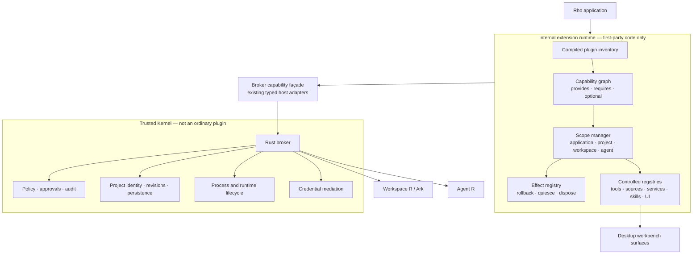
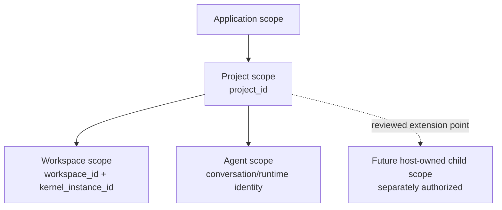

# Phase 1 Internal Plugin Runtime Design

Status: implemented; P1-0 through P1-4, final safety review, six-leg
stable/MSRV matrix, and three-platform unsigned installed-app acceptance
completed 2026-08-18

Date: 2026-08-14
Issue: [#17](https://github.com/YuLab-SMU/Rho/issues/17)
Scope: compiled-in, first-party plugins only; capability composition,
dependency resolution, scoped lifetime, reversible registration, and migration
of a small set of existing built-in capabilities

Change class: D3 shared architecture. Every P1 package was separately activated
and stopped at its reviewed gate. P1-4 completed the whole-Phase-1 acceptance
under the stop-point rules in
`docs/project/active-development-governance.md` on 2026-08-18.

Source review:

- `YuLab-SMU/Rho` `main` at the rebased P1-0 baseline
  `95d7d2c7774519ef956637aeff678ed4f2752ab5`;
- [DeepSeek Harness architecture](https://github.com/deepseek-ai/deepseek-harness/blob/master/docs/architecture.md),
  especially shared contexts, service dependencies, and reversible effects;
- [JupyterLab application plugins](https://jupyterlab.readthedocs.io/en/4.4.x/extension/extension_dev.html),
  especially `provides`, `requires`, and `optional` tokens;
- [OSGi Declarative Services](https://docs.osgi.org/specification/osgi.cmpn/8.1.0/service.component.html),
  especially dependency satisfaction and symmetric activation/deactivation;
- [VS Code proposed API practice](https://code.visualstudio.com/api/advanced-topics/using-proposed-api),
  especially the cost of prematurely freezing a public extension API.

Cross-reviewed against:

- `AGENTS.md`;
- `docs/project/active-development-governance.md`;
- `docs/project/active-development-roadmap.md`;
- `docs/project/active-document-cross-review.md`;
- `docs/decisions/accepted-ADR-002-kernel-transport.md`;
- `docs/decisions/accepted-ADR-003-agent-transport.md`;
- `docs/architecture/implemented-aisdk-family-integration.md`;
- `docs/implementation/implemented-wp4-project-skills-interface.md`;
- `docs/design/proposed-2026-07-26-public-workbench-protocol-cli-mcp-design.md`;
- `docs/design/implemented-agent-file-editing-design.md`;
- `docs/plans/proposed-2026-08-10-ai-capability-gap-closure-plan.md`;
- [Issue #95](https://github.com/YuLab-SMU/Rho/issues/95), especially the
  first-party Execution Target composition, target-session lifecycle, and
  Trusted Kernel boundary;
- [Issue #96](https://github.com/YuLab-SMU/Rho/issues/96), especially the
  Primary Workspace / Compute Environment / Job / Attempt ownership model.

Repository integration note: P1-0 through P1-4 completion is recorded in their
separate implemented contracts, the shared documentation index, and the
central cross-review matrix. The separate Phase 2 and Phase 2.5 designs in
PR #76 remain proposed and Git-independent.

Implementation entry rule: Phase 1 is closed. Any follow-up behavior change or
legacy deletion requires a new active contract. This design does not authorize
third-party or project-authored executable code.

## Summary

Rho should first use plugin architecture as an **internal composition model**,
not as an installation feature.

Phase 1 introduces a capability-oriented internal extension runtime for
compiled-in, first-party modules. It standardizes four things that currently
need one coherent contract before any external plugin ecosystem is safe:

1. a `PluginContext` that exposes narrow registries and host services;
2. a dependency graph based on capability identifiers rather than concrete
   plugin imports;
3. reversible effects, so every registration has a deterministic teardown;
4. explicit application, project, Workspace R, and Agent scope lifetimes;
5. a host-owned scope/generation and candidate-replacement contract that can
   support later internal runtime consumers without granting them policy or
   process authority.

The governing trust decision is:

> Everything above the Trusted Kernel may become pluggable. The Rust broker,
> policy, approvals, process ownership, persistence authority, and credential
> mediation are not ordinary plugin capabilities.

Phase 1 contains no plugin directory, no dynamic import, no marketplace, no
native ABI, and no untrusted code. Existing built-in behavior is migrated only
behind a feature flag and only after parity, rollback, project isolation, and
resource-cleanup evidence pass.

## Problem

Rho already spans several ownership domains:

- the desktop shell and workbench surfaces;
- Agent R and the `aisdk` tool/session layer;
- the Rust broker and durable store;
- authoritative Workspace R and Ark lifecycle;
- project-local declarative Skills.

These boundaries are intentional. The missing piece is a uniform way for
first-party capabilities above the broker to declare:

- what they provide;
- what they require;
- which scope owns them;
- what registrations and resources they create;
- how activation failure rolls back;
- how project close, Workspace R restart, or Agent teardown disposes them.

Adding a `plugins/` folder or a set of ad hoc hooks would solve code discovery
without solving dependency order, partial activation, rollback, project
isolation, stale service references, or cleanup. Phase 1 therefore treats the
plugin runtime as an architectural primitive and deliberately postpones
external distribution.

## Goals

Phase 1 will define and, after separate authorization, allow Rho to implement:

- one internal plugin descriptor and lifecycle contract;
- explicit capability identifiers and provider/consumer dependencies;
- `required` and `optional` dependency semantics;
- deterministic graph validation and activation order;
- application-, project-, Workspace R-, and Agent-scoped contexts;
- a reversible effect stack for registrations, subscriptions, timers, tasks,
  handles, and other resources;
- transactional activation and reverse-order rollback;
- quiesce-before-dispose teardown;
- two-phase project scope replacement, preserving the old active project scope
  when candidate activation fails;
- a generic candidate-scope replacement protocol whose first required use is
  project switching;
- host-owned extensible child-scope identity without allowing plugins to create
  arbitrary scope kinds or parent relationships;
- a distinction between one capability-provider implementation and multiple
  product-configured instances of that implementation;
- controlled registries for tools, sources, services, Skills, commands,
  viewers, and panels;
- migration of a deliberately varied set of two or three built-in capabilities;
- diagnostics and tests sufficient to decide whether the abstraction should
  become the foundation for Phase 2.

## Non-Goals

Phase 1 does not authorize or freeze:

- loading code from `.rho/plugins`, a user directory, a URL, or a package
  catalog;
- executing project-authored JavaScript, R, Python, shell, native libraries, or
  WebAssembly;
- a public plugin SDK or compatibility promise to third parties;
- a marketplace, catalog, publisher identity, signature scheme, or updater;
- a native Rust, C, C++, Node, Tauri, R, or dynamic-library plugin ABI;
- arbitrary DOM mutation, global CSS injection, application-store monkey
  patching, or direct Tauri invocation;
- plugin-defined approval, credential, privacy, or security UI;
- raw SQLite, broker IPC, Workspace R transport, process, filesystem, network,
  or credential access;
- dynamic service rebinding inside a live scope;
- plugin-to-plugin concrete object references;
- a generic persistent plugin key-value store;
- replacing the current `.rho/skills` trust and discovery model;
- changing the public Workbench Protocol;
- implementing Execution Targets, R discovery, Conda, containers, SSH, Slurm,
  remote runtime transport, Compute Environments, Jobs, Attempts, scheduling,
  or Artifact import/promotion from Issues #95 and #96;
- exposing runtime, transport, allocator, process, arbitrary R/shell, or raw
  credential authority as a third-party plugin capability;
- mining task history into reusable recipes or Skills;
- generating, repairing, evaluating, enabling, merging, or pruning
  Agent-authored executable plugins;
- a durable plugin-lineage, standing evolution policy, protected replay suite,
  or capability-gardening model;
- removing legacy wiring before migrated behavior has passed parity and
  rollback acceptance.

## Definitions

### Plugin

A Phase 1 plugin is compiled-in first-party code that contributes executable
capabilities through the internal extension runtime.

A plugin is not merely a package or directory. It is the combination of:

- stable identity;
- declared scope;
- declared provided and consumed capabilities;
- an activation function;
- all effects and resources created during activation;
- deterministic quiesce and disposal behavior.

### Capability

A capability answers:

> What new service or contribution does this plugin provide to Rho?

Initial namespaces are internal and experimental:

| Namespace | Meaning | Example |
| --- | --- | --- |
| `service.*` | typed internal service contract | `service.run-history` |
| `tool.*` | Agent-callable tool contribution | `tool.workspace.inspect` |
| `source.*` | bounded context/data source | `source.workspace.objects` |
| `provider.*` | model/runtime/domain adapter | `provider.artifact-preview` |
| `skill.*` | declarative Skill pack contribution | `skill.bioconductor` |
| `ui.command.*` | command contribution | `ui.command.open-run` |
| `ui.viewer.*` | result or Artifact viewer | `ui.viewer.plot` |
| `ui.panel.*` | controlled shell panel/slot | `ui.panel.run-history` |

Capability registration grants no security authority. Phase 1 plugins remain
subject to the existing broker-owned execution, file, approval, process,
persistence, and credential paths.

### Permission

A permission answers:

> What privileged operation may the broker perform on behalf of a plugin?

Phase 1 does not expose a third-party permission API. It only reserves the
semantic distinction required by Phase 2. A capability such as
`tool.workspace.inspect` never implies `workspace.r.inspect`, filesystem,
network, process, or credential authority.

### Skill

A Skill is declarative Agent knowledge or procedure. A plugin is an executable
capability provider.

A plugin may register a Skill pack. A Skill may state that it needs a
capability. A Skill does not receive ambient authority and cannot turn
project-authored content into executable plugin code. The existing bounded,
untrusted `.rho/skills` contract remains authoritative.

### Scope

A scope owns plugin instances, resolved dependencies, effects, and resources.
Closing a scope revokes access to everything owned by that scope and disposes
children before the parent.

A scope identity includes a host-defined kind, stable scope ID, optional parent
scope ID, and activation generation. The host owns the allowed parent/child
graph and creates all scopes. Plugins cannot invent scope kinds, reparent
instances, or turn a configured product object into an authorization scope.

Phase 1 implements only the minimum application/project/Workspace/Agent scope
set selected by its authorized work packages. The contract must not assume that
this is the final scope depth: later host-owned child kinds can be added only
through their own reviewed product contracts.

### Effect

An effect is any reversible registration or resource created during plugin
activation. Examples include a registry entry, event subscription, timer,
background task, channel, temporary file lease, viewer registration, host
handle, supervised process lease, watcher, mount/bind lease, allocation,
container, or transfer lease. Every effect must have idempotent disposal.

External-resource examples are lifecycle classes, not ambient authority. A
plugin may acquire such an effect only through a narrow broker façade that
already owns and authorizes the operation. The effect record owns cleanup; it
does not expose the raw process, credential, socket, scheduler, or filesystem
handle to the plugin.

Each effect is attributable to one plugin instance, scope generation, and
creation order. Disposal records success, timeout, or cleanup failure
truthfully. A failed cleanup does not make the effect routable again and cannot
be reported as fully disposed.

## Relationship To Skills, Tools, Providers, And MCP

These concepts remain layered rather than collapsed into one artifact:

| Concept | Role | Lifecycle/authority implication |
| --- | --- | --- |
| Plugin | packages and activates executable contributions | owns scope, dependencies, effects, and teardown |
| Capability | names a contract that can be provided and consumed | registration alone grants no privileged authority |
| Provider | implements one capability contract | replaceable behind the capability identifier |
| Tool | a capability exposed to Agent reasoning/calls | execution still follows Agent and broker admission |
| Skill | declarative knowledge, procedure, examples, and references | does not execute or receive ambient authority |
| MCP | a transport/integration protocol for exposing or consuming capabilities | does not define plugin lifecycle, project ownership, or Rho permission by itself |

A future plugin may contribute an MCP-backed provider, but MCP connectivity does
not bypass broker policy or convert a remote tool into a trusted plugin. Phase 1
does not change Rho's MCP server/client plans or the existing Agent transport.

## Authority And Trusted Kernel Boundary

The current authority model remains unchanged.

| Domain | Authority | Phase 1 rule |
| --- | --- | --- |
| Rust broker | policy, approvals, process creation, revisions, durable storage, project identity | remains non-pluggable and authoritative |
| Workspace R | live `.GlobalEnv`, scientific objects, arbitrary R execution | accessed only through existing broker-owned paths |
| Agent R | model credentials, `ChatSession`, reasoning, tool selection | plugins may contribute adapters/tools but do not receive raw credentials |
| Desktop shell | trusted user interaction, approval and review surfaces | renders controlled contributions; plugins do not replace trusted UI |
| Internal extension runtime | capability graph, scoped registration, effect ownership | composition only; no independent authority |

The runtime may coordinate first-party code, but it must not become a second
policy engine, process supervisor, project registry, durable store, or approval
lane.

## Proposed Architecture



### Logical Ownership

The design freezes logical ownership, not a final file layout:

- a small host-neutral module owns plugin descriptors, graph validation,
  activation planning, scope state, and effect ordering;
- `rho-server` or the broker coordinator owns creation and replacement of
  project, Workspace R, and Agent scopes because it already owns their identity
  and lifecycle;
- language-specific adapters keep registrations in their current authoritative
  runtime: desktop UI contributions remain in the shell, Agent tools remain in
  Agent R/its adapter, and Workspace R operations remain behind broker RPC;
- the extension runtime passes typed identifiers and bounded payloads across
  boundaries, not native object references.

A dedicated `rho-extension-runtime` crate owns these contracts. It inherits the
workspace version, Edition 2024, Rust 1.88 MSRV, and AGPL metadata. P1-0 uses
workspace `serde`, `thiserror`, and `semver`, plus `petgraph 0.8` with default
features disabled and only `std` enabled. It does not depend on Tokio or
ArcSwap. Phase 1 uses an explicit static `Vec<Arc<dyn InternalPlugin>>`; it does
not introduce `inventory`.

## Internal Plugin Contract

Phase 1 uses a compiled inventory. An external JSON manifest is neither needed
nor accepted.

Illustrative contract:

```rust
struct InternalPluginDescriptor {
    id: PluginId,
    version: PluginVersion,
    scopes: Vec<PluginScopeKind>,
    provides: Vec<CapabilityDeclaration>,
    requires: Vec<CapabilityRequirement>,
    optional: Vec<CapabilityRequirement>,
    activation: ActivationPolicy,
}

trait InternalPlugin: Send + Sync {
    fn descriptor(&self) -> &InternalPluginDescriptor;

    async fn activate(
        &self,
        context: PluginContext,
    ) -> Result<Option<Box<dyn Disposable>>, PluginActivationError>;
}
```

The concrete language may differ. The required semantics do not:

- identity is stable and unique;
- the descriptor is available before activation;
- dependencies are validated before side effects begin;
- activation receives only the services and registries allowed for that scope;
- every returned or context-added effect is owned by the plugin instance;
- activation failure cannot leave a visible partial registration;
- disposal is idempotent and bounded;
- no plugin resolves another plugin by concrete implementation type.

### Identity

Initial identifier rules:

- 1 through 128 bytes of lowercase ASCII;
- only `a-z`, `0-9`, `.`, `_`, and `-` are accepted;
- path separators, whitespace, control characters, uppercase ASCII, non-ASCII,
  and Unicode-normalization ambiguity are rejected;
- one descriptor per ID in an inventory;
- plugin instance identity additionally includes scope ID and activation
  generation.

Each scope admits at most 256 plugins. A descriptor admits at most 64 provided,
64 required, and 64 optional capability declarations. The resolved effective
graph admits at most 8192 requirement-provider edges.

### Capability Contracts

A capability declaration contains at minimum:

```text
capability ID
contract major version
provider plugin ID
provider scope
```

Phase 1 supports one provider for a capability within the effective visible
scope. A provider in the current scope may not shadow the same capability from
a visible parent scope. Duplicate providers fail graph validation. Provider
override, ranking, or configuration patching is deferred until a real Rho use
case proves it is needed.

A requirement contains:

```text
capability ID
compatible contract major version
required | optional
```

The runtime does not use application-version equality as a capability contract.

### Provider Implementation Versus Configured Instance

The one-provider rule applies to a capability contract implementation within an
effective scope. It does not prohibit the product from creating multiple
configured instances backed by that implementation.

For example, a future first-party implementation of an internal
`target.runtime.batch-rscript` contract could support multiple configured R
runtime instances. Those instances are product state selected by a
broker-owned routing contract; they are not additional capability providers and
do not participate as duplicate nodes in the plugin dependency graph.

Rules:

- the capability graph resolves implementations and their dependencies;
- product-owned routing selects among configured instances;
- plugin activation cannot create a second provider for the same contract
  slot;
- configured-instance identity, persistence, availability, scheduling, and
  authorization remain with the owning product contract;
- provider registration never grants permission to connect, launch, allocate,
  transfer, install, execute, or read credentials.

The example reserves no public namespace or API. Any concrete target/runtime
capability IDs and instance schemas remain owned by Issue #95.

## PluginContext

Illustrative API:

```rust
struct PluginContext {
    plugin: PluginInstanceIdentity,
    scope: ScopeIdentity,
    services: ServiceResolver,
    tools: ToolRegistry,
    sources: SourceRegistry,
    skills: SkillRegistry,
    ui: UiContributionRegistry,
    events: ScopedEventBus,
    broker: BrokerFacade,
    effects: EffectSink,
    log: PluginLogger,
}
```

Rules:

- `BrokerFacade` is a narrow adapter over existing authorized broker operations;
  it is not raw coordinator, store, Tauri, socket, or process access;
- each `register`, `subscribe`, or `start` operation returns a `Disposable`;
- `effects.add(disposable)` transfers ownership to the current plugin instance;
- returned registry handles cannot be reused outside the owning scope;
- services are resolved by capability token and contract, not by plugin name;
- optional services are represented explicitly as absent, not by a guessed
  fallback;
- registry payloads are bounded and typed at their authoritative boundary;
- logging automatically attaches plugin, scope, project, and activation IDs and
  must not include credentials or unbounded scientific payloads.

The Phase 1 API is internal and experimental. Only lifecycle and authority
invariants are candidates for durable acceptance; ergonomic method names may
change during the built-in migrations.

## Scope Model



### Application Scope

Owns process-wide first-party contributions that are safe across projects, such
as generic viewer definitions or command descriptors. It must not retain a
project path, Workspace R handle, Agent conversation, or project-scoped data.

### Project Scope

Owns all contributions bound to canonical `project_id`. It is the minimum scope
for project configuration, project-local sources, run/history projections, and
project-aware UI state.

Closing or replacing the active project scope disposes all Workspace R and
Agent child scopes before project-level effects.

### Workspace Scope

Owns capabilities tied to the current authoritative Workspace R lineage and
kernel instance. Workspace R restart creates a new workspace activation
generation. Old handles and services do not silently rebind to the new kernel.

### Agent Scope

Owns Agent conversation/session contributions. It may consume project-level
services, but it cannot directly resolve Workspace-scope implementations across
its sibling boundary. Workspace operations continue through broker-mediated
capabilities so stale kernel and revision checks remain authoritative.

### Host-Owned Child Scope Extension Contract

The current four scope kinds are not a public closed enum promise. A future
product design may add host-owned child scopes, but only when all of the
following are defined and reviewed:

- canonical scope identity and allowed parent kind;
- activation generation and stale-message behavior;
- which parent capabilities may be resolved;
- which children must quiesce/dispose first;
- effect, lease, deadline, and cleanup ownership;
- project/Workspace/runtime revision binding where relevant;
- persistence ownership, if any, outside the ephemeral extension runtime;
- failure, replacement, restart, and application-shutdown semantics.

Potential downstream consumers include target sessions and runtime instances
from Issue #95 and Compute Environments, Jobs, and Attempts from Issue #96.
They are examples of why the scope contract must be extensible; Phase 1 does not
create those scope kinds or implement their product behavior.

Plugins cannot register a scope kind. Scope creation remains a host/broker
lifecycle operation. A future scope may use the extension runtime to compose
first-party capabilities while keeping its project identity, process,
persistence, permission, and scheduling authority elsewhere.

### Resolution Rules

A plugin may resolve capabilities from:

1. its own scope;
2. the parent project scope;
3. the application scope.

A child does not export state upward automatically. Sibling scopes never share
native service objects. Cross-domain work uses existing typed broker or Agent
transport.

## Dependency Graph

Phase 1 graph behavior is deliberately static within a live scope.

1. Build the effective inventory for the scope.
2. Validate IDs, contract versions, providers, and scope compatibility.
3. Reject duplicate providers.
4. Resolve all required dependencies.
5. Record absent optional dependencies explicitly.
6. Detect cycles and emit the complete cycle path.
7. Produce deterministic topological order, with plugin ID as the stable tie
   breaker.
8. Activate only after the complete plan validates.

Missing required capability, incompatible contract major, duplicate provider,
or cycle is a scope activation error. The runtime does not activate a partial
subset and pretend the scope is healthy.

Live provider replacement and dynamic bind/unbind are out of scope. A plugin
inventory change creates a candidate scope or activation generation and uses
the replacement protocol below.

## Activation, Rollback, And Disposal

### Lifecycle States

| State | Meaning |
| --- | --- |
| `declared` | descriptor is known; no graph decision yet |
| `resolved` | dependency plan is valid |
| `activating` | activation transaction is open |
| `active` | all activation effects committed |
| `quiescing` | new calls are rejected; in-flight work is draining or cancelling |
| `disposing` | effects are being released in reverse order |
| `disposed` | the instance has no live registrations or handles |
| `failed` | resolution, activation, or disposal failed with truthful diagnostics |

Transitions are host-owned and serialized per plugin instance. A second close,
cancel, or disposal request is idempotent.

### Activation Transaction

For each plugin:

1. create an empty activation effect stack;
2. call `activate(context)`;
3. add every registration/resource to that stack immediately;
4. if activation succeeds, commit the stack to the scope;
5. if activation fails, dispose the stack in reverse creation order;
6. report the original activation error plus any cleanup errors separately.

For the scope as a whole, activation proceeds in topological order. A failure
rolls back every plugin activated for that candidate scope in reverse activation
order. No candidate contribution becomes visible to the active application
until the complete candidate scope commits.

### Quiesce And Dispose

Scope teardown:

1. enters `quiescing` and refuses new capability calls;
2. asks in-flight work to cancel or finish within a bounded deadline;
3. disposes dependent plugins before providers;
4. disposes each plugin's effects in reverse creation order;
5. continues cleanup after one effect fails;
6. records unresolved resources truthfully;
7. reaches `disposed` only when the host no longer routes calls to the scope.

A disposal failure must not resurrect registry entries or make a stale scope
active again. Resources that cannot be proved closed become an explicit
recovery/diagnostic condition.

## Candidate Scope Replacement Protocol

Any host-owned live-scope replacement is a high-risk lifecycle boundary. The
extension runtime must not tear down the active generation before it knows the
candidate can activate. Project switching is the first required product use and
remains the only replacement integrated by Phase 1.

```mermaid
sequenceDiagram
    participant B as Broker/coordinator
    participant OLD as Active scope generation
    participant NEW as Candidate scope generation
    participant UI as Desktop shell

    B->>NEW: construct + resolve graph
    B->>NEW: activate transactionally
    alt candidate activation succeeds
        B->>UI: atomically publish new scope generation
        B->>OLD: quiesce and dispose
    else candidate activation fails
        B->>NEW: rollback and dispose
        B->>UI: report failure; keep old generation active
    end
```

Generic rules:

- build and validate the complete candidate graph before side effects;
- register candidate effects immediately during transactional activation;
- publish exactly one candidate generation only after readiness succeeds;
- after publication, reject new calls/leases on the old generation;
- boundedly drain or cancel existing calls/leases according to the owning
  product contract;
- dispose old dependents and effects in reverse order;
- on candidate failure, roll back candidate effects and preserve the old
  generation when it remains safe;
- generation checks reject late candidate or old-generation completion.

For project switching, the active `project_id`, project revision, Workspace R
identity, and UI projection continue to follow existing authoritative switch
contracts. The extension runtime does not invent a second project-selection
state. Later target/environment replacement may reuse these generic mechanics
only after its own contract defines readiness, leases, rollback, and durable
truth.

## Controlled Registries

Every registry is host-owned and returns a disposable registration handle.
Phase 1 may implement only the registries required by selected migrations, but
all follow these rules:

- unique contribution ID within effective scope;
- typed and bounded metadata;
- owner plugin instance recorded by the host;
- no registration after the scope enters `quiescing`;
- deregistration on effect disposal;
- no contribution can replace trusted approval, credential, privacy, or policy
  surfaces;
- UI contributions are descriptors rendered by the trusted shell, not arbitrary
  access to the root DOM;
- tool execution continues through existing Agent R and broker admission paths;
- source payloads continue to obey project ownership, revision, and byte/shape
  bounds;
- Skill contributions remain declarative and untrusted according to their
  origin.

## Built-In Migration Strategy

The runtime is not accepted merely because a synthetic demo plugin works. Phase
1 must migrate a deliberately varied set of existing built-in capabilities.
The authorized package selects exact targets, but the set must include:

1. one bounded source/provider;
2. one Agent tool or tool adapter;
3. one controlled UI command, viewer, or panel contribution.

Candidate targets include:

- Workspace object/source projection;
- run-history or current-project-check source/tool integration;
- Artifact or plot viewer registration.

The migration must not move Workspace R authority into Agent R, move durable
state out of the broker, or create a duplicate UI/application state. Existing
legacy wiring remains available behind a feature flag until each target passes
behavioral parity and lifecycle acceptance.

### Feature Flag And Fallback

Initial implementation uses the private host-owned
`RHO_INTERNAL_EXTENSION_RUNTIME=legacy|candidate` mode:

- P1-1 through P1-3 default to `legacy`; an invalid value falls back to
  `legacy` with a typed diagnostic and is not persisted or exposed in the UI;
- a test matrix exercises both paths while migration is incomplete;
- candidate scope failure falls back to the legacy path without retaining
  candidate effects;
- fallback is diagnostic, not silent;
- the legacy path is removed only in a later explicitly reviewed package after
  all selected built-ins have accepted parity evidence.

## Persistence And Configuration

Phase 1 adds no generic plugin persistence and no user plugin configuration.

- inventory is compiled into the application;
- ephemeral scope state is owned by the runtime;
- durable product state remains in its current authoritative schema and store;
- an internal plugin that needs existing durable data uses the current owning
  repository/service, not a private shadow store;
- no SQLite migration is part of the initial graph/effect packages;
- no `.rho/plugins` directory is discovered;
- no plugin code or configuration is downloaded at runtime.

A later Phase 2 design may define workspace plugin manifests, scoped grants,
and plugin storage. Phase 1 must keep its capability interfaces transport-safe
so those features do not require exposing native host objects.

## Diagnostics

The runtime emits structured internal diagnostics for:

- inventory and graph validation;
- missing/optional/incompatible capability resolution;
- cycle and duplicate-provider paths;
- activation start, success, failure, and rollback;
- quiesce, timeout, disposal, and leaked-resource detection;
- project/workspace/Agent scope generation;
- migrated-capability fallback to legacy wiring.

Diagnostics include plugin ID, instance ID, scope kind, scope ID, activation
generation, and stable error code. They exclude credentials, raw model content,
unbounded R objects, and absolute paths unless an existing authorized local
diagnostic contract already permits them.

Phase 1 does not add these events to the public Workbench Protocol or durable
audit schema by default. Persistence is authorized separately if operational
evidence proves it is needed.

## Failure And Recovery Semantics

| Failure | Required behavior |
| --- | --- |
| malformed internal descriptor | build/test failure or startup diagnostic; no partial scope |
| missing required capability | candidate scope rejected before activation |
| optional capability absent | explicit `None`/absent injection |
| duplicate provider | graph rejected with both provider IDs |
| dependency cycle | graph rejected with deterministic cycle path |
| activation fails before effects | plugin fails; candidate scope rolls back |
| activation fails after effects | all recorded effects dispose in reverse order |
| rollback effect fails | continue rollback; report activation and cleanup errors separately |
| plugin panics/throws | catch at runtime boundary where possible; candidate scope fails truthfully |
| dispose hangs | deadline, cancellation, leaked-resource diagnostic, no stale routing |
| project candidate fails | old project scope remains active |
| non-project candidate fails | old generation remains active only when the owning product contract proves it safe |
| late old/candidate generation result | reject; never publish or rebind stale state |
| Workspace R restarts | old workspace scope is invalidated; no implicit stale-handle reuse |
| rapid A/B project switching | generations prevent late activation from becoming current |
| application shutdown | child scopes dispose before application scope |

## Verification Matrix For Future Implementation

No tests are claimed by this documentation-only PR. An authorized Phase 1
implementation must add deterministic coverage at least for the following.

### Pure Graph Tests

- empty inventory;
- one plugin with no dependencies;
- required dependency order;
- optional dependency present and absent;
- incompatible contract major;
- missing required capability;
- duplicate plugin ID;
- duplicate provider;
- direct and multi-node cycles;
- deterministic order independent of map iteration;
- application/project/workspace/Agent scope compatibility;
- provider-implementation versus configured-instance fixtures;
- host-owned child-scope ancestry and invalid parent-kind fixtures;
- bounded plugin and dependency counts.

### Effect And Lifecycle Tests

- successful activation and reverse disposal;
- activation failure before and after multiple effects;
- rollback order across dependent plugins;
- idempotent double-dispose;
- disposal failure does not stop remaining cleanup;
- quiescing rejects new registrations and calls;
- in-flight cancellation and deadline;
- activation/disposal race;
- candidate replacement success/failure and late-generation rejection;
- synthetic external effect/lease cleanup without exposing a raw host handle;
- cleanup timeout/failure remains non-routable and diagnostically visible;
- application shutdown cascade.

### Project And Runtime Isolation Tests

- projects A and B use distinct plugin instances and state;
- identical contribution IDs in A and B do not collide;
- failed B activation leaves A current and functional;
- rapid A/B/A switch rejects stale completion;
- Workspace R restart invalidates old workspace services;
- Agent scope cannot resolve sibling Workspace native objects;
- project close removes all project, workspace, and Agent effects;
- a synthetic future child scope cannot leak a service/lease into its sibling
  or survive parent teardown.

### Migration Parity Tests

For each migrated built-in:

- legacy and plugin paths produce equivalent bounded results;
- success, empty, malformed, stale, unavailable, cancellation, and restart
  behavior remain truthful;
- project identity and revisions are checked at the same authoritative boundary;
- browser/mock and real desktop wiring remain aligned for visible contributions;
- feature-flag fallback leaves no duplicate command, viewer, tool, or event
  subscription.

### Repository Validation

The final authorized migration package runs the complete affected Rust, R, and
frontend matrix required by governance, plus `git diff --check`. Exact commands
and unrun manual checks are recorded in the implementation handoff.

During the long-lived Draft construction stream, P1-0 through P1-3 use focused
local checks, one current-toolchain affected workspace checkpoint where
required, available local MSRV evidence, and exact-head Ubuntu-stable Rust Fast
CI. The complete macOS/Windows/Linux stable/Rust-1.88 hosted matrix is deferred
to P1-4 after all intended Phase 1 code is present and the PR moves from Draft
to Ready. Fast CI never substitutes for that final native compatibility gate.

## Work Packages And Mandatory Stop Points

Each package requires separate authorization. Later packages do not activate
implicitly.

### P1-0: Vocabulary And Pure Contracts

Deliver:

- plugin/capability/scope/effect types;
- host-owned extensible scope identity and allowed-parent validation;
- provider-implementation versus configured-instance semantics;
- generic candidate-replacement and generation fixtures;
- descriptor validation;
- capability graph fixtures;
- no application integration.

Stop gate:

- pure unit tests pass;
- capability and permission remain distinct;
- no public API, persistence, or runtime behavior change.

### P1-1: Scope And Effect Runtime Behind A Flag

Deliver:

- application and project scope manager;
- activation transaction and rollback;
- generic candidate-generation replacement mechanics, exercised first through
  project switching;
- bounded call/effect lease and late-generation rejection;
- quiesce/dispose cascade;
- structured diagnostics;
- no migrated user-facing capability yet.

Stop gate:

- failure injection, idempotency, and two-project scope tests pass;
- active project survives candidate-scope activation failure;
- review confirms the broker remains sole project/lifecycle authority.

### P1-2: Project-Scoped Run History Source

Deliver:

- compiled-in plugin `org.yulab.rho.run-history` provides
  `source.project.run-history@1` and consumes broker-owned
  `service.broker.runs@1` in project scope;
- legacy and plugin paths behind the feature flag;
- parity and isolation evidence.

Stop gate:

- no schema or public protocol drift;
- old and new paths agree on ownership, revisions, bounds, and errors;
- rollback leaves no registration or subscription.

### P1-3: Workspace Snapshot Tool And Project File Viewer

Deliver:

- compiled-in `org.yulab.rho.workspace-snapshot-tool` provides
  `tool.workspace.snapshot@1` and consumes
  `service.broker.workspace-probe@1` in workspace scope;
- compiled-in `org.yulab.rho.project-file-viewer` provides
  `ui.viewer.project-file@1` in application scope without retaining a project
  path;
- no arbitrary DOM or direct privileged invocation.

Stop gate:

- Agent execution still uses existing broker admission;
- UI contribution is rendered by the trusted shell;
- browser/mock parity and project isolation pass.

### P1-4: Acceptance And Internal API Review

Deliver:

- complete affected validation;
- independent architecture/safety review;
- actual deviations recorded;
- decision to accept, revise, or remove the abstraction;
- explicit decision on legacy wiring removal;
- downstream suitability review against Issues #95 and #96 without
  implementing their product scopes or backends.

Stop gate:

- Phase 1 is not described as implemented until selected migrations and all
  acceptance evidence are complete;
- Phase 2 remains blocked until the transport-safe API and lifecycle invariants
  are accepted.

## Definition Of Done

Phase 1 may be accepted only when:

- two or three varied built-in capabilities run through the extension runtime;
- no selected behavior regresses relative to legacy wiring;
- activation failure fully rolls back candidate effects;
- candidate replacement never publishes a partial generation and preserves the
  old generation only when the owning product contract says it is safe;
- project A/B isolation and failed-switch recovery pass;
- Workspace R and Agent scope teardown leave no routable stale handles;
- disposal is deterministic, idempotent, bounded, and independently reviewed;
- the broker remains the only authority for policy, approval, project identity,
  process creation, persistence, and privileged Workspace R operations;
- the internal API is documented as experimental or explicitly accepted;
- version, NEWS, document lifecycle, and release impact are recorded truthfully;
- the central cross-review record is reconciled before implementation status is
  advanced.

## Authorization Decisions

The 2026-08-18 authorization review closed the Phase 1 construction choices:

1. the host-neutral implementation lives in `rho-extension-runtime`;
2. P1-2 migrates Run History, while P1-3 migrates Workspace Snapshot and the
   Project File Viewer;
3. P1-1 implements application, project, workspace, and Agent scopes;
4. default deadlines are 5 seconds to quiesce, 2 seconds per effect, and 10
   seconds for total scope disposal, with injectable test deadlines;
5. diagnostics remain typed and ephemeral; the host may forward them to the
   existing log, but no durable schema is added;
6. `RHO_INTERNAL_EXTENSION_RUNTIME` is private and host-owned; P1-1 through
   P1-3 default to `legacy`, and P1-4 may make `candidate` the default while
   retaining the legacy override for one later release cycle;
7. lifecycle and authority semantics are the acceptance target, while Rust
   module layout, trait method names, and ergonomic API remain internal and
   experimental;
8. scope kinds use validated IDs and a host-owned parent policy; plugins cannot
   register scope kinds or create scopes;
9. effect records bind plugin instance, scope, generation, creation order,
   state, and cleanup error; P1-1 defines the concrete lease implementation;
10. Issues #95 and #96 may consume only the generic typed capability,
    scope/generation, candidate, effect, quiesce/dispose, diagnostic, and
    broker-façade semantics. Their targets, runtimes, jobs, persistence,
    scheduling, transport, and UI remain separately owned.

P1-0 completed its Draft stop gate on 2026-08-18. P1-1 was separately
authorized and completed its Draft stop gate later that day through
`docs/plans/implemented-2026-08-18-p1-1-extension-runtime-lifecycle-spec.md`. P1-2
then completed its Draft stop gate through
`docs/plans/implemented-2026-08-18-p1-2-run-history-source-spec.md`. P1-3 then
completed its Draft stop gate through
`docs/plans/implemented-2026-08-18-p1-3-workspace-snapshot-viewer-spec.md`.
P1-4 and the whole-P1 acceptance completed through
`docs/plans/implemented-2026-08-18-p1-4-default-acceptance-spec.md`.

## Version, NEWS, And Release Impact

P1-4 allocates application development identity `0.4.1-dev.0` and updates
`NEWS.md` for the internal default switch plus explicit legacy escape hatch.
The version was later bumped to `0.4.1-dev.1` by `41c0220` (deferred Provider
credential access) without changing the acceptance targets above.
R package versions remain unchanged. No tag, GitHub Release, updater manifest,
signature, publication, or release GO is created. The internal runtime must not
be advertised as a public plugin SDK; third-party or workspace executable
plugin support requires a separate Phase 2 contract and release acceptance.

## Hosted CI Repair After Acceptance

The 2026-08-19 Ready run `32231716500` exposed one Windows-stable packaging
regression after all compile/test steps passed: the restored Cargo `target/`
cache contained an older NSIS installer, while the Full build correctly created
the current installer. Exact-artifact validation then saw more than one
`*-setup.exe` and failed. The authorized repair makes Full mode own and clear
only `target/release/bundle/nsis` before bundling; NoBundle and BundleOnly keep
their stricter pre-existing clean-directory contracts. The SignPath workflow
contract test now protects this cache-contamination regression. No application,
runtime, installer-content, version, or release authority changes.

## Downstream Host-Owned Runtime Consumers

The internal extension runtime is intended to be a construction foundation for
future first-party, host-owned capabilities above the Trusted Kernel. Issues
#95 and #96 are concrete downstream architecture consumers:

- Issue #95 composes first-party Execution Target adapters for transport,
  allocation, isolation, runtime, and project location;
- Issue #96 defines one Primary Workspace plus Compute Environment, Job, and
  Attempt lifecycles.

They may reuse only the generic Phase 1 contracts:

```text
typed/versioned capability dependency
host-owned scope identity and activation generation
provider implementation versus configured instance
transactional candidate activation
reversible effect ownership
quiesce, bounded drain/cancel, and reverse disposal
late-generation rejection
structured bounded diagnostics
transport-safe broker façade
```

The authority boundary is fixed:

- Execution Target, scheduler, runtime, and worker adapters are compiled-in
  first-party capabilities unless a later independent security contract says
  otherwise;
- the extension runtime may resolve and coordinate adapters, but the Rust
  broker remains the sole process, policy, approval, credential, project
  identity, revision, persistence, and audit authority;
- a target-side runtime host is a release-matched trusted broker peer, not an
  ordinary workspace plugin;
- capability registration does not grant process, remote-connect, scheduler,
  container, filesystem, network, transfer, installation, execution, or
  credential permission;
- project or Agent content cannot supply executable provider code, raw commands,
  shell fragments, launch hooks, or credential values as authority.

Phase 1 does not define or implement:

- `RInstallationRegistry`, `rig`, `Rscript`, Ark target selection, Conda,
  Docker/Podman/Apptainer, SSH, Slurm, or remote transport;
- target-host wire messages, target configuration, project-location identity,
  environment manifests, or constrained remote handles;
- Compute Environment, Job, Attempt, queue, scheduler, retry, staging, Artifact,
  import/promotion, persistence, routing, or UI schemas;
- third-party `provider.runtime.*` or process/R/shell authority.

Those remain in Issues #95/#96 and their future active specifications. Phase 1
acceptance should include a downstream suitability review proving that these
consumers can use the generic lifecycle contracts without exposing raw Rust,
Tauri, Node, R environment, socket, database, process, credential, or DOM
objects. If they cannot, Phase 1 must revise the transport-safe façade rather
than allowing downstream code to bypass the Trusted Kernel.

## Future Capability-Growth Substrate

Phase 1 also supplies part of the safety substrate for a later, separately
governed capability-growth system. The long-term product direction is not only
that developers can install extensions, but that an Agent may eventually turn
repeated, successful project work into a durable capability:

```text
task-local method
    -> experience trace
    -> reusable recipe
    -> declarative Skill
    -> executable candidate plugin
    -> accepted lineage version
    -> repair / generalize / merge / prune
```

This is **not** implemented behavior and is not a Phase 1 acceptance claim.
Experience capture, authorship, evaluation, policy, persistence, activation,
and gardening require a distinct Phase 2.5 contract after the Phase 2
third-party isolation and permission foundation is accepted.

The Phase 1 mechanisms that are intentionally reusable are:

- typed capability and dependency identities;
- host-owned scope and activation generations;
- transactional candidate activation before publication;
- reversible effect ownership and bounded cleanup;
- atomic publication of a ready candidate while the old generation remains a
  valid rollback target;
- quiesce-before-dispose and late-generation rejection;
- bounded diagnostics through a transport-safe broker façade.

Those mechanisms allow an Agent to create a new candidate instead of mutating
live code. They do **not** answer whether the Agent may author the candidate,
which observations may be retained, how improvement is measured, whether a
new digest may execute without a prompt, or when overlapping capabilities may
be merged or retired.

The durable boundary for that future design is:

> An Agent may propose and improve capability code, but it may not grant
> itself authority, enlarge its permission envelope, weaken its protected
> evaluation gate, rewrite its audit history, or promote itself into the
> Trusted Kernel.

A future `PluginLineage` may provide long-lived provenance across package
digests, but it cannot become an authorization identity. Every executable
package digest remains a new plugin identity. If a broker-owned standing
policy later permits autonomous evolution within a pre-authorized envelope,
the broker must still make and persist a fresh grant decision for the new
digest, issue fresh handles, and bind that decision to the exact policy
revision and evaluation evidence. It must never copy an old digest's grant or
handles forward implicitly.

Similarly, future replay and shadow evaluation cannot reuse arbitrary private
task history as an unbounded training corpus. The owning contract must define
project scope, consent, redaction, retention, fixture sealing, side-effect
suppression, and a separation between candidate authoring and protected
acceptance tests. Promotion into a first-party capability remains ordinary Rho
source governance and release work, never an automatic lineage transition.

The complementary maintenance loop is capability gardening:

```text
observe -> distill -> create -> evaluate -> use -> repair
   ^                                                |
   +--------- merge / generalize / prune -----------+
```

Overlap detection, low usage, latency, cost, failure rate, and human
corrections may support a merge or retirement proposal. They are not deletion
authority. A future gardener must preserve provenance and rollback, distinguish
deprecated from deleted, and require the policy/user decision owned by the
Phase 2.5 contract.

## Phase 2 Handoff Constraints

Phase 1 is intentionally designed so a later isolated plugin host can reuse the
same semantics without receiving host-native authority.

Before Phase 2 may start, Phase 1 must prove:

- capabilities are addressable by typed/versioned identifiers;
- plugin dependencies can be serialized and validated before activation;
- registration effects are reversible without concrete cross-plugin references;
- scope identity and generation are explicit;
- all privileged work already enters through narrow host/broker façades;
- no accepted plugin API requires raw Rust, Tauri, Node, R environment, socket,
  database, process, credential, or DOM objects.

These are prerequisites, not permission to expose the internal API unchanged to
third parties.
