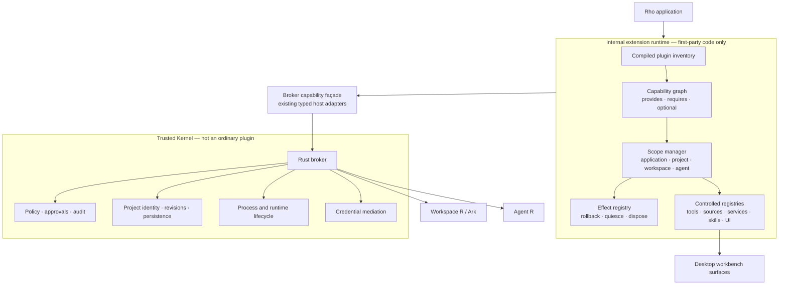
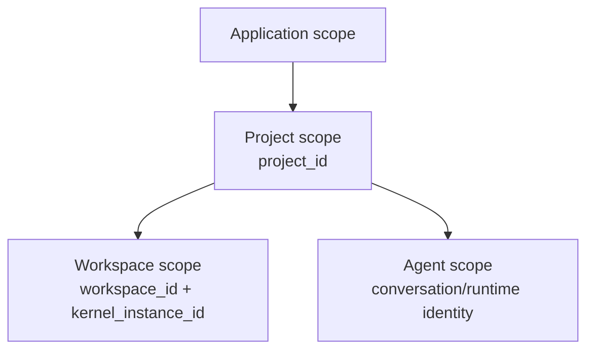

# Phase 1 Internal Plugin Runtime Design

Status: proposed architecture design; implementation not authorized

Date: 2026-08-14
Issue: [#17](https://github.com/YuLab-SMU/Rho/issues/17)
Scope: compiled-in, first-party plugins only; capability composition,
dependency resolution, scoped lifetime, reversible registration, and migration
of a small set of existing built-in capabilities

Change class: D3 shared architecture. This pull request is documentation-only.
Any product-code slice remains subject to the authorization, activation,
cross-review, testing, and stop-point rules in
`docs/project/active-development-governance.md`.

Source review:

- `YuLab-SMU/Rho` `main` at
  `533ac12f324b2d9b15653a8cf33351d593050853`;
- [DeepSeek Harness architecture](https://github.com/deepseek-ai/deepseek-harness/blob/master/docs/architecture.md),
  especially shared contexts, service dependencies, and reversible effects;
- [JupyterLab application plugins](https://jupyterlab.readthedocs.io/en/4.4.x/extension/extension_dev.html),
  especially `provides`, `requires`, and `optional` tokens;
- [OSGi Declarative Services](https://docs.osgi.org/specification/osgi.cmpn/8.1.0/service.component.html),
  especially dependency satisfaction and symmetric activation/deactivation;
- [VS Code proposed API practice](https://code.visualstudio.com/api/advanced-topics/using-proposed-api),
  especially the cost of prematurely freezing a public extension API.

Cross-reviewed against:

- `AGENTS.md`;
- `docs/project/active-development-governance.md`;
- `docs/project/active-development-roadmap.md`;
- `docs/project/active-document-cross-review.md`;
- `docs/decisions/accepted-ADR-002-kernel-transport.md`;
- `docs/decisions/accepted-ADR-003-agent-transport.md`;
- `docs/architecture/implemented-aisdk-family-integration.md`;
- `docs/implementation/implemented-wp4-project-skills-interface.md`;
- `docs/design/proposed-2026-07-26-public-workbench-protocol-cli-mcp-design.md`;
- `docs/design/implemented-agent-file-editing-design.md`;
- `docs/plans/proposed-2026-08-10-ai-capability-gap-closure-plan.md`.

Repository integration note: this proposal is intentionally a single-file,
independently reviewable change. It does not edit the shared documentation index
or central cross-review matrix. Those shared records are updated only after a
proposal is accepted or a bounded implementation package is explicitly
activated, so this design and the separate Phase 2 design can merge or close
independently without a synthetic conflict.

Implementation entry rule: no product code begins from this proposal alone.
Authorization must name one work package, record its entry conditions, create
or activate its implementation contract, update the central cross-review
matrix, and stop at the package checkpoint. Phase 1 does not authorize loading
third-party or project-authored executable code.

## Summary

Rho should first use plugin architecture as an **internal composition model**,
not as an installation feature.

Phase 1 introduces a capability-oriented internal extension runtime for
compiled-in, first-party modules. It standardizes four things that currently
need one coherent contract before any external plugin ecosystem is safe:

1. a `PluginContext` that exposes narrow registries and host services;
2. a dependency graph based on capability identifiers rather than concrete
   plugin imports;
3. reversible effects, so every registration has a deterministic teardown;
4. explicit application, project, Workspace R, and Agent scope lifetimes.

The governing trust decision is:

> Everything above the Trusted Kernel may become pluggable. The Rust broker,
> policy, approvals, process ownership, persistence authority, and credential
> mediation are not ordinary plugin capabilities.

Phase 1 contains no plugin directory, no dynamic import, no marketplace, no
native ABI, and no untrusted code. Existing built-in behavior is migrated only
behind a feature flag and only after parity, rollback, project isolation, and
resource-cleanup evidence pass.

## Problem

Rho already spans several ownership domains:

- the desktop shell and workbench surfaces;
- Agent R and the `aisdk` tool/session layer;
- the Rust broker and durable store;
- authoritative Workspace R and Ark lifecycle;
- project-local declarative Skills.

These boundaries are intentional. The missing piece is a uniform way for
first-party capabilities above the broker to declare:

- what they provide;
- what they require;
- which scope owns them;
- what registrations and resources they create;
- how activation failure rolls back;
- how project close, Workspace R restart, or Agent teardown disposes them.

Adding a `plugins/` folder or a set of ad hoc hooks would solve code discovery
without solving dependency order, partial activation, rollback, project
isolation, stale service references, or cleanup. Phase 1 therefore treats the
plugin runtime as an architectural primitive and deliberately postpones
external distribution.

## Goals

Phase 1 will define and, after separate authorization, allow Rho to implement:

- one internal plugin descriptor and lifecycle contract;
- explicit capability identifiers and provider/consumer dependencies;
- `required` and `optional` dependency semantics;
- deterministic graph validation and activation order;
- application-, project-, Workspace R-, and Agent-scoped contexts;
- a reversible effect stack for registrations, subscriptions, timers, tasks,
  handles, and other resources;
- transactional activation and reverse-order rollback;
- quiesce-before-dispose teardown;
- two-phase project scope replacement, preserving the old active project scope
  when candidate activation fails;
- controlled registries for tools, sources, services, Skills, commands,
  viewers, and panels;
- migration of a deliberately varied set of two or three built-in capabilities;
- diagnostics and tests sufficient to decide whether the abstraction should
  become the foundation for Phase 2.

## Non-Goals

Phase 1 does not authorize or freeze:

- loading code from `.rho/plugins`, a user directory, a URL, or a package
  catalog;
- executing project-authored JavaScript, R, Python, shell, native libraries, or
  WebAssembly;
- a public plugin SDK or compatibility promise to third parties;
- a marketplace, catalog, publisher identity, signature scheme, or updater;
- a native Rust, C, C++, Node, Tauri, R, or dynamic-library plugin ABI;
- arbitrary DOM mutation, global CSS injection, application-store monkey
  patching, or direct Tauri invocation;
- plugin-defined approval, credential, privacy, or security UI;
- raw SQLite, broker IPC, Workspace R transport, process, filesystem, network,
  or credential access;
- dynamic service rebinding inside a live scope;
- plugin-to-plugin concrete object references;
- a generic persistent plugin key-value store;
- replacing the current `.rho/skills` trust and discovery model;
- changing the public Workbench Protocol;
- removing legacy wiring before migrated behavior has passed parity and
  rollback acceptance.

## Definitions

### Plugin

A Phase 1 plugin is compiled-in first-party code that contributes executable
capabilities through the internal extension runtime.

A plugin is not merely a package or directory. It is the combination of:

- stable identity;
- declared scope;
- declared provided and consumed capabilities;
- an activation function;
- all effects and resources created during activation;
- deterministic quiesce and disposal behavior.

### Capability

A capability answers:

> What new service or contribution does this plugin provide to Rho?

Initial namespaces are internal and experimental:

| Namespace | Meaning | Example |
| --- | --- | --- |
| `service.*` | typed internal service contract | `service.run-history` |
| `tool.*` | Agent-callable tool contribution | `tool.workspace.inspect` |
| `source.*` | bounded context/data source | `source.workspace.objects` |
| `provider.*` | model/runtime/domain adapter | `provider.artifact-preview` |
| `skill.*` | declarative Skill pack contribution | `skill.bioconductor` |
| `ui.command.*` | command contribution | `ui.command.open-run` |
| `ui.viewer.*` | result or Artifact viewer | `ui.viewer.plot` |
| `ui.panel.*` | controlled shell panel/slot | `ui.panel.run-history` |

Capability registration grants no security authority. Phase 1 plugins remain
subject to the existing broker-owned execution, file, approval, process,
persistence, and credential paths.

### Permission

A permission answers:

> What privileged operation may the broker perform on behalf of a plugin?

Phase 1 does not expose a third-party permission API. It only reserves the
semantic distinction required by Phase 2. A capability such as
`tool.workspace.inspect` never implies `workspace.r.inspect`, filesystem,
network, process, or credential authority.

### Skill

A Skill is declarative Agent knowledge or procedure. A plugin is an executable
capability provider.

A plugin may register a Skill pack. A Skill may state that it needs a
capability. A Skill does not receive ambient authority and cannot turn
project-authored content into executable plugin code. The existing bounded,
untrusted `.rho/skills` contract remains authoritative.

### Scope

A scope owns plugin instances, resolved dependencies, effects, and resources.
Closing a scope revokes access to everything owned by that scope and disposes
children before the parent.

### Effect

An effect is any reversible registration or resource created during plugin
activation. Examples include a registry entry, event subscription, timer,
background task, channel, temporary file lease, viewer registration, or host
handle. Every effect must have idempotent disposal.

## Relationship To Skills, Tools, Providers, And MCP

These concepts remain layered rather than collapsed into one artifact:

| Concept | Role | Lifecycle/authority implication |
| --- | --- | --- |
| Plugin | packages and activates executable contributions | owns scope, dependencies, effects, and teardown |
| Capability | names a contract that can be provided and consumed | registration alone grants no privileged authority |
| Provider | implements one capability contract | replaceable behind the capability identifier |
| Tool | a capability exposed to Agent reasoning/calls | execution still follows Agent and broker admission |
| Skill | declarative knowledge, procedure, examples, and references | does not execute or receive ambient authority |
| MCP | a transport/integration protocol for exposing or consuming capabilities | does not define plugin lifecycle, project ownership, or Rho permission by itself |

A future plugin may contribute an MCP-backed provider, but MCP connectivity does
not bypass broker policy or convert a remote tool into a trusted plugin. Phase 1
does not change Rho's MCP server/client plans or the existing Agent transport.

## Authority And Trusted Kernel Boundary

The current authority model remains unchanged.

| Domain | Authority | Phase 1 rule |
| --- | --- | --- |
| Rust broker | policy, approvals, process creation, revisions, durable storage, project identity | remains non-pluggable and authoritative |
| Workspace R | live `.GlobalEnv`, scientific objects, arbitrary R execution | accessed only through existing broker-owned paths |
| Agent R | model credentials, `ChatSession`, reasoning, tool selection | plugins may contribute adapters/tools but do not receive raw credentials |
| Desktop shell | trusted user interaction, approval and review surfaces | renders controlled contributions; plugins do not replace trusted UI |
| Internal extension runtime | capability graph, scoped registration, effect ownership | composition only; no independent authority |

The runtime may coordinate first-party code, but it must not become a second
policy engine, process supervisor, project registry, durable store, or approval
lane.

## Proposed Architecture



### Logical Ownership

The design freezes logical ownership, not a final file layout:

- a small host-neutral module owns plugin descriptors, graph validation,
  activation planning, scope state, and effect ordering;
- `rho-server` or the broker coordinator owns creation and replacement of
  project, Workspace R, and Agent scopes because it already owns their identity
  and lifecycle;
- language-specific adapters keep registrations in their current authoritative
  runtime: desktop UI contributions remain in the shell, Agent tools remain in
  Agent R/its adapter, and Workspace R operations remain behind broker RPC;
- the extension runtime passes typed identifiers and bounded payloads across
  boundaries, not native object references.

A dedicated `rho-extension-runtime` crate is the preferred implementation if it
keeps the graph and lifecycle logic pure and independently testable. Reusing an
existing crate is acceptable only if the same ownership and dependency
invariants remain explicit.

## Internal Plugin Contract

Phase 1 uses a compiled inventory. An external JSON manifest is neither needed
nor accepted.

Illustrative contract:

```rust
struct InternalPluginDescriptor {
    id: PluginId,
    version: PluginVersion,
    scopes: Vec<PluginScopeKind>,
    provides: Vec<CapabilityDeclaration>,
    requires: Vec<CapabilityRequirement>,
    optional: Vec<CapabilityRequirement>,
    activation: ActivationPolicy,
}

trait InternalPlugin: Send + Sync {
    fn descriptor(&self) -> &InternalPluginDescriptor;

    async fn activate(
        &self,
        context: PluginContext,
    ) -> Result<Option<Box<dyn Disposable>>, PluginActivationError>;
}
```

The concrete language may differ. The required semantics do not:

- identity is stable and unique;
- the descriptor is available before activation;
- dependencies are validated before side effects begin;
- activation receives only the services and registries allowed for that scope;
- every returned or context-added effect is owned by the plugin instance;
- activation failure cannot leave a visible partial registration;
- disposal is idempotent and bounded;
- no plugin resolves another plugin by concrete implementation type.

### Identity

Initial identifier rules:

- lowercase reverse-domain or Rho-owned prefix;
- maximum 128 UTF-8 bytes;
- no path separators or whitespace normalization ambiguity;
- one descriptor per ID in an inventory;
- plugin instance identity additionally includes scope ID and activation
  generation.

### Capability Contracts

A capability declaration contains at minimum:

```text
capability ID
contract major version
provider plugin ID
provider scope
```

Phase 1 supports one provider for a capability within the effective scope.
Duplicate providers fail graph validation. Provider override, ranking, or
configuration patching is deferred until a real Rho use case proves it is
needed.

A requirement contains:

```text
capability ID
compatible contract major version
required | optional
```

The runtime does not use application-version equality as a capability contract.

## PluginContext

Illustrative API:

```rust
struct PluginContext {
    plugin: PluginInstanceIdentity,
    scope: ScopeIdentity,
    services: ServiceResolver,
    tools: ToolRegistry,
    sources: SourceRegistry,
    skills: SkillRegistry,
    ui: UiContributionRegistry,
    events: ScopedEventBus,
    broker: BrokerFacade,
    effects: EffectSink,
    log: PluginLogger,
}
```

Rules:

- `BrokerFacade` is a narrow adapter over existing authorized broker operations;
  it is not raw coordinator, store, Tauri, socket, or process access;
- each `register`, `subscribe`, or `start` operation returns a `Disposable`;
- `effects.add(disposable)` transfers ownership to the current plugin instance;
- returned registry handles cannot be reused outside the owning scope;
- services are resolved by capability token and contract, not by plugin name;
- optional services are represented explicitly as absent, not by a guessed
  fallback;
- registry payloads are bounded and typed at their authoritative boundary;
- logging automatically attaches plugin, scope, project, and activation IDs and
  must not include credentials or unbounded scientific payloads.

The Phase 1 API is internal and experimental. Only lifecycle and authority
invariants are candidates for durable acceptance; ergonomic method names may
change during the built-in migrations.

## Scope Model



### Application Scope

Owns process-wide first-party contributions that are safe across projects, such
as generic viewer definitions or command descriptors. It must not retain a
project path, Workspace R handle, Agent conversation, or project-scoped data.

### Project Scope

Owns all contributions bound to canonical `project_id`. It is the minimum scope
for project configuration, project-local sources, run/history projections, and
project-aware UI state.

Closing or replacing the active project scope disposes all Workspace R and
Agent child scopes before project-level effects.

### Workspace Scope

Owns capabilities tied to the current authoritative Workspace R lineage and
kernel instance. Workspace R restart creates a new workspace activation
generation. Old handles and services do not silently rebind to the new kernel.

### Agent Scope

Owns Agent conversation/session contributions. It may consume project-level
services, but it cannot directly resolve Workspace-scope implementations across
its sibling boundary. Workspace operations continue through broker-mediated
capabilities so stale kernel and revision checks remain authoritative.

### Resolution Rules

A plugin may resolve capabilities from:

1. its own scope;
2. the parent project scope;
3. the application scope.

A child does not export state upward automatically. Sibling scopes never share
native service objects. Cross-domain work uses existing typed broker or Agent
transport.

## Dependency Graph

Phase 1 graph behavior is deliberately static within a live scope.

1. Build the effective inventory for the scope.
2. Validate IDs, contract versions, providers, and scope compatibility.
3. Reject duplicate providers.
4. Resolve all required dependencies.
5. Record absent optional dependencies explicitly.
6. Detect cycles and emit the complete cycle path.
7. Produce deterministic topological order, with plugin ID as the stable tie
   breaker.
8. Activate only after the complete plan validates.

Missing required capability, incompatible contract major, duplicate provider,
or cycle is a scope activation error. The runtime does not activate a partial
subset and pretend the scope is healthy.

Live provider replacement and dynamic bind/unbind are out of scope. A plugin
inventory change creates a candidate scope or activation generation and uses
the replacement protocol below.

## Activation, Rollback, And Disposal

### Lifecycle States

| State | Meaning |
| --- | --- |
| `declared` | descriptor is known; no graph decision yet |
| `resolved` | dependency plan is valid |
| `activating` | activation transaction is open |
| `active` | all activation effects committed |
| `quiescing` | new calls are rejected; in-flight work is draining or cancelling |
| `disposing` | effects are being released in reverse order |
| `disposed` | the instance has no live registrations or handles |
| `failed` | resolution, activation, or disposal failed with truthful diagnostics |

Transitions are host-owned and serialized per plugin instance. A second close,
cancel, or disposal request is idempotent.

### Activation Transaction

For each plugin:

1. create an empty activation effect stack;
2. call `activate(context)`;
3. add every registration/resource to that stack immediately;
4. if activation succeeds, commit the stack to the scope;
5. if activation fails, dispose the stack in reverse creation order;
6. report the original activation error plus any cleanup errors separately.

For the scope as a whole, activation proceeds in topological order. A failure
rolls back every plugin activated for that candidate scope in reverse activation
order. No candidate contribution becomes visible to the active application
until the complete candidate scope commits.

### Quiesce And Dispose

Scope teardown:

1. enters `quiescing` and refuses new capability calls;
2. asks in-flight work to cancel or finish within a bounded deadline;
3. disposes dependent plugins before providers;
4. disposes each plugin's effects in reverse creation order;
5. continues cleanup after one effect fails;
6. records unresolved resources truthfully;
7. reaches `disposed` only when the host no longer routes calls to the scope.

A disposal failure must not resurrect registry entries or make a stale scope
active again. Resources that cannot be proved closed become an explicit
recovery/diagnostic condition.

## Project Switch And Replacement Protocol

Project switching is a high-risk lifecycle boundary. The extension runtime must
not tear down the active project before it knows the replacement can activate.

```mermaid
sequenceDiagram
    participant B as Broker/coordinator
    participant OLD as Active project scope
    participant NEW as Candidate project scope
    participant UI as Desktop shell

    B->>NEW: construct + resolve graph
    B->>NEW: activate transactionally
    alt candidate activation succeeds
        B->>UI: atomically publish new scope generation
        B->>OLD: quiesce and dispose
    else candidate activation fails
        B->>NEW: rollback and dispose
        B->>UI: report failure; keep old scope active
    end
```

The active `project_id`, project revision, Workspace R identity, and UI
projection continue to follow existing authoritative switch contracts. The
extension runtime does not invent a second project-selection state.

## Controlled Registries

Every registry is host-owned and returns a disposable registration handle.
Phase 1 may implement only the registries required by selected migrations, but
all follow these rules:

- unique contribution ID within effective scope;
- typed and bounded metadata;
- owner plugin instance recorded by the host;
- no registration after the scope enters `quiescing`;
- deregistration on effect disposal;
- no contribution can replace trusted approval, credential, privacy, or policy
  surfaces;
- UI contributions are descriptors rendered by the trusted shell, not arbitrary
  access to the root DOM;
- tool execution continues through existing Agent R and broker admission paths;
- source payloads continue to obey project ownership, revision, and byte/shape
  bounds;
- Skill contributions remain declarative and untrusted according to their
  origin.

## Built-In Migration Strategy

The runtime is not accepted merely because a synthetic demo plugin works. Phase
1 must migrate a deliberately varied set of existing built-in capabilities.
The authorized package selects exact targets, but the set must include:

1. one bounded source/provider;
2. one Agent tool or tool adapter;
3. one controlled UI command, viewer, or panel contribution.

Candidate targets include:

- Workspace object/source projection;
- run-history or current-project-check source/tool integration;
- Artifact or plot viewer registration.

The migration must not move Workspace R authority into Agent R, move durable
state out of the broker, or create a duplicate UI/application state. Existing
legacy wiring remains available behind a feature flag until each target passes
behavioral parity and lifecycle acceptance.

### Feature Flag And Fallback

Initial implementation uses a host-owned flag such as
`internalExtensionRuntime`:

- default remains the current wiring until the first migration package is
  explicitly authorized;
- a test matrix exercises both paths while migration is incomplete;
- candidate scope failure falls back to the legacy path without retaining
  candidate effects;
- fallback is diagnostic, not silent;
- the legacy path is removed only in a later explicitly reviewed package after
  all selected built-ins have accepted parity evidence.

## Persistence And Configuration

Phase 1 adds no generic plugin persistence and no user plugin configuration.

- inventory is compiled into the application;
- ephemeral scope state is owned by the runtime;
- durable product state remains in its current authoritative schema and store;
- an internal plugin that needs existing durable data uses the current owning
  repository/service, not a private shadow store;
- no SQLite migration is part of the initial graph/effect packages;
- no `.rho/plugins` directory is discovered;
- no plugin code or configuration is downloaded at runtime.

A later Phase 2 design may define workspace plugin manifests, scoped grants,
and plugin storage. Phase 1 must keep its capability interfaces transport-safe
so those features do not require exposing native host objects.

## Diagnostics

The runtime emits structured internal diagnostics for:

- inventory and graph validation;
- missing/optional/incompatible capability resolution;
- cycle and duplicate-provider paths;
- activation start, success, failure, and rollback;
- quiesce, timeout, disposal, and leaked-resource detection;
- project/workspace/Agent scope generation;
- migrated-capability fallback to legacy wiring.

Diagnostics include plugin ID, instance ID, scope kind, scope ID, activation
generation, and stable error code. They exclude credentials, raw model content,
unbounded R objects, and absolute paths unless an existing authorized local
diagnostic contract already permits them.

Phase 1 does not add these events to the public Workbench Protocol or durable
audit schema by default. Persistence is authorized separately if operational
evidence proves it is needed.

## Failure And Recovery Semantics

| Failure | Required behavior |
| --- | --- |
| malformed internal descriptor | build/test failure or startup diagnostic; no partial scope |
| missing required capability | candidate scope rejected before activation |
| optional capability absent | explicit `None`/absent injection |
| duplicate provider | graph rejected with both provider IDs |
| dependency cycle | graph rejected with deterministic cycle path |
| activation fails before effects | plugin fails; candidate scope rolls back |
| activation fails after effects | all recorded effects dispose in reverse order |
| rollback effect fails | continue rollback; report activation and cleanup errors separately |
| plugin panics/throws | catch at runtime boundary where possible; candidate scope fails truthfully |
| dispose hangs | deadline, cancellation, leaked-resource diagnostic, no stale routing |
| project candidate fails | old project scope remains active |
| Workspace R restarts | old workspace scope is invalidated; no implicit stale-handle reuse |
| rapid A/B project switching | generations prevent late activation from becoming current |
| application shutdown | child scopes dispose before application scope |

## Verification Matrix For Future Implementation

No tests are claimed by this documentation-only PR. An authorized Phase 1
implementation must add deterministic coverage at least for the following.

### Pure Graph Tests

- empty inventory;
- one plugin with no dependencies;
- required dependency order;
- optional dependency present and absent;
- incompatible contract major;
- missing required capability;
- duplicate plugin ID;
- duplicate provider;
- direct and multi-node cycles;
- deterministic order independent of map iteration;
- application/project/workspace/Agent scope compatibility;
- bounded plugin and dependency counts.

### Effect And Lifecycle Tests

- successful activation and reverse disposal;
- activation failure before and after multiple effects;
- rollback order across dependent plugins;
- idempotent double-dispose;
- disposal failure does not stop remaining cleanup;
- quiescing rejects new registrations and calls;
- in-flight cancellation and deadline;
- activation/disposal race;
- application shutdown cascade.

### Project And Runtime Isolation Tests

- projects A and B use distinct plugin instances and state;
- identical contribution IDs in A and B do not collide;
- failed B activation leaves A current and functional;
- rapid A/B/A switch rejects stale completion;
- Workspace R restart invalidates old workspace services;
- Agent scope cannot resolve sibling Workspace native objects;
- project close removes all project, workspace, and Agent effects.

### Migration Parity Tests

For each migrated built-in:

- legacy and plugin paths produce equivalent bounded results;
- success, empty, malformed, stale, unavailable, cancellation, and restart
  behavior remain truthful;
- project identity and revisions are checked at the same authoritative boundary;
- browser/mock and real desktop wiring remain aligned for visible contributions;
- feature-flag fallback leaves no duplicate command, viewer, tool, or event
  subscription.

### Repository Validation

The final authorized migration package runs the complete affected Rust, R, and
frontend matrix required by governance, plus `git diff --check`. Exact commands
and unrun manual checks are recorded in the implementation handoff.

## Work Packages And Mandatory Stop Points

Each package requires separate authorization. Later packages do not activate
implicitly.

### P1-0: Vocabulary And Pure Contracts

Deliver:

- plugin/capability/scope/effect types;
- descriptor validation;
- capability graph fixtures;
- no application integration.

Stop gate:

- pure unit tests pass;
- capability and permission remain distinct;
- no public API, persistence, or runtime behavior change.

### P1-1: Scope And Effect Runtime Behind A Flag

Deliver:

- application and project scope manager;
- activation transaction and rollback;
- quiesce/dispose cascade;
- structured diagnostics;
- no migrated user-facing capability yet.

Stop gate:

- failure injection, idempotency, and two-project scope tests pass;
- active project survives candidate-scope activation failure;
- review confirms the broker remains sole project/lifecycle authority.

### P1-2: First Bounded Source/Provider Migration

Deliver:

- one read-only, bounded built-in source/provider through the registry;
- legacy and plugin paths behind the feature flag;
- parity and isolation evidence.

Stop gate:

- no schema or public protocol drift;
- old and new paths agree on ownership, revisions, bounds, and errors;
- rollback leaves no registration or subscription.

### P1-3: Tool And UI Contribution Migrations

Deliver:

- one Agent tool/tool adapter;
- one controlled command/viewer/panel contribution;
- no arbitrary DOM or direct privileged invocation.

Stop gate:

- Agent execution still uses existing broker admission;
- UI contribution is rendered by the trusted shell;
- browser/mock parity and project isolation pass.

### P1-4: Acceptance And Internal API Review

Deliver:

- complete affected validation;
- independent architecture/safety review;
- actual deviations recorded;
- decision to accept, revise, or remove the abstraction;
- explicit decision on legacy wiring removal.

Stop gate:

- Phase 1 is not described as implemented until selected migrations and all
  acceptance evidence are complete;
- Phase 2 remains blocked until the transport-safe API and lifecycle invariants
  are accepted.

## Definition Of Done

Phase 1 may be accepted only when:

- two or three varied built-in capabilities run through the extension runtime;
- no selected behavior regresses relative to legacy wiring;
- activation failure fully rolls back candidate effects;
- project A/B isolation and failed-switch recovery pass;
- Workspace R and Agent scope teardown leave no routable stale handles;
- disposal is deterministic, idempotent, bounded, and independently reviewed;
- the broker remains the only authority for policy, approval, project identity,
  process creation, persistence, and privileged Workspace R operations;
- the internal API is documented as experimental or explicitly accepted;
- version, NEWS, document lifecycle, and release impact are recorded truthfully;
- the central cross-review record is reconciled before implementation status is
  advanced.

## Open Decisions For Authorization

The implementation-authorization review must close or explicitly defer:

1. whether the pure graph/lifecycle module lives in a new crate or an existing
   core crate;
2. the exact first source, tool, and UI migration targets;
3. the minimum initial scope set implemented in P1-1;
4. activation and disposal deadlines;
5. whether diagnostics remain ephemeral or later receive a durable broker
   projection;
6. the exact feature-flag owner and default during migration;
7. which lifecycle invariants are accepted as stable before Phase 2 and which
   API names remain experimental.

## Version, NEWS, And Release Impact

This design PR changes no runtime behavior, public contract, package contents,
application version, R package version, `NEWS.md`, installer, or release gate.

Each future work package records its own version impact. Internal refactoring
without user-visible or distributed contract changes should not be advertised
as a shipped plugin system. A public plugin SDK or workspace executable plugin
support requires the separate Phase 2 contract and later release acceptance.

## Phase 2 Handoff Constraints

Phase 1 is intentionally designed so a later isolated plugin host can reuse the
same semantics without receiving host-native authority.

Before Phase 2 may start, Phase 1 must prove:

- capabilities are addressable by typed/versioned identifiers;
- plugin dependencies can be serialized and validated before activation;
- registration effects are reversible without concrete cross-plugin references;
- scope identity and generation are explicit;
- all privileged work already enters through narrow host/broker façades;
- no accepted plugin API requires raw Rust, Tauri, Node, R environment, socket,
  database, process, credential, or DOM objects.

These are prerequisites, not permission to expose the internal API unchanged to
third parties.
